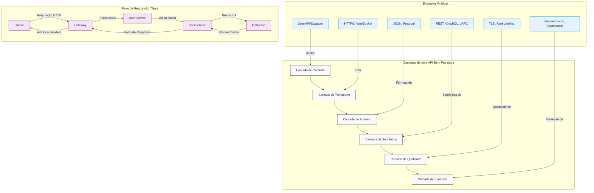

**Navegação:** [[MOC — TRILHA INTERMEDIÁRIA]]
← [[PARTE 14 — SERVICE DISCOVERY]] | #trilha/intermediaria | [[PARTE 16 — COMUNICAÇÃO ENTRE SERVIÇOS]] →

---
# PARTE 15 — API DESIGN

> 🧠 **ESSENCIAL**
> API Design é a arte de criar interfaces bem definidas, consistentes e evoluíveis entre sistemas, permitindo comunicação eficiente e segura enquanto se adapta às mudanças de requisitos ao longo do tempo.

> 🎯 **ENTREVISTA — ALTA FREQUÊNCIA**
> Perguntas sobre design de API aparecem em quase todas as entrevistas de backend, especialmente focando em REST vs GraphQL vs gRPC, versionamento, idempotência e tratamento de erros.

## O que é API Design?

API Design envolve a criação de contratos claros entre sistemas que definem:
- Como os clientes solicitam serviços
- Que dados são trocados
- Quais operações estão disponíveis
- Como erros são comunicados
- Como a API evolui sem quebrar clientes existentes

## Por que existe?

APIs existem para permitir integração entre sistemas distintos, promovendo:
- **Desacoplamento**: Sistemas podem evoluir independentemente
- **Reutilização**: Funcionalidades podem ser consumidas por múltiplos clientes
- **Escalabilidade**: Diferentes partes podem ser dimensionadas Separadamente
- **Inovação**: Novos clientes podem ser criados sem modificar o servidor
- **Padronização**: Interfaces consistentes reduzem curva de aprendizado

## Problema que resolve

Sem um bom design de API, enfrentamos:
- **Integração frágil**: Mudanças quebram clientes existentes
- **Inconsistência**: Diferentes endpoints seguem padrões diferentes
- **Dificuldade de evolução**: Medo de fazer mudanças necessárias
- **Má experiência do desenvolvedor**: Documentação confusa, comportamento inesperado
- **Problemas de desempenho**: Sobrecarga desnecessária, múltiplas chamadas
- **Riscos de segurança**: Exposição acidental de dados sensíveis

## Como funciona internamente

Uma API bem projetada opera em vários níveis:

1. **Camada de Contrato**: Define o que está disponível (endpoints, schemas, tipos)
2. **Camada de Transporte**: Como os dados são enviados (HTTP/1.1, HTTP/2, WebSocket, etc.)
3. **Camada de Formato**: Estrutura dos dados (JSON, XML, Protobuf, etc.)
4. **Camada de Semântica**: Significado das operações (CRUD, business actions, eventos)
5. **Camada de Qualidade**: Não-funcionais (segurança, performance, observabilidade)
6. **Camada de Evolução**: Como mudanças são gerenciadas (versionamento, deprecation)

## Exemplo simples

### REST API básica para gerenciamento de usuários

```http
GET /users          # Lista todos os usuários
POST /users         # Cria um novo usuário
GET /users/123      # Obtém detalhes do usuário 123
PUT /users/123      # Atualiza completamente o usuário 123
PATCH /users/123    # Atualiza parcialmente o usuário 123
DELETE /users/123   # Remove o usuário 123
```

Respostas típicas:
```json
// GET /users
[
  {"id": 1, "name": "João", "email": "joao@email.com"},
  {"id": 2, "name": "Maria", "email": "maria@email.com"}
]

// GET /users/123
{"id": 123, "name": "João", "email": "joao@email.com"}

// POST /users (com body)
// {"name": "Pedro", "email": "pedro@email.com"}
{"id": 124, "name": "Pedro", "email": "pedro@email.com"}
```

## Exemplo real

### API de pagamento do Stripe (simplificada)

**Endpoints principais:**
```
POST /v1/payment_intents          # Cria intenção de pagamento
GET /v1/payment_intents/{id}      # Obtém detalhes da intenção
POST /v1/payment_intents/{id}/confirm  # Confirma o pagamento
POST /v1/refunds                  # Cria reembolso
GET /v1/charges                   # Lista cobranças
```

**Características do design:**
- Versionamento na URL (`/v1/`)
- Uso consistente de HTTP methods
- Respostas JSON padronizadas
- Expansão de objetos através de parâmetros (`?expand=latest_charge`)
- Idempotência através de header `Idempotency-Key`
- Tratamento rico de erros com códigos e mensagens
- Paginação através de `limit`, `starting_after`, `ending_before`

## Exemplo em arquitetura distribuída

### API Gateway em microservícios e-commerce

```
Cliente → [API Gateway] → 
    ├── Auth Service (POST /login, POST /refresh)
    ├── User Service (GET /users/{id}, PUT /users/{id})
    ├── Product Service (GET /products, GET /products/{id}/reviews)
    ├── Cart Service (GET /cart, POST /cart/items, DELETE /cart/items/{id})
    ├── Order Service (POST /orders, GET /orders/{id}/status)
    └── Payment Service (POST /payments, GET /payments/{id})
```

**Padrões aplicados:**
- **Aggregation**: Gateway combina dados de múltiplos serviços
- **Protocol Translation**: Converte entre REST interno e GraphQL externo
- **Rate Limiting**: Protege serviços de sobrecarga
- **Authentication/Authorization**: Centraliza validação de tokens
- **Request/Response Transformation**: Adapta formatos conforme necessário
- **Caching**: Armazena respostas frequentes (catalogo de produtos)
- **Circuit Breaker**: Evita cascata de falhas

## Exemplo de código

### Implementação REST com Node.js/Express

```javascript
const express = require('express');
const app = express();
const port = 3000;

// Middleware
app.use(express.json());
app.use((req, res, next) => {
  console.log(`${req.method} ${req.path}`);
  next();
});

// In-memory store (para exemplo simples)
let users = [
  { id: 1, name: 'João Silva', email: 'joao@email.com', active: true },
  { id: 2, name: 'Maria Santos', email: 'maria@email.com', active: true }
];
let nextId = 3;

// GET /users - Lista usuários com paginação e filtros
app.get('/users', (req, res) => {
  const { limit = 10, offset = 0, active, nameContains } = req.query;
  
  let filtered = users;
  
  if (active !== undefined) {
    filtered = filtered.filter(u => u.active === (active === 'true'));
  }
  
  if (nameContains) {
    filtered = filtered.filter(u => 
      u.name.toLowerCase().includes(nameContains.toLowerCase())
    );
  }
  
  const paginated = filtered.slice(parseInt(offset), parseInt(offset) + parseInt(limit));
  
  res.json({
    data: paginated,
    pagination: {
      limit: parseInt(limit),
      offset: parseInt(offset),
      total: filtered.length,
      hasMore: offset + parseInt(limit) < filtered.length
    }
  });
});

// GET /users/:id - Obtém usuário específico
app.get('/users/:id', (req, res) => {
  const user = users.find(u => u.id === parseInt(req.params.id));
  
  if (!user) {
    return res.status(404).json({
      error: {
        code: 'USER_NOT_FOUND',
        message: 'Usuário não encontrado',
        details: { userId: req.params.id }
      }
    });
  }
  
  res.json({ data: user });
});

// POST /users - Cria novo usuário
app.post('/users', (req, res) => {
  const { name, email } = req.body;
  
  // Validação básica
  if (!name || !email) {
    return res.status(400).json({
      error: {
        code: 'VALIDATION_ERROR',
        message: 'Nome e email são obrigatórios',
        details: { missingFields: !name ? ['name'] : [], missingFields: !email ? ['email'] : [] }
      }
    });
  }
  
  // Verifica se email já existe
  if (users.some(u => u.email.toLowerCase() === email.toLowerCase())) {
    return res.status(409).json({
      error: {
        code: 'EMAIL_ALREADY_EXISTS',
        message: 'Este email já está em uso',
        details: { email }
      }
    });
  }
  
  const newUser = {
    id: nextId++,
    name,
    email,
    active: true,
    createdAt: new Date().toISOString()
  };
  
  users.push(newUser);
  
  res.status(201).json({ data: newUser });
});

// PUT /users/:id - Atualização completa
app.put('/users/:id', (req, res) => {
  const userIndex = users.findIndex(u => u.id === parseInt(req.params.id));
  
  if (userIndex === -1) {
    return res.status(404).json({
      error: {
        code: 'USER_NOT_FOUND',
        message: 'Usuário não encontrado'
      }
    });
  }
  
  const { name, email, active } = req.body;
  
  // Validação
  if ((name === undefined || name === '') && 
      (email === undefined || email === '') && 
      (active === undefined)) {
    return res.status(400).json({
      error: {
        code: 'NO_FIELDS_TO_UPDATE',
        message: 'Pelo menos um campo deve ser fornecido para atualização'
      }
    });
  }
  
  // Atualiza apenas campos fornecidos
  if (name !== undefined) users[userIndex].name = name;
  if (email !== undefined) users[userIndex].email = email;
  if (active !== undefined) users[userIndex].active = active;
  
  users[userIndex].updatedAt = new Date().toISOString();
  
  res.json({ data: users[userIndex] });
});

// DELETE /users/:id - Remove usuário (soft delete)
app.delete('/users/:id', (req, res) => {
  const userIndex = users.findIndex(u => u.id === parseInt(req.params.id));
  
  if (userIndex === -1) {
    return res.status(404).json({
      error: {
        code: 'USER_NOT_FOUND',
        message: 'Usuário não encontrado'
      }
    });
  }
  
  // Soft delete - marca como inativo em vez de remover
  users[userIndex].active = false;
  users[userIndex].deletedAt = new Date().toISOString();
  
  res.status(204).send(); // No Content
});

// Tratamento global de erros
app.use((err, req, res, next) => {
  console.error(err.stack);
  res.status(500).json({
    error: {
      code: 'INTERNAL_SERVER_ERROR',
      message: 'Erro interno do servidor',
      details: process.env.NODE_ENV === 'development' ? { stack: err.stack } : undefined
    }
  });
});

// 404 handler
app.use((req, res) => {
  res.status(404).json({
    error: {
      code: 'ENDPOINT_NOT_FOUND',
      message: `Endpoint ${req.method} ${req.path} não encontrado`
    }
  });
});

app.listen(port, () => {
  console.log(`API rodando em http://localhost:${port}`);
});

module.exports = app;
```

## Diagrama



## Quando usar

Investimento significativo em API Design é justificado quando:

✅ **Múltiplos clientes**: Web app, mobile app, parceiros externos, integrações de terceiros  
✅ **Longevidade esperada**: API deve durar anos com evolução gradual  
✅ **Equipes diferentes**: Frontend, backend, mobile, parceiros trabalham separadamente  
✅ **Criticidade alta**: Falhas na API impactam diretamente receito ou experiência do usuário  
✅ **Regulamentação**: Setores como finanças, saúde exigem padronização e auditabilidade  
✅ **Ecossistema**: Planeja-se criar plataforma com desenvolvedores externos  
✅ **MicroServices**: Serviços precisam comunicar-se de forma estável e documentada  

## Quando NÃO usar

Evite over-engineering em APIs quando:

❌ **Prototipagem rápida**: Validação de conceito onde velocidade é mais importante que perfeição  
❌ **Uso interno restrito**: Apenas um cliente conhece e controla tanto servidor quanto cliente  
❌ **Vida curta esperada**: API será substituída em semanas/meses  
❌ **Equipe única**: Mesmo time desenvolve e consome a API, permitindo comunicação informal  
❌ **Sobrecarga desnecessária**: Aplicação simples que não se beneficia de formalidade excessiva  
❌ **Performance crítica extrema**: Latência mínima absolutamente necessária (considere binários diretos)  
❌ **Legado existente**: Sistema já estabelecido onde mudança traz mais risco que benefício  

## Vantagens

### Benefits de curto prazo:
- **Desenvolvimento mais rápido**: Equipes frontend/backend trabalham em paralelo
- **Menos retrabalho**: Menos recomendações e correções durante integração
- **Depuração facilitada**: Contratos claros ajudam a isolar problemas
- **Documentação automática**: Ferramentas geram docs a partir de definições
- **Testabilidade melhorada**: Contratos permitem mocks e testes de contrato

### Benefits de longo prazo:
- **Evolução segura**: Mudanças podem ser feitas sem quebrar clientes existentes
- **Escalabilidade organizacional**: Mais equipes podem consumir a API com autonomia
- **Qualidade consistente**: Padrões estabelecidos elevam o nível geral
- **Menor custo de suporte**: Menos dúvidas e chamados de suporte
- **Facilita parcerias**: Parceiros externos podem integrar mais rapidamente
- **Valor de negócio**: APIs bem projetadas podem se tornar produtos por si mesmos

## Desvantagens

### Custos iniciais:
- **Tempo de planejamento**: Requer investimento inicial em design e acordos
- **Curva de aprendizado**: Equipe precisa aprender ferramentas e metodologias
- **Overhead inicial**: Mais reuniões, documentação e validações no início
- **Ferramentas e infraestrutura**: Pode exigir investimento em ferramentas de design, mock, teste

### Limitações:
- **Flexibilidade reduzida**: Mudanças drásticas exigem deprecation cuidadoso
- **Complexidade adicional**: Camada extra de abstração a ser mantida
- **Risco de over-engineering**: Possibilidade de criar solução mais complexa que o necessário
- **Dependência de ferramentas**: Pode criar dependência de ferramentas específicas de design

## Trade-offs

| Aspecto | Opção A (Rígido/Formal) | Opção B (Flexível/Informal) |
|---------|-------------------------|-----------------------------|
| **Controle de Versão** | Versionamento estrito com deprecation planejado | Mudanças ad-hoc, versionamento implícito |
| **Validação** | Schemas rigorosos (JSON Schema, Protobuf) | Validação mínima no código |
| **Documentação** | Gerada automaticamente de definições | Escrita manualmente, pode ficar desatualizada |
| **Performance** | Pode ter overhead de validação/conversão | Mais direto, menos processamento |
| **Evolução** | Mudanças cuidadosas com backward compatibility | Liberdade para quebrar e mudar rapidamente |
| **Experiência Dev** | Consistente, previsível, bem documentada | Variável, depende da comunicação da equipe |
| **Custo Inicial** | Alto (plano, ferramentas, treinamento) | Baixo (comece a codificar rapidamente) |
| **Custo Longo Prazo** | Bajo (menos bugs, menos suporte, evolução segura) | Alto (mais retrabalho, mais suporte, dívida técnica) |

## Alternativas

### Quando REST não é ideal:
- **GraphQL**: Quando clientes precisam de flexibilidade na seleção de dados
- **gRPC**: Quando performance crítica e comunicação service-to-service são prioritárias
- **WebSocket/SSE**: Quando comunicação bidirecional em tempo real é necessária
- **Webhooks**: Para notificações assíncronas em vez de polling
- **GraphQL Subscriptions**: Para dados em tempo real com filtragem no servidor
- **Message Queues**: Para comunicação assíncrona confiável entre serviços
- **File-based transfer**: Para grandes volumes de dados (arquivos, exports)

### Quando evitar APIs totalmente:
- **Biblioteca compartilhada**: Quando código é compartilhado diretamente entre componentes
- **Memória compartilhada**: Para processos tightly coupled no mesmo servidor
- **Banco de dados direto**: Quando acesso direto aos dados é suficiente e seguro
- **Event streaming**: Para processamento de fluxo de eventos contínuo
- **Shared kernel**: Arquitetura onde núcleo funcional é compartilhado

## Impacto em performance

### Fatores positivos:
- **Cacheabilidade**: Respostas bem estruturadas podem ser cacheadas efetivamente
- **Compression**: Formatos como JSON gzipado ou Protobuf binário reduzem tamanho
- **Connection reuse**: HTTP/2 permite múltiplas requisições sobre mesma conexão
- **Prioritização**: HTTP/2 e QUIC permitem priorizar recursos críticos
- **Edge caching**: CDNs podem cachear respostas estáticas e semi-estáticas

### Fatores negativos:
- **Overhead de serialização**: Conversão de objetos para JSON/Protobuf consome CPU
- **Overhead de transporte**: Headers HTTP, handshake TLS adicionam bytes
- **Parsing do lado cliente**: Converte JSON de volta para objetos consome tempo/memória
- **Round trips**: Múltiplas chamadas podem ser necessárias para dados relacionados
- **Verbosity**: Formatos como XML são mais verbosos que binários

### Otimizações comuns:
- **Pagination**: Limita tamanho de resposta
- **Field selection**: Permite clientes solicitarem apenas campos necessários (GraphQL, field masking)
- **Compression**: Gzip/Deflate para reduzir payload size
- **HTTP/2**: Multiplexação reduz handshake e latency
- **Cache headers**: Proper Cache-Control, ETag para evitar retransferência desnecessária
- **Binary protocols**: Protobuf, Avro para comunicações internas de alta performance
- **Batching**: Combina múltiplas operações em uma requisição
- **Prefetching**: Antecipa necessidades do cliente baseado em padrões

## Impacto em escala

### Como boa API Design facilita escalabilidade:
- **Statelessness**: Permite horizontal scaling sem afinidade de sessão
- **Cacheabilidade**: Reduz carga no backend através de caching intermediário
- **Rate limiting**: Protege serviços de sobrecarga e permite throttling inteligente
- **Pagination**: Evita transferência de grandes volumes desnecessários
- **Load balancing friendly**: Operações idempotentes permitem retry seguro
- **Circuit breaker friendly**: Failures claros permitem detecção rápida de problemas
- **Observability**: Métricas claras por endpoint facilitam tuning e debugging

### Desafios de escala em APIs mal projetadas:
- **Stateful sessions**: Exigem sticky sessions ou shared session store
- **Large payloads**: Sobrecarregam rede e memória em escala
- **N+1 query problems**: Múltiplas chamadas sequenciais não otimizadas
- **Tight coupling**: Mudanças em um serviço quebram múltiplos clientes
- **Poor error handling**: Dificulta retry automático e circuit breaking
- **Lack of versioning**: Medo de fazer mudanças necessárias por risco de quebra
- **Inconsistent interfaces**: Aumenta carga cognitiva e chances de erro

## Impacto em disponibilidade

### Como API Design afeta disponibilidade:
- **Health checks endpoints**: Permitem detecção rápida de problemas (/health, /ready)
- **Graceful degradation**: API continua funcionando com funcionalidade reduzida quando dependências falham
- **Timeouts configuráveis**: Evitam que problemas em um serviço travem todo o sistema
- **Retry logic claro**: Documenta quando e como retry deve ser feito
- **Circuit breaker pattern**: Permite falha rápida quando serviço está indisponível
- **Bulkhead pattern**: Isola falhas para que não se propaguem para todo o sistema
- **Fallback responses**: Fornece respostas padrão quando dados não estão disponíveis
- **Degraded mode indicators**: Headers ou campos que indicam modo reduzido de funcionamento

### Riscos à disponibilidade:
- **Long-running requests**: Consomem recursos e bloqueiam threads
- **Unbounded responses**: Podem causar OOM em clientes ou servidores
- **Tight coupling a dependências externas**: Queda de um serviço crítico derruba toda API
- **Lack of timeouts/clients hanging**: Consomem conexões e threads indefinidamente
- **Error cascades**: Falha em um componente causa falha em cascata em outros
- **Resource exhaustion**: Endpoints maliciosos ou bugados consomem todos os recursos disponíveis

## Impacto em consistência

### Como API Design afeta consistência de dados:
- **Idempotency keys**: Permitem retry seguro sem efeitos colaterais
- **Transactional boundaries**: Operações claramente definidas como atômicas ou não
- **Consistent error codes**: Padronização ajuda clientes a tratar erros adequadamente
- **Clear concurrency model**: Documenta comportamento sob acesso concorrente
- **Optimistic locking headers**: ETag, If-Match para prevenir lost updates
- **Eventual consistency indicators**: Campos que indicam quando dados podem estar desatualizados
- **Read-after-write consistency**: Garantias explícitas para operações críticas
- **Conflict resolution strategies**: Como conflitos são tratados em sistemas distribuídos

### Problemas de consistência comuns:
- **Lost updates**: Duas atualizações simultâneas sobrescrevem uma a outra
- **Dirty reads**: Leitura de dados que foram modificados mas não committados
- **Non-repeatable reads**: Mesma consulta retorna resultados diferentes em sequência
- **Phantom reads**: Novos registros aparecem em consultas repetidas
- **Write skew**: Restrições são violadas por atualizações aparentemente independentes
- **Inconsistent reads**: Réplicas retornam versões diferentes dos mesmos dados
- **Clock skew issues**: Timestamps confiáveis difíceis em sistemas distribuídos

## Impacto em segurança

### Como API Design contribui para segurança:
- **Principio do menor privilégio**: Endpoints expõem apenas o necessário
- **Input validation rigorosa**: Previne injection attacks (SQL, NoSQL, XSS, etc.)
- **Output encoding**: Previne XSS em respostas que podem ser renderizadas como HTML
- **Authentication clara**: Métodos bem definidos (JWT, OAuth2, API keys, mTLS)
- **Authorization granular**: Permissões específicas por recurso e ação
- **Rate limiting**: Previne brute force e DoS através de limitação de taxa
- **Secure defaults**: Configurações seguras por padrão (HTTPS, cookies secure, etc.)
- **Audit logging claro**: O que foi feito, por quem e quando é claramente registrado
- **Data minimization**: Apenas dados necessários são transmitidos e armazenados
- **Secure error messages**: Erros não vazam informações sensíveis ou stack traces em produção
- **Content-Type validation**: Previne ataque de content-type confusion
- **CORS policies bem definidas**: Controla quais origens podem fazer requisições
- **Security headers**: HSTS, CSP, X-Frame-Options, etc. configurados adequadamente

### Vulnerabilidades comuns em APIs mal projetadas:
- **Injection flaws**: SQLi, NoSQLi, Command injection através de entrada não validada
- **Broken authentication**: Sessões expostas, tokens vazados, lógica de auth flaws
- **Sensitive data exposure**: Dados pessoais, credenciais em respostas ou logs
- **XML External Entity (XXE)**: Através de parsing XML não seguro
- **Broken access control**: Falha em restringir acesso a recursos baseado em permissão
- **Security misconfiguration**: Headers faltando, CORS muito permissivo, etc.
- **Cross-site scripting (XSS)**: Injeção de scripts através de campos que não são escapados
- **Insecure deserialization**: Ataques através de desserialização de objetos não confiáveis
- **Using components with known vulnerabilities**: Bibliotecas desatualizadas com CVEs conhecidos
- **Insufficient logging & monitoring**: Falta de visibilidade para detectar e responder a ataques
- **Improper error handling**: Stack traces e informações internas vazados em respostas de erro
- **Missing function level access control**: Falha em verificar permissão em nível de endpoint/método
- **Cross-site request forgery (CSRF)**: Ataques que fazem usuários autenticados executarem ações não desejadas

## Impacto em custo

### Como API Design afeta custos:
#### Redução de custos:
- **Desenvolvimento mais rápido**: Menos tempo gasto em retrabalho e esclarecimentos
- **Menor custo de suporte**: Menos dúvidas, menos chamados, documentação clara
- **Maior produtividade**: Equipes trabalham em paralelo com menos dependências
- **Menor taxa de falhas**: Menos bugs em produção devido a contratos claros
- **Facilita automação**: Testes, deployment, monitoramento mais fácil de automatizar
- **Melhor reuse**: Mesma API pode servir múltiplos clientes e use cases
- **Menor vendor lock-in**: Padrões abertos facilitam mudança de fornecedores ou tecnologias
- **Escalabilidade mais previsível**: Capacidade de planejar crescimento com maior precisão
- **Menor dívida técnica**: Menos atalhos e soluções temporárias que precisam ser refatoradas

#### Aumento de custos (inicial):
- **Tempo de design**: Reuniões, workshops, acordos sobre contrato
- **Ferramentas e treinamento**: Investimento em ferramentas de design, mock, teste de contrato
- **Documentação inicial**: Criação de especificação detalhada antes do desenvolvimento
- **Processo de approval**: Mais etapas antes de começar a codificar
- **Treinamento da equipe**: Aprendizado de novas metodologias e ferramentas
- **Overhead de versionamento**: Gerenciamento de múltiplas versões simultâneas
- **Deprecation process**: Plano e comunicação para remover funcionalidades antigas

#### Trade-offs de custo:
- **Investimento inicial vs economia longo prazo**: Alto custo inicial amortizado ao longo de anos de uso
- **Padronização vs flexibilidade**: Menos liberdade para experimentar, mas mais previsibilidade
- **Cobertura completa vs MVP**: Especificar tudo versus lançar e iterar baseado em feedback
- **Ferramentas proprietárias vs abertas**: Custo de licença vs potencialmente menos suporte/comunidade
- **Centralização vs descentralização**: Equipe dedicada de API squads vs responsabilidade distribuída

## Erros comuns

### Erros de design contratual:
- **Endpoints inconsistentes**: Alguns usam snake_case, outros camelCase, alguns plural, outros singular
- **Versionamento confuso**: Versionamento na URL, headers, query params de forma inconsistente
- **Field naming inconsistente**: `user_id` em um lugar, `userId` em outro, `ID` em outro
- **Tipos de dados ambíguos**: String que às vezes é número, objeto que às vezes é array
- **Nenhum schema formal**: Reliance em documentação humana que fica desatualizada
- **Campos opcionais não documentados**: Dificulta consumo correto da API
- **Valores default não especificados**: Comportamento impreciso quando campos são omitidos
- **Nenhum exemplo de request/response**: Torna difícil entender uso correto
- **Enums não documentados**: Valores permitidos não são especificados claramente
- **Unidades não especificadas**: É bytes ou kilobytes? Segundos ou milissegundos?

### Erros de semântica e comportamento:
- **Verbos HTTP mal usados**: Usando POST para atualizações, GET com side effects
- **Idempotência quebrada**: Operações que deveriam ser idempotentes não são
- **Status codes inconsistentes**: 200 vs 201 vs 204 usados de forma arbitrária
- **Error handling inconsistente**: Alguns endpoints retornam HTML, outros JSON, outros texto puro
- **Mensagens de erro não padronizadas**: Estrutura varia completamente entre endpoints
- **Falta de documentação de side effects**: O que acontece além do retorno explícito
- **Comportamento não especificado para edge cases**: O que acontece com entradas vazias, nulos, muito grandes
- **Timeouts não documentados**: Cliente não sabe quanto esperar antes de desistir
- **Rate limits não documentados**: Cliente é bloqueado sem saber por quê ou limite
- **Authentication requirements não claros**: Alguns endpoints públicos, outros privados, sem padrão óbvio

### Erros de performance e escalabilidade:
- **N+1 query problem**: Endpoint que faz múltiplas queries sequenciais em vez de uma join
- **Payloads desnecessariamente grandes**: Inclui campos que raramente são usados
- **Falta de pagination**: Retorna milhões de registros em uma única resposta
- **Falta de filtering/ordering**: Cliente deve filtrar/ordenar localmente grandes volumes
- **Cacheability quebrada**: Headers de cache incorretos ou variáveis que impedem caching
- **Server-side processing pesado**: Operações que consomem CPU significativo por request
- **Connection exhaustion**: Não reutiliza conexões HTTP, abrindo nova para cada request
- **Blocking I/O em thread pool limitado**: Consome threads que deveriam atender outras requisições
- **Large file uploads/downloads sem streaming**: Carrega arquivos inteiros na memória
- **Falta de compressão**: Envia dados que poderiam ser significativamente menores com gzip

### Erros de segurança:
- **Exposição de dados sensíveis**: Senhas, tokens, PII em logs, respostas de erro, traces
- **Authentication faltando ou quebrada**: Endpoints que deveriam ser protegidos estão abertos
- **Authorization inadequada**: Usuários podem acessar dados ou executar ações não autorizadas
- **Input validation insuficiente**: Susceptível a injection attacks diversos
- **Output encoding faltante**: Susceptível a XSS quando dados são renderizados em HTML
- **CORS muito permissivo**: Permite qualquer origem fazer requisições
- **Security headers faltando**: HSTS, CSP, X-Frame-Options não configurados
- **Rate limiting ausente ou ineficaz**: Susceptível a brute force, DoS, credential stuffing
- **Session management flaws**: Sessões que não expiram, tokens que podem ser reutilizados
- **Password handling inadequado**: Armazenamento em plain text, hash fracos, falta de salt
- **Information disclosure**: Versões de software, paths de stack, detalhes de sistema em respostas de erro
- **File upload vulnerabilities**: Path traversal, execution de arquivos uploadados, tipos não validados

### Erros de evolução e versionamento:
- **Breaking changes sem aviso**: Modifica contrato existente sem deprecation period
- **Nenhum mecanismo de deprecation**: Não avisa quando funcionalidade será removida
- **Versionamento inconsistente**: Alguns endpoints versionados, outros não
- **Múltiplas estratégias de versionamento conflituosas**: URL, header, query param usados aleatoriamente
- **Falta de backward compatibility**: Força clientes a atualizarem imediatamente
- **Deprecation sem alternativa clara**: Remove funcionalidade sem indicar o que usar no lugar
- **Comunicação pobre de changes**: Clientes descobrem quebra apenas quando algo para de funcionar
- **Nenhum processo de sunset**: Funcionalidades antigas permanecem para sempre por medo de remover
- **Over-versionamento**: Cria nova versão para mudanças triviais que não afetam contrato
- **Under-versionamento**: Não cria nova versão quando contrato é realmente quebrado

### Erros de observabilidade e operação:
- **Falta de health checks**: Nenhum endpoint para verificar se API está funcionando
- **Logs insuficientes ou excessivos**: Pouco info para debug ou muito ruído que esconde signal
- **Métricas ausentes ou mal definidas**: Não se sabe QPS, latência, taxas de erro por endpoint
- **Distributed tracing quebrado**: Correlation IDs não propagados entre serviços
- **Alerting inadequado**: Alerts muito sensíveis (falsos positivos) ou não sensíveis o suficiente
- **Falha em logar requests e responses completos**: Dificulta reproduzir problemas de produção
- **Nenhum mecanismo de debug/profiling**: Difícil identificar gargalos de performance
- **Versionamento de logging não considerado**: Mudanças em formato de log quebram parsers existentes
- **Falha em medir experiência do desenvolvedor**: Não se sabe quão fácil é consumir a API
- **Inadequate error correlation**: Difícil conectar erros de cliente com causas de servidor

## Anti-patterns

### Anti-patterns de contrato:
- **God Endpoint**: Um único endpoint que faz tudo através de parâmetros complexos
- **Swiss Army Knife**: Endpoint com dezenas de parâmetros opcionais que mudam comportamento completamente
- **Magic Strings**: Valores especiais em parâmetros que mudam comportamento de forma não óbvia
- **Inconsistent Resource Modeling**: Às vezes recurso é singular, às vezes plural, às vezes ambas
- **Over-POSTing**: Usando POST para tudo porque é mais fácil que aprender outros verbos
- **Tunneling**: Colocando operações reais dentro de parâmetros de um endpoint genérico
- **Action-based вместо Resource-based**: `/transferMoney` em vez de `POST /accounts/123/transfers`
- **Leaky Abstractions**: Vazamento de detalhes internos através da API (IDs internos, estruturas de banco)
- **Impedance Mismatch**: Modelo de recurso não corresponde bem ao modelo de domínio

### Anti-patterns de comportamento:
- **Silent Failures**: Retorna 200 OK mesmo quando operação falhou parcialmente
- **Magic Error Codes**: Códigos de erro que requerem tabela de lookup externa para entender
- **Inconsistent Data Formats**: Às vezes retorna array, às vezes objeto vazio para "nenhum resultado"
- **Chatty API**: Exige muitas chamadas relacionadas para completar uma operação simples
- **Bloated Responses**: Inclui dados que raramente são necessários no response padrão
- **Side Effects Não Documentados**: Operação tem efeitos colaterais significativos não mencionados
- **Temporal Coupling**: Exige que chamadas sejam feitas em ordem específica sem documentar por quê
- **Stateful Cookies**: Depende de cookies para estado em vez de torná-lo explícito na requisição
- **Redirect Hell**: Série de redirects que dificultam seguir fluxo lógico da operação
- **Polling Instead of Push**: Força cliente a poller quando notificação seria mais eficiente

### Anti-patterns de performance:
- **N+1 Queries**: Fazendo múltiplas queries sequenciais que poderiam ser uma join
- **Unnecessary Joins**: Inclui joins que não são necessários para o resultado solicitado
- **Memory Leaks**: Acumula estado entre requests que nunca é liberado
- **Blocking Operations**: Operações longas que bloqueiam thread pool inteiro
- **Large Synchronous Operations**: Operações que levam segundos para completar síncronamente
- **Inefficient Serialization**: Usa formatos pesados quando binários seriam mais eficientes
- **Repeated Work**: Faz mesmo cálculo caro múltiplas vezes no mesmo request
- **Unbounded Result Sets**: Não limita tamanho de resposta, podendo retornar milhões de registros
- **Expensive Operations in Getters**: Propriedades que executam lógica complexa ou acesso a banco
- **Synchronous External Calls**: Chamadas síncronas para serviços externos dentro do request processing

### Anti-patterns de segurança:
- **Security Through Obscurity**: Acreditar que não documentar endpoints os torna seguros
- **Hardcoded Secrets**: Chaves de API, senhas em código fonte ou config versionado
- **Insecure Defaults**: Configurações iniciais que são inseguras e precisam ser alteradas manualmente
- **Overly Permissive CORS**: Permite qualquer origem, qualquer método, qualquer header
- **Missing Authentication**: Endpoints que deveriam estar protegidos estão acessíveis públicamente
- **Broken Authorization**: Falha em verificar se usuário tem permissão para ação específica
- **Information Leakage in Errors**: Stack traces, paths de arquivo, detalhes de sistema em respostas de erro
- **Insufficient Input Validation**: Falha em validar tamanho, tipo, formato, range de entradas
- **Insecure Direct Object Reference (IDOR)**: Acesso direto a objetos baseado em ID sem verificação de permissão
- **Session Fixation**: Permite atacante definir ID de sessão que será usado após login
- **CSRF Vulnerable**: Falha em proteger contra ataques de request forgery
- **Insecure Cookie Flags**: Cookies sem HttpOnly, Secure, SameSite adequadamente configurados

### Anti-patterns de evolução:
- **Breaking Changes without Notice**: Modifica contrato sem aviso prévio ou período de deprecation
- **Versionamento por Cópia Inteira**: Duplica toda API em vez de versionar apenas o que mudou
- **Lack of Deprecation Strategy**: Nenhum plano para remover funcionalidades antigas de forma segura
- **Feature Toggles mal implementados**: Flags que criam caminhos de código complexos e difíceis de testar
- **Database Schema Leaks**: Vazamento de detalhes de esquema de banco através da API
- **Tight Coupling to Clients**: Desenvolvimento considerando apenas um cliente específico
- **No Backward Compatibility Attempt**: Nenhum esforço para manter compatibilidade com versões antigas
- **Over-engineering for Future**: Construindo complexidade desnecessária para casos de uso hipotéticos
- **Ignoring Client Versions**: Não considerando que clientes podem estar em versões antigas

## Quando usar cada estilo de API

### REST é melhor quando:
- ✅ Recursos têm modelo naturalmente hierárquico ou baseado em entidades
- ✅ Operações se mapeiam bem para CRUD (Create, Read, Update, Delete)
- ✅ Cacheabilidade é importante (HTTP caching infrastructure funciona bem)
- ✅ *Statelessness* é desejado para facilitar horizontal scaling
- ✅ Amplo suporte de ferramentas (Postman, Insomnia, Swagger, etc.)
- ✅ Equipe já familiarizada com conceitos HTTP e REST
- ✅ Necessidade de interoperabilidade com amplia gama de clientes
- ✅ Requisitos relativamente simples e bem compreendidos
- ✅ Quando compatibilidade com web standards é importante

### GraphQL é melhor quando:
- ✅ Clientes precisam de flexibilidade significativa na seleção de dados
- ✅ Múltiplos clientes com necessidades de dados muito diferentes
- ✅ Problema de over-fetching ou under-fetching é significativo
- ✅ Dados têm relações complexas e aninhadas que seriam múltiplas chamadas REST
- ✅ Desenvolvimento rápido baseado em feedback de clientes é importante
- ✅ Experiência de desenvolvedor é prioridade (autocompletion, documentação interativa)
- ✅ Bandwidth é crítico e reduzir payload size traz benefício significativo
- ✅ Evolução frequente do schema é esperada e desejada
- ✅ Equipe está confortável com pensamento em termos de grafos e tipos

### gRPC é melhor quando:
- ✅ Comunicação service-to-service de alta performance é necessária
- ✅ Latência extremamente baixa é crítica (microservices internos, alta frequência)
- ✅ Comunicação bidirecional ou streaming é necessária
- ✅ Uso eficiente de banda e CPU é prioridade (ambientes com restrição de recursos)
- ✅ Linguagem fortemente tipada é valorizada (melhor experiência de desenvolvimento)
- ✅ Code generation é desejado para reduzir boilerplate manual
- ✅ Controle fino sobre comportamento de transporte é necessário
- ✅ Ambiente controlado onde tanto cliente quanto servidor podem ser atualizados juntos
- ✅ Política de versionamento rigorosa pode ser aplicada e seguida

## Checklist para boa API Design

### Antes de começar:
- [ ] Requisitos claramente definidos e acordados com stakeholders
- [ ] Público-alvo bem definido (internos, parceiros, público geral)
- [ ] Casos de uso principais documentados e priorizados
- [ ] Restrições técnicas, regulatórias e de negócio identificadas
- [ ] Métricas de sucesso definidas (adoption, performance, satisfação)
- [ ] Orçamento de tempo e recursos para design adequado alocado
- [ ] Equipe treinada em metodologias e ferramentas de API design escolhidas
- [ ] Ferramentas de design, mock, teste, documentação selecionadas e provisionadas

### Durante o design:
- [ ] Modelo de recursos bem definido e revisado com especialistas de domínio
- [ ] Operações mapeadas corretamente para verbos HTTP (quando aplicável)
- [ ] Status codes usados adequadamente conforme RFC 7231
- [ ] Headers HTTP usados corretamente (Cache-Control, ETag, etc.)
- [ ] Esquemas de dados definidos formalmente (OpenAPI, GraphQL Schema, Protobuf)
- [ ] Exemplos de request e response fornecidos para todos os endpoints
- [ ] Casos de erro bem definidos com códigos e mensagens padronizados
- [ ] Mecanismo de versionamento escolhido e documentado
- [ ] Plano de deprecation e sunset definido para funcionalidades antigas
- [ ] Estratégia de autenticação e autorização claramente definida
- [ ] Plano de rate limiting e throttling definido
- [ ] Estratégia de caching analisada e headers apropriados definidos
- [ ] Requisitos de performance considerados (latência, throughput, concorrência)
- [ ] Requisitos de segurança analisados e controles apropriados definidos
- [ ] Requisitos de observabilidade considerados (logging, métricas, tracing)
- [ ] Documentação gerada automaticamente a partir de definições formais
- [ ] Experiência de desenvolvedor testada com membros da equipe não familiarizados
- [ ] Feedback de clientes potenciais incorporado no design
- [ ] Trade-offs documentados e decisões justificadas

### Depois da implementação:
- [ ] Testes de contrato validam que implementação corresponde ao design
- [ ] Testes de segurança identificam vulnerabilidades comuns
- [ ] Testes de performance validam latência e throughput esperados
- [ ] Testes de carga validam comportamento sob estresse
- [ ] Testes de failover validam resiliência a falhas de dependências
- [ ] Documentação publicada e acessível aos consumidores
- [ ] SDKs ou bibliotecas de cliente gerados e disponibilizados (quando apropriado)
- [ ] Programa de treinamento e onboarding para novos consumidores estabelecido
- [ ] Mecanismo de feedback e sugestões de melhoria estabelecido
- [ ] Métricas de adoption e utilização coletadas e monitoradas
- [ ] Revisões periódicas de design agendadas para identificar melhorias
- [ ] Plano de evolução e roadmap futuro definido e comunicado

## Perguntas de entrevista

### Básicas:
1. **Qual a diferença entre PUT e PATCH?**
   - PUT substitui completamente o recurso, PATCH aplica modificação parcial

2. **O que torna uma operação idempotente? Por que é importante?**
   - Operação que pode ser aplicada múltiplas vezes sem mudar resultado além da primeira aplicação
   - Importante para retry seguro em caso de falhas de rede

3. **Quais são os principais códigos de status HTTP e quando usar cada um?**
   - 2xx: Sucesso, 3xx: Redirecionamento, 4xx: Erro do cliente, 5xx: Erro do servidor

4. **Qual a diferença entre REST e SOAP?**
   - REST é arquitetural style baseado em HTTP, SOAP é protocolo com envelope XML rígido

5. **O que é HATEOAS e por que é útil?**
   - Hypermedia As The Engine Of Application State - respostas contêm links para ações disponíveis

### Intermediárias:
1. **Como você projetaria versionamento em uma API REST?**
   - Opções: URL versioning (/v1/resource), Header versioning (Accept: application/vnd.myapi.v1+json), Media type versioning

2. **Como você lidaria com grandes volumes de dados em uma API?**
   - Paginação, streaming, field selection, compression, async processing com webhooks

3. **Quais estratégias você usaria para tornar uma API mais segura?**
   - Autenticação forte (OAuth2/JWT), autorização granular, input validation, output encoding, rate limiting, security headers, HTTPS obrigatório

4. **Como você documentaria uma API para facilitar o consumo por desenvolvedores externos?**
   - OpenAPI/Swagger, exemplos de código, sandbox interativo, changelog claro, suporte dedicado

5. **Como você lidaria com breaking changes em uma API publicada?**
   - Deprecation period com headers de aviso, versão alternativa disponível, comunicação clara com timeline, eventual remoção após período adequado

### Avançadas:
1. **Como você equilibraria consistência e disponibilidade em uma API distribuída?**
   - Análise de trade-offs baseada em requisitos de negócio, uso de padrões como eventual consistency com read-your-writes quando necessário, circuit breakers, fallback mechanisms

2. **Como você projetaria API para comunicação em tempo real com milhares de clientes conectados simultaneamente?**
   - WebSocket ou Server-Sent Esvents com load balancing sticky sessions, heartbeats, reconnection logic eficiente, sharding por usuário/tópico, mensagens binárias quando apropriado

3. **Como você lidaria com versionamento em uma API GraphQL onde o schema evolui constantemente?**
   - Deprecation de fields ao invés de versionamento completo, uso de directives @deprecated, fornecimento de migration path claro, schema evolution com backward compatibility quando possível

4. **Como você projetaria uma API que precisa processar pagamentos com requisitos extremos de segurança e compliance?**
   - Tokenização de dados sensíveis, uso de HSMs ou serviços especializados, minimização de dados, logs de auditoria completos, separation of duties, penetration testing regular, compliance com PCI DSS, GDPR, etc.

5. **Como você projetaria API para sistema com requisitos contraditórios de baixa latência (<10ms) e alta consistência forte?**
   - Análise de onde consistência forte é realmente necessária vs onde eventual consistência é aceitável, uso de caching em múltiplas camadas, read replicas, geographic distribution estratégica, pre-computation de dados frequentemente acessados

## Follow-ups possíveis

### Se perguntarem sobre REST:
- "Como você lidaria com operações que não se encaixam bem no modelo CRUD?"
  - Discutir uso de verbos não-standard com cuidado, ou modelagem de recursos que representam ações (ex: /transferencias em vez de POST /contas/123/transferir)

- "Qual sua estratégia para caching em APIs que atualizam frequentemente?"
  - Discutir ETag, Last-Modified, Cache-Control headers, stale-while-revalidate, purging/invalidation strategies

- "Como você garantiría que sua API seja fácil de consumir para desenvolvedores mobile?"
  - Discutir payload size minimization, compression, field selection, batching, offline support considerations, error handling claro

### Se perguntarem sobre GraphQL:
- "Como você resolveria o problema N+1 em resolvers GraphQL?"
  - Discutir DataLoader pattern, batching de consultas, análise de query para otimização

- "Como você lidaria com authorization em nível de field em GraphQL?"
  - Discutir directives customizadas, middleware de resolução, context sharing entre resolvers

- "Qual sua estratégia para evitar queries excessivamente complexas ou custosas em GraphQL?"
  - Discutir query complexity analysis, depth limiting, cost analysis, persisted queries, allowlists

### Se perguntarem sobre gRPC:
- "Como você lidaria com versionamento de protobuf mantendo backward compatibility?"
  - Discutir regras de evolution de protobuf (não remover ou mudar número de campos existentes, apenas adicionar novos com números novos)

- "Quando você escolheria gRPC em vez de REST para comunicação externa com clientes?"
  - Discutir cenários onde performance crítica supera necessidade de legibilidade humana e ampla compatibilidade

- "Como você implementaria streaming bidirecional eficiente em gRPC?"
  - Discutir padrões de uso, backpressure handling, connection lifecycle, error propagation em streams

## Resposta esperada

### Resposta Júnior:
Foca nos aspectos superficiais: "REST usa HTTP verbs, GraphQL permite selecionar campos, gRPC é rápido." Menciona alguns códigos de status básicos e talvez algum exemplo de endpoint. Não aborda versionamento, segurança, performance ou trade-offs de forma estruturada. Resposta mostra familiaridade básica com conceitos mas falta profundidade e capacidade de aplicar em cenários reais.

### Resposta Pleno:
Mostra entendimento bom dos diferentes estilos de API, pode comparar REST vs GraphQL vs gRPC em termos de uso apropriado. Aborda versionamento, algum tratamento de erros, talvez menciona autenticação básica. Mostra capacidade de aplicar conceitos a cenários realistas, mas pode perder alguns aspectos avançados como deep diving em security patterns, observabilidade detalhada ou estratégias de evolução complexa.

### Resposta Sênior:
Demonstra visão holística de API Design como disciplina, não apenas coleta de tecnologias. Aborda profundamente trade-offs entre consistência, disponibilidade, performance e custo. Mostra capacidade de projetar para evolução segura com versionamento e deprecation adequados. Discute segurança em profundidade (OWASP API Top 10, authz models, input validation strategies). Considera experiência do desenvolvedor como fator crítico. Mostra capacidade de adaptar abordagem baseado em requisitos específicos de negócio, escala, equipe e restrições. Inclui métricas, monitoramento e melhoria contínua no processo.

### Resposta Staff/Arquiteto:
Vê API Design como parte estratégica da arquitetura de sistema e negócio. Considera não apenas a API em si mas seu papel no ecossistema maior (parceiros, plataformas, modelos de negócio). Aborda aspectos de governança, padrões organizacionais, centro de excelência em API. Considera impacto de longo prazo em velocidade de entrega da organização, custo de operação, capacidade de inovação. Mostra capacidade de projetar não apenas para uso atual mas para evolução futura do negócio e tecnologia. Inclui aspectos de monetização de APIs, estratégias de developer experience em escala, programas de parceria e ecossistema. Pensa em API como produto com lifecycle completo, não apenas como interface técnica.

## Checklist rápido para revisão

Antes de considerar uma API "pronta":
- [ ] Modelo de recurso bem definido e revisado com especialistas de domínio
- [ ] Operações mapeadas corretamente para verbos HTTP (REST) ou têm tipos claros (GraphQL/gRPC)
- [ ] Status codes usados adequadamente (201 para criação, 204 para deleção sem conteúdo, etc.)
- [ ] Erros seguem formato padronizado com códigos e mensagens claras
- [ ] Exemplos de request e response fornecidos para todos os endpoints
- [ ] Mecanismo de versionamento escolhido e documentado
- [ ] Plano de deprecation definido para funcionalidades antigas
- [ ] Autenticação e autorização claramente implementadas e testadas
- [ ] Input validation rigorosa em todos os pontos de entrada
- [ ] Rate limiting implementado para proteger contra abuso
- [ ] Headers de cache apropriadamente definidos onde aplicável
- [ ] Documentação gerada automaticamente a partir de definições formais
- [ ] Testes de contrato validam implementação contra especificação
- [ ] Testes de segurança cobrem vulnerabilidades comuns (OWASP API Top 10)
- [ ] Métricas de utilização, performance e erro sendo coletadas e monitoradas
- [ ] SDKs ou bibliotecas de cliente disponibilizados quando apropriado
- [ ] Mecanismo de feedback de consumidores estabelecido e ativo
- [ ] Plano de evolução e roadmap futuro definido e comunicado aos stakeholders

---
*Este segmento faz parte da documentação completa de Arquitetura de Software. Para continuar estudando, consulte a PARTE 16 — COMUNICAÇÃO ENTRE SERVIÇOS.*