**Navegação:** [[MOC — TRILHA INTERMEDIÁRIA]]
← [[PARTE 15 — API DESIGN]] | #trilha/intermediaria | [[PARTE 17 — MESSAGE BROKERS E EVENT STREAMING]] →

---
# PARTE 16 — COMUNICAÇÃO ENTRE SERVIÇOS

> 🧠 **ESSENCIAL**
> Comunicação entre serviços é o mecanismo pelo qual componentes distribuídos trocam informações, coordenam ações e alcançam consistência em sistemas arquiteturais modernos.

> 🎯 **ENTREVISTA — ALTA FREQUÊNCIA**
> Perguntas sobre comunicação síncrona vs assíncrona, trade-offs entre diferentes mecanismos, e escolha apropriada com base em requisitos são extremamente comuns em entrevistas de arquitetura.

## O que é Comunicação entre Serviços?

Comunicação entre serviços refere-se às diversas formas pelas quais componentes independentes em um sistema distribuído trocam dados, solicitam ações e coordenam seu comportamento. Inclui tanto mecanismos síncronos (onde o remetente aguarda uma resposta) quanto assíncronos (onde o remetente continua sua execução após enviar a mensagem).

## Por que existe?

À medida que sistemas evoluem de monolíticos para arquiteturas distribuídas (microservices, serverless, etc.), a comunicação entre componentes torna-se um aspecto crítico porque:

- **Componentes estão fisicamente separados**: Não podem mais compartilhar memória ou fazer chamadas de função diretas
- **Falhas parciais são inevitáveis**: Redes podem falhar, serviços podem ficar indisponíveis
- **Escalabilidade independente**: Diferentes componentes podem precisar de diferentes níveis de recursos
- **Tecnologias heterogêneas**: Serviços podem ser escritos em linguagens diferentes usando diferentes stacks
- **Equipes independentes**: Diferentes times desenvolvem, deployam e mantêm serviços diferentes

## Problema que resolve

Sem mecanismos bem definidos de comunicação entre serviços, enfrentamos:

- **Acoplamento rígido**: Serviços ficam fortemente dependentes uns dos outros
- **Fragilidade à falha**: Queda de um serviço pode causar falha em cascata
- **Dificuldade de evolução**: Mudanças em um serviço quebram consumidores
- **Escalabilidade limitada**: Não é possível dimensionar componentes independentemente
- **Complexidade operacional**: Difícil de monitorar, debugar e manter
- **Inconsistência de dados**: Dificuldade em manter estado coerente entre serviços

## Como funciona internamente

A comunicação entre serviços opera em vários níveis:

1. **Camada de Transporte**: Protocolo de rede subjacente (TCP/UDP, HTTP/1.1, HTTP/2, etc.)
2. **Camada de Codificação**: Formato dos dados (JSON, XML, Protobuf, Avro, etc.)
3. **Camada de Protocolo**: Padrão de interação (request-response, publish-subscribe, push-pull, etc.)
4. **Camada de Semântica**: Significado da comunicação (comando, query, evento, etc.)
5. **Camada de Qualidade**: Não-funcionais (confiabilidade, ordering, exatamente-uma-vez, etc.)
6. **Camada de Roteamento**: Como mensagens chegam ao destino (endereçamento direto, tópicos, filas, etc.)
7. **Camada de Observabilidade**: Mecanismos para rastrear, métricar e logar comunicações

## Exemplo simples

### Comunicação Síncrona REST

**Serviço A (Cliente):**
```http
GET /api/usuarios/123/profile
Accept: application/json
```

**Serviço B (Servidor):**
```http
HTTP/1.1 200 OK
Content-Type: application/json

{
  "id": 123,
  "name": "João Silva",
  "email": "joao@email.com",
  "profile": {
    "bio": "Desenvolvedor",
    "avatarUrl": "https://example.com/avatar.jpg"
  }
}
```

### Comunicação Assíncrona com Message Queue

**Serviço A (Produtor):**
```java
// Envia pedido de processamento
messageQueue.send("order-processing", 
    new OrderEvent("ORDER_CREATED", orderId, timestamp));
```

**Serviço B (Consumidor):**
```java
// Processa pedidos assincronamente
messageQueue.receive("order-processing", (event) -> {
    if (event.getType().equals("ORDER_CREATED")) {
        processOrder(event.getOrderId());
    }
});
```

## Exemplo real

### Arquitetura de Pagamentos do Uber

**Fluxo de processamento de pagamento:**
1. **Passageiro solicita corrida** → App móvel → API Gateway → Serviço de Corridas
2. **Corrida confirmada** → Serviço de Corridas → Publica evento `RIDE_CONFIRMED` (Kafka)
3. **Serviço de Pagamentos** consome `RIDE_CONFIRMED` → Cria intenção de pagamento (Stripe API - síncrono REST)
4. **Processamento de pagamento** → Serviço de Pagamentos → Publica evento `PAYMENT_PROCESSED` (Kafka)
5. **Serviço de Notificações** consome `PAYMENT_PROCESSED` → Envia recibo por email/SMS (assíncrono)
6. **Serviêço de Corridas** consome `PAYMENT_PROCESSED` → Atualiza status da corrida
7. **Serviço de Analítica** consome ambos os eventos → Atualiza dashboards e métricas

**Tecnologias usadas:**
- **Síncrono**: REST/HTTP para chamadas diretas críticas (confirmação de reserva, chamada ao Stripe)
- **Assíncrono**: Apache Kafka para eventos de negócio (confirmação de corrida, processamento de pagamento)
- **Message Queue**: Redis/RabbitMQ para tarefas em background (envio de emails, processamento de imagens)
- **WebSocket**: Para atualizações em tempo real no app móvel (localização do motorista, status da corrida)

## Exemplo em arquitetura distribuída

### Sistema de E-commerce com Microserviços

```
[Cliente Web/Mobile] 
        ↓ (HTTPS)
[API Gateway] 
        ↓ 
┌─────────────────────────────────────┐
│          ORQUESTRAÇÃO/SAGA          │ ←─ Coordena transações distribuídas
└───────────────────────┬─────────────┘
                        ↓
        ┌─────────────┴─────────────┐
        ↓                           ↓
[Serviço de Catalog]     [Serviço de Carrinho]
        ↓ (gRPC)                  ↓ (REST/HTTP)
[Catálogo DB]              [Carrinho DB/Redis]
        ↑                           ↑
        ↓                           ↓
[Serviço de Pagamento] ←─┐   [Serviço de Estoque]
        ↓ (REST)           ↓ (Async via Kafka)
[Gateway Pagamento]      [Evento: ITEM_RESERVADO]
        ↓                           ↓
[Banco Externo]      [Serviêço de Notificação]
                                        ↓
                                [Email/SMS Service]

Padrões de comunicação:
- **Síncrono**: gRPC para catalog (baixa latência necessária), REST para pagamentos (compatibilidade com gateways externos)
- **Assíncrono**: Kafka para eventos de negócio (estoque reservado, pagamento processado, pedido criado)
- **Request-Response**: Para consultas diretas onde resposta imediata é necessária
- **Fire-and-Forget**: Para notificações onde não precisamos de confirmação imediata
- **Event-Carried State Transfer**: Eventos contêm dados suficientes para atualizar caches locais
```

## Exemplo de código

### Comunicação Síncrona com gRPC (Java)

**protobuf definition:**
```proto
syntax = "proto3";

package ecommerce;

service ProductService {
  rpc GetProduct(GetProductRequest) returns (Product);
  rpc ListProducts(ListProductsRequest) returns (stream Product);
}

message GetProductRequest {
  string product_id = 1;
}

message Product {
  string id = 1;
  string name = 2;
  string description = 3;
  double price = 4;
  repeated string tags = 5;
  bool in_stock = 6;
}

message ListProductsRequest {
  int32 page = 1;
  int32 page_size = 2;
  repeated string category_filters = 3;
}
```

**Implementação do serviço (servidor):**
```java
@GrpcService
public class ProductServiceImpl extends ProductServiceGrpc.ProductServiceImplBase {
    
    private final ProductRepository productRepository;
    
    public ProductServiceImpl(ProductRepository productRepository) {
        this.productRepository = productRepository;
    }
    
    @Override
    public void getProduct(GetProductRequest request, 
                          StreamObserver<Product> responseObserver) {
        try {
            ProductEntity entity = productRepository.findById(request.getProductId());
            if (entity == null) {
                responseObserver.onError(
                    Status.NOT_FOUND.withDescription("Product not found").asException()
                );
                return;
            }
            
            Product response = Product.newBuilder()
                .setId(entity.getId())
                .setName(entity.getName())
                .setDescription(entity.getDescription())
                .setPrice(entity.getPrice())
                .addAllTags(entity.getTags())
                .setInStock(entity.getInStock())
                .build();
                
            responseObserver.onNext(response);
            responseObserver.onCompleted();
        } catch (Exception e) {
            responseObserver.onError(
                Status.INTERNAL.withDescription("Internal server error").cause(e).asException()
            );
        }
    }
    
    @Override
    public void listProducts(ListProductsRequest request,
                            StreamObserver<Product> responseObserver) {
        try {
            List<ProductEntity> entities = productRepository.findAll(
                    request.getPage(), 
                    request.getPageSize(),
                    request.getCategoryFiltersList()
            );
            
            for (ProductEntity entity : entities) {
                Product product = Product.newBuilder()
                    .setId(entity.getId())
                    .setName(entity.getName())
                    .setDescription(entity.getDescription())
                    .setPrice(entity.getPrice())
                    .addAllTags(entity.getTags())
                    .setInStock(entity.getInStock())
                    .build();
                    
                responseObserver.onNext(product);
            }
            responseObserver.onCompleted();
        } catch (Exception e) {
            responseObserver.onError(
                Status.INTERNAL.withDescription("Internal server error").cause(e).asException()
            );
        }
    }
}
```

**Cliente gRPC:**
```java
@GrpcClient("product-service")
private ProductServiceGrpc.ProductServiceBlockingStub productServiceStub;

// Uso síncrono simples
public ProductDto getProduct(String productId) {
    GetProductRequest request = GetProductRequest.newBuilder()
        .setProductId(productId)
        .build();
    
    try {
        Product response = productServiceStub.getProduct(request);
        return new ProductDto(
            response.getId(),
            response.getName(),
            response.getDescription(),
            response.getPrice(),
            response.getTagsList(),
            response.getInStock()
        );
    } catch (StatusRuntimeException e) {
        if (e.getStatus().getCode() == Status.Code.NOT_FOUND) {
            throw new ProductNotFoundException(productId);
        }
        throw new ServiceUnavailableException("Product service unavailable", e);
    }
}

// Uso com streaming
public List<ProductDto> browseProducts(int page, int pageSize, 
                                      List<String> categories) {
    ListProductsRequest request = ListProductsRequest.newBuilder()
        .setPage(page)
        .setPageSize(pageSize)
        .addAllCategoryFilters(categories)
        .build();
    
    List<ProductDto> products = new ArrayList<>();
    try (StreamObserver<Product> responseObserver = 
            new StreamObserver<Product>() {
                
                private final List<ProductDto> collected = new ArrayList<>();
                
                @Override
                public void onNext(Product value) {
                    collected.add(new ProductDto(
                        value.getId(),
                        value.getName(),
                        value.getDescription(),
                        value.getPrice(),
                        value.getTagsList(),
                        value.getInStock()
                    ));
                }
                
                @Override
                public void onError(Throwable t) {
                    throw new ServiceUnavailableException("Product service unavailable", t);
                }
                
                @Override
                public void onCompleted() {
                    // Stream completed normally
                }
                
                public List<ProductDto> getCollected() {
                    return collected;
                }
            }) {
        
        productServiceStub.listProducts(request, responseObserver);
        // Em uma implementação real, você precisaria aguardar a conclusão do stream
        // Este é um exemplo simplificado
        return responseObserver.getCollected();
    }
}
```

### Comunicação Assíncrona com Apache Kafka (Java)

**Configuração do produtor:**
```java
@Configuration
public class KafkaProducerConfig {
    
    @Bean
    public ProducerFactory<String, OrderEvent> producerFactory() {
        Map<String, Object> configProps = new HashMap<>();
        configProps.put(
            ProducerConfig.BOOTSTRAP_SERVERS_CONFIG,
            "localhost:9092");
        configProps.put(
            ProducerConfig.KEY_SERIALIZER_CLASS_CONFIG,
            StringSerializer.class);
        configProps.put(
            ProducerConfig.VALUE_SERIALIZER_CLASS_CONFIG,
            JsonSerializer.class);
        // Configurações de confiabilidade
        configProps.put(
            ProducerConfig.ACKS_CONFIG, "all");
        configProps.put(
            ProducerConfig.RETRIES_CONFIG, Integer.MAX_VALUE);
        configProps.put(
            ProducerConfig.ENABLE_IDEMPOTENCE_CONFIG, true);
        configProps.put(
            ProducerConfig.MAX_IN_FLIGHT_REQUESTS_PER_CONNECTION, 5);
        
        return new DefaultKafkaProducerFactory<>(configProps);
    }
    
    @Bean
    public KafkaTemplate<String, OrderEvent> kafkaTemplate() {
        return new KafkaTemplate<>(producerFactory());
    }
}
```

**Serviço produtor (envia eventos):**
```java
@Service
public class OrderEventProducer {
    
    private static final String ORDER_EVENTS_TOPIC = "order-events";
    
    @Autowired
    private KafkaTemplate<String, OrderEvent> kafkaTemplate;
    
    public void sendOrderCreatedEvent(Order order) {
        OrderEvent event = new OrderEvent(
            OrderEventType.ORDER_CREATED,
            order.getId(),
            order.getCustomerId(),
            order.getTotalAmount(),
            Instant.now()
        );
        
        // Envio assíncrono com callback
        ListenableFuture<SendResult<String, OrderEvent>> future = 
            kafkaTemplate.send(ORDER_EVENTS_TOPIC, order.getId(), event);
        
        future.addCallback(
            result -> {
                // Log de sucesso
                log.info("Sent order created event for orderId={} with offset={}", 
                        order.getId(), result.getRecordMetadata().offset());
            },
            ex -> {
                // Tratamento de falha
                log.error("Failed to send order created event for orderId={}", 
                        order.getId(), ex);
                // Pode ser enviado para fila de tentativas ou dead letter
            }
        );
    }
    
    // Alternativa: envio síncrono (bloqueante)
    public void sendOrderCreatedEventSync(Order order) {
        OrderEvent event = new OrderEvent(
            OrderEventType.ORDER_CREATED,
            order.getId(),
            order.getCustomerId(),
            order.getTotalAmount(),
            Instant.now()
        );
        
        try {
            SendResult<String, OrderEvent> result = 
                kafkaTemplate.send(ORDER_EVENTS_TOPIC, order.getId(), event).get();
            log.info("Sent order created event for orderId={} with offset={}", 
                    order.getId(), result.getRecordMetadata().offset());
        } catch (InterruptedException | ExecutionException e) {
            Thread.currentThread().interrupt();
            throw new RuntimeException("Failed to send order event", e);
        }
    }
}
```

**Serviço consumidor (processa eventos):**
```java
@Service
public class OrderEventConsumer {
    
    private static final String ORDER_EVENTS_TOPIC = "order-events";
    private static final String CONSUMER_GROUP = "order-processing-group";
    
    @Autowired
    private InventoryService inventoryService;
    
    @Autowired
    private PaymentService paymentService;
    
    @Autowired
    private NotificationService notificationService;
    
    @KafkaListener(
        topics = ORDER_EVENTS_TOPIC,
        groupId = CONSUMER_GROUP,
        containerFactory = "kafkaListenerContainerFactory"
    )
    public void handleOrderEvent(ConsumerRecord<String, OrderEvent> record) {
        OrderEvent event = record.value();
        String orderId = record.key();
        
        log.info("Received order event: type={} for orderId={} at offset={}", 
                event.getType(), orderId, record.offset());
        
        try {
            switch (event.getType()) {
                case ORDER_CREATED:
                    handleOrderCreated(event, orderId);
                    break;
                case PAYMENT_PROCESSED:
                    handlePaymentProcessed(event, orderId);
                    break;
                case ORDER_SHIPPED:
                    handleOrderShipped(event, orderId);
                    break;
                default:
                    log.warn("Unknown order event type: {}", event.getType());
            }
        } catch (Exception e) {
            log.error("Failed to process order event for orderId={}", orderId, e);
            // Em um sistema de produção, você quereríamos enviar para dead letter queue
            // ou implementar algum mecanismo de retry
            throw e; // Re-throw para permitir que o framework trate conforme configuração
        }
    }
    
    private void handleOrderCreated(OrderEvent event, String orderId) {
        // Reserve inventory
        inventoryService.reserveItemsForOrder(event.getOrderId());
        
        // Initiate payment
        paymentService.processPayment(
            event.getOrderId(), 
            event.getCustomerId(),
            event.getAmount()
        );
        
        // Send order confirmation
        notificationService.sendOrderConfirmation(
            event.getCustomerId(),
            event.getOrderId()
        );
    }
    
    private void handlePaymentProcessed(OrderEvent event, String orderId) {
        // Update order status
        // Notify fulfillment team
        notificationService.sendPaymentConfirmation(
            event.getCustomerId(),
            event.getOrderId()
        );
    }
    
    private void handleOrderShipped(OrderEvent event, String orderId) {
        // Update tracking information
        // Notify customer
        notificationService.sendShipmentNotification(
            event.getCustomerId(),
            event.getOrderId(),
            event.getTrackingNumber()
        );
    }
}
```

**Configuração do consumidor:**
```java
@Configuration
@EnableKafka
public class KafkaConsumerConfig {
    
    @Bean
    public ConsumerFactory<String, OrderEvent> consumerFactory() {
        Map<String, Object> props = new HashMap<>();
        props.put(
            ConsumerConfig.BOOTSTRAP_SERVERS_CONFIG,
            "localhost:9092");
        props.put(
            ConsumerConfig.GROUP_ID_CONFIG,
            "order-processing-group");
        props.put(
            ConsumerConfig.KEY_DESERIALIZER_CLASS_CONFIG,
            StringDeserializer.class);
        props.put(
            ConsumerConfig.VALUE_DESERIALIZER_CLASS_CONFIG,
            JsonDeserializer.class);
        props.put(
            JsonDeserializer.TRUSTED_PACKAGES,
            "com.ecommerce.events.*");
        // Configurações de confiabilidade
        props.put(
            ConsumerConfig.ENABLE_AUTO_COMMIT_CONFIG, false);
        props.put(
            ConsumerConfig.AUTO_OFFSET_RESET_CONFIG, "earliest");
        props.put(
            ConsumerConfig.MAX_POLL_RECORDS_CONFIG, 500);
        
        return new DefaultKafkaConsumerFactory<>(props);
    }
    
    @Bean
    public ConcurrentKafkaListenerContainerFactory<String, OrderEvent> 
            kafkaListenerContainerFactory() {
        
        ConcurrentKafkaListenerContainerFactory<String, OrderEvent> factory =
                new ConcurrentKafkaListenerContainerFactory<>();
        factory.setConsumerFactory(consumerFactory());
        factory.getContainerProperties().setPollTimeout(3000);
        factory.getContainerProperties().setAckMode(ContainerProperties.AckMode.MANUAL_IMMEDIATE);
        factory.setBatchListener(false);
        return factory;
    }
}
```

## Diagrama

```mermaid
flowchart TD
    %% Tipos de Comunicação
    subgraph "Tipos de Comunicação entre Serviços"
        direction TB
        A[Síncrona] --> A1[Request/Response]
        A --> A2[Fire-and-Forget]
        B[Assíncrona] --> B1[Message Queues]
        B --> B2[Publish/Subscribe]
        B --> B3[Event Streaming]
        B --> B4[Event Carried State Transfer]
    end
    
    %% Padrões de Interação
    subgraph "Padrões de Interação Comuns"
        direction LR
        C1[Cliente/Serviço A] -->|HTTP/gRPC| C2[Serviço B]
        C1 -->|Message Queue| C3[Broker/Fila] --> C2
        C1 -->|Topic| C4[Event Broker] --> C2
        C1 -->|WebSocket| C2
        C1 -->|gRPC Streaming| C2
    end
    
    %% Fluxo de Dados
    subgraph "Exemplo de Fluxo de Pedido E-commerce"
        direction TB
        D1[App Móvel/Web] -->|HTTPS/REST| D2[API Gateway]
        D2 -->|gRPC| D3[Serviço de Catalog]
        D2 -->|REST/HTTP| D4[Serviço de Carrinho]
        D4 -->|Async/Kafka| D5[Evento: CARRINHO_ATUALIZADO]
        D2 -->|REST/HTTP| D6[Serviço de Pedido]
        D6 -->|Async/Kafka| D7[Evento: PEDIDO_CRIADO]
        D7 --> D8[Serviço de Pagamento]
        D8 -->|REST/HTTP| D9[Gateway de Pagamento Externo]
        D8 -->|Async/Kafka| D10[Evento: PAGAMENTO_PROCESSADO]
        D10 --> D11[Serviço de Estoque]
        D10 --> D12[Serviêço de Notificação]
        D11 --> D13[Evento: ESTOQUE_ATUALIZADO]
        D13 --> D14[Serviêço de Analytics]
        D12 --> D14
    end
    
    %% Qualidades de Serviço
    subgraph "Qualidades de Comunicação"
        direction TB
        E1[Confiabilidade] --> E11[Exatamente-uma-vez]
        E1 --> E12[Pelo menos-uma-vez]
        E1 --> E13[No-máximo-uma-vez]
        E2[Ordenação] --> E21[Global]
        E2 --> E22[Por-chave]
        E2 --> E23[Nenhuma]
        E3[Latência] --> E31[Baixa]
        E3 --> E32[Média]
        E3 --> E33[Alta]
        E4[Throughput] --> E41[Baixo]
        E4 --> E42[Médio]
        E4 --> E43[Alto]
    end
    
    classDef tipo fill:#f9f9f9,stroke:#333,stroke-width:1px;
    classDef padrao fill:#e3f2fd,stroke:#2196f3,stroke-width:1px;
    classDef fluxo fill:#f3e5f5,stroke:#9c27b0,stroke-width:1px;
    classDef qualidade fill:#fff3e0,stroke:#ff9800,stroke-width:1px;
    
    class A,A1,A2,B,B1,B2,B3,B4 tipo;
    class C1,C2,C3,C4 padrao;
    class D1,D2,D3,D4,D5,D6,D7,D8,D9,D10,D11,D12,D13,D14 fluxo;
    class E1,E2,E3,E4,E11,E12,E13,E21,E22,E23,E31,E32,E33,E41,E42,E43 qualidade;
```



## Quando usar

### Comunicação Síncrona é preferível quando:

✅ **Latência crítica é essencial**: Resposta imediata necessária para continuidade do fluxo de trabalho  
✅ **Consistência forte requerida**: Precisa de ACID transacional ou consistência imediata  
✅ **Fluxo de trabalho sequencial**: Próxima etapa depende diretamente do resultado atual  
✅ **Simplicidade de desenvolvimento e depuração**: Modelo familiar de chamada de função  
✅ **Volume relativamente baixo**: Número de interações por segundo gerenciável  
✅ **Ambiente confiável**: Rede estável com baixa probabilidade de falhas  
✅ **Necessidade de controle de fluxo**: Cliente precisa regular o ritmo de processamento  
✅ **Políticas de timeout rígidas**: Limites superiores bem definidos para tempo de resposta  

### Comunicação Assíncrona é preferível quando:

✅ **Desacoplamento é prioridade**: Serviços devem evoluir independentemente  
✅ **Tolerância a falhas necessária**: Sistema deve continuar funcionando mesmo se alguns componentes estiverem indisponíveis  
✅ **Picos de carga imprevisíveis**: Tráfego variável que requer bufferização  
✅ **Processamento em background aceitável**: Não é necessário resultado imediato  
✅ **Escalabilidade independente necessária**: Diferentes componentes precisam de diferentes escalas  
✅ **Workloads de longa duração**: Operações que podem levar segundos, minutos ou horas  
✅ **Integração com sistemas legados**: Necessidade de interoperabilidade com sistemas mais antigos  
✅ **Padronização de eventos de negócio**: querer capturar fatos de domínio para múltiplos consumidores  

## Quando NÃO usar

### Evite comunicação síncrona excessiva quando:

❌ **Cadeias longas de dependências**: A → B → C → D onde cada etapa aguarda a anterior  
❌ **Alta variabilidade de latência**: Alguns serviços são muito mais lentos que outros  
❌ **Falhas frequentes ou esperadas**: Componentes que são conhecidos por ter instabilidade  
❌ **Escalabilidade em milhões de RPS**: Overhead de conexões síncronas se torna proibitivo  
❌ **Necessidade de alta disponibilidade**: Queda de qualquer serviço na cadeia derruba tudo  
❌ **Operações em lote ou batch**: Processamento de grandes volumes onde latência não é crítica  
❌ **Workloads de computação intensiva**: Tarefas que consomem CPU significativo por request  
❌ **Quando o cliente não precisa da resposta imediatamente**: Fire-and-forget seria suficiente  

### Evite comunicação assíncrona quando:

❌ **Consistência forte imediata é necessária**: Não pode tolerar janela de inconsistência  
❌ **Experiência do usuário requer feedback imediato**: Usuário está aguardando ação completar  
❌ **Lógica de negócio complexa com múltiplas dependências**: Difícil de coordenar assincronamente  
❌ **Requisitos regulatórios de confirmação imediata**: Algumas indústrias exigem confirmação síncrona  
❌ **Simplicidade é prioridade absoluta**: Overhead de infraestrutura assíncrona não justificado  
❌ **Volume muito baixo**: Overhead de manter infraestrutura assíncrona não compensa benefícios  
❌ **Quando order preserving é crítico e difícil de alcançar**: Alguns sistemas assíncronos complicam ordering  
❌ **Latência extremamente baixa (<1ms) necessária**: Overhead de fila/tópico pode ser proibitivo  

## Vantagens

### Vantagens da Comunicação Síncrona:

- **Simplicidade conceptual**: Modelo familiar de chamada e retorno
- **Feedback imediato**: Saber imediatamente se operação succeeded ou falhou
- **Depuração mais fácil**: Fluxo de execução linear e previsível
- **Consistência transacional**: Mais fácil de lograr ACID quando necessário
- **Latência mínima possível**: Sem overhead de fila ou broker intermediário
- **Controle de fluxo natural**: Caller naturalmente regula o ritmo baseado na capacidade do callee
- **Menos componentes de infraestrutura**: Não requer message brokers, filas, etc.
- **Depende menos da rede**: Menos pontos de falha na cadeia de comunicação
- **Mais fácil de razões sobre comportamento**: Pré-condições e pós-condições claros
- **Better debugging experience**: Stack traces mais úteis, menos contexto perdido

### Vantagens da Comunicação Assíncrona:

- **Maior resiliência a falhas**: Serviços podem continuar operando mesmo se dependentes estiverem temporariamente indisponíveis
- **Melhor escalabilidade**: Componentes podem ser dimensionados independentemente baseado em carga
- **Desacoplamento temporal**: Produtor e consumidor não precisam estar online simultaneamente
- **Absorção de picos de carga**: Filas atuam como buffer durante picos inesperados
- **Melhor utilização de recursos**: Processamento pode acontecer quando recursos estão disponíveis
- **Facilita replay e reprocessamento**: Eventos podem ser rejogados para recuperação ou correção
- **Permite múltiplos consumidores**: Mesmo evento pode ser processado por diferentes serviços para diferentes propósitos
- **Melhor adequação para eventos de negócio**: Natural para representar fatos que já aconteceram
- **Facilita arquiteturas orientadas a eventos**: Base sólida para event-driven architecture
- **Reduz pressão em serviços de downstream**: Consumidores processam no seu próprio ritmo
- **Melhor para operações de longa duração**: Não bloqueia threads ou conexões esperando conclusão

## Desvantagens

### Desvantagens da Comunicação Síncrona:

- **Acoplamento temporal**: Produtor e consumidor devem estar disponíveis simultaneamente
- **Propagação de falhas**: Falha no consumidor pode afetar o produtor (timeouts, retries esgotados)
- **Dificuldade de escalabilidade independente**: Ambos os lados precisam escalar juntas para lidar com aumento de carga
- **Bloqueio de recursos**: Threads ou conexões ficam ocupadas aguardando resposta
- **Complexidade de retry e timeout**: Difícil de obter certo sem causar problemas de cascata
- **Limitação na taxa de transferência**: Limitada pela latência de round trip e capacidade de processamento
- **Pontos únicos de falha**: Qualquer intermediário (load balancer, etc.) pode derrubar comunicação
- **Dificuldade de operação em paralelo**: Difícil de fan-out para múltiplos consumidores simultaneamente
- **Overhead de conexão**: Handshake TCP/TLS ocorre para cada interação (exceto com HTTP/2 multiplexing)
- **Difficult to achieve high availability**: Requer sistemas complexos de failover e replicação

### Desvantagens da Comunicação Assíncrona:

- **Maior complexidade operacional**: Precisa monitorar filas, tópicos, lag de consumidores, etc.
- **Janela de inconsistência**: Período onde dados podem estar desatualizados entre serviços
- **Dificuldade de transações distribuídas**: Mais complexo lograr consistência atomicidade entre serviços
- **Overhead de infraestrutura**: Requer message brokers, clusters de streaming, etc.
- **Latência adicional**: Tempo para mensagem chegar ao broker + tempo para consumidor processar
- **Possibilidade de duplicação de mensagens**: Dependendo das garantias de entrega do sistema
- **Ordenação complexa**: Difícil de manter ordering estrita em sistemas distribuídos
- **Dead letter queues e poison messages**: Mensagens que falham repetidamente precisam de tratamento especial
- **Monitoring e alerting mais complexo**: Precisa de métricas de lag, throughput, taxas de erro, etc.
- **Curva de aprendizado mais íngrime**: Equipe precisa entender padrões assíncronos, guarantees, etc.
- **Possibilidade de aumento de custo**: Infraestrutura adicional pode aumentar custos operacionais

## Trade-offs

| Aspecto | Síncrono | Assíncrono |
|---------|----------|------------|
| **Latência** | Mínima (sem intermediário) | Maior (queue/broker delay) |
| **Acoplamento** | Alto temporal e de disponibilidade | Baixo (desacoplado em tempo) |
| **Confiabilidade** | Depende da disponibilidade instantânea | Alta (persistência no broker) |
| **Escalabilidade** | Difícil de escalar independentemente | Fácil de escalar componentes separadamente |
| **Complexidade de desenvolvimento** | Simpler (modelo familiar) | Mais complexo (callbacks, eventos, estado) |
| **Consistência** | Mais fácil de lograr forte | Normalmente eventual (requer padrões especiais) |
| **Throughput** | Limitado por latency e conexões | Pode ser muito alto com batching e paralelismo |
| **Recursos utilizados** | Bloqueia threads/conexões durante espera | Libera recursos imediatamente após envio |
| **Depuração** | Mais fácil (stack trace linear) | Mais difícil (evento processado posteriormente) |
| **Sobrecarga de infraestrutura** | Minimal | Requer brokers, filas, gerenciamento |
| **Tolerance a falhas de rede** | Baixa (falha imediata) | Alta (mensagens persistem até processamento) |
| **Ordering guarantees** | Natural (FIFO por conexão) | Difícil de manter (requer partitioning cuidadoso) |
| **Exatamente-uma-vez semântica** | Mais fácil de alcançar | Requer idempotência e detecção de duplicação |
| **Experiência do desenvolvedor** | Familiar, semelhante a chamada de função | Requer pensamento em eventos e fluxos assíncronos |
| **Custo operacional** | Lower (menos componentes) | Higher (infraestrutura adicional de messaging) |
| **Facilidade de teste** | Simpler (mock direto) | Mais complexo (simular filas, tópicos, lag) |
| **Adequação para eventos de negócio** | Pouco natural (foca em comandos) | Muito natural (representa fatos que aconteceram) |

## Alternativas

### Quando nem síncrono nem assíncrono tradicional é ideal:

- **Shared Memory / Distributed Cache**: Para troca rápida de estado entre serviços no mesmo cluster (Redis, Memcached)
- **Database as Communication Mechanism**: Usar tabelas ou filas no banco como mecanismo de comunicação (menos ideal mas funciona)
- **File-based Transfer**: Para grandes volumes de dados (arquivos de log, exports, etc.) via S3, NFS, etc.
- **Shared Kernel / Library**: Quando serviços podem compartilhar código diretamente (menos desacoplado)
- **gRPC Streaming**: Comunicação síncrona com capacidades de fluxo bidirecional
- **WebSocket / Server-Sent Events**: Para comunicação bidirecional em tempo real com navegadores
- **Callback URLs / Webhooks**: Para notificação assíncrona onde o consumidor fornece endpoint para ser chamado
- **Service Mesh**: Camada de infraestrutura que gerencia comunicação (Istio, Linkerd, AWS App Mesh)
- **Function-as-a-Service (FaaS) Events**: Funções disparadas por eventos de armazenamento, fila, etc.
- **Change Data Capture (CDC)**: Capturar mudanças de banco e propagar como eventos

### Abordagens híbridas:

- **Async with Sync Fallback**: Tentar assíncrono primeiro, recorrer a síncrono se assíncrono indisponível
- **Sync for Critical Path, Async for Notifications**: Operações críticas síncronas, notificações e limpeza assíncronas
- **Request-Response over Async**: Usar filas/tópicos para implementar padrões de request-response (correlation IDs)
- **Event Sourcing with CQRS**: Combina armazenamento de eventos assíncronos com consultas síncronas em modelos de leitura
- **Transactional Outbox**: Garante atomicidade entre operação local e envio de mensagem assíncrona
- **Idempotent Receivers**: Projetar consumidores para serem seguros para reprocessamento

## Impacto em performance

### Fatores que afetam performance de comunicação síncrona:

#### Positivos:
- **Minimal serialization overhead**: Apenas o necessário para transmissão
- **Connection reuse**: HTTP/2 permite multiplexação sobre mesma conexão
- **Zero-copy networking**: Técnicas como RDMA reduzem cópias de dados
- **Protocol optimization**: Protobuf/Avro mais eficientes que JSON/XML
- **Batching**: Agrupar múltiplas operações em uma única chamada quando possível
- **Compression**: Gzip/deflate para reduzir tamanho de payload
- **Keep-alive connections**: Evitar overhead de handshake repetido

#### Negativos:
- **Round-trip latency**: Tempo para ida e volta afeta diretamente latência percebida
- **Blocking I/O**: Threads consumidas aguardando resposta
- **Connection establishment overhead**: Handshake TCP/TLS para cada nova conexão
- **Head-of-line blocking**: Em HTTP/1.1, uma resposta lenta bloqueia outras na mesma conexão
- **Serialization/deserialization cost**: CPU gasto convertendo entre objetos e formato de transmissão
- **Network congestion**: Pacotes perdidos provocando retransmissões
- **Middleware overhead**: Load balancers, proxies, firewalls adicionam latência

### Fatores que afetam performance de comunicação assíncrona:

#### Positivos:
- **Buffered throughput**: Pode absorver picos ao processar em taxa estável
- **Parallel processing**: Múltiplos consumidores podem trabalhar simultaneamente
- **Disk-based persistence**: Mensagens sobreviverem a reinicializações de serviço
- **Batching no broker**: Produtores e consumidores podem processar em lotes
- **Prefetching**: Consumidores podem buscar múltiplas mensagens de uma vez
- **Asynchronous I/O**: Não bloqueia threads aguardando I/O de rede
- **Resource leveling**: Suaviza demanda por recursos computacionais

#### Negativos:
- **Queueing delay**: Tempo gasto esperando na fila antes de processamento
- **Broker overhead**: Processamento adicional no message broker
- **Network hops adicionais**: Produtor → Broker → Consumidor em vez de direto
- **Context switching**: Overhead de alternar entre diferentes tipos de trabalho
- **Polling latency**: Em sistemas de pull-based, delay entre verificações por nova mensagem
- **Serialization overhead adicional**: Pode ocorrer tanto no produtor quanto no consumidor
- **Storage I/O**: Leitura/escrita em disco para persistência de mensagens
- **Garbage collection pressure**: Objetos de mensagem criados e descartados frequentemente

### Otimizações comuns para ambos:

- **Efficient serialization**: Protobuf/Avro ao invés de JSON/XML para payloads menores
- **Connection pooling**: Reutilizar conexões em vez de criar novas para cada requisição
- **Compression**: Gzip/deflate para reduzir tamanho de transmissão
- **Batching**: Agrupar múltiplas mensagens/operações quando apropriado
- **Prefetching**: Antecipar necessidade baseado em padrões de uso
- **Caching**: Cachear resultados frequentes para evitar comunicação desnecessária
- **Circuit breaker**: Evitar sobrecarregar serviços indisponíveis
- **Bulkhead**: Isolar diferentes tipos de trabalho para evitar esgotamento de recursos
- **Rate limiting**: Proteger serviços de sobrecarga
- **Load balancing**: Distribuir carga uniformemente entre instâncias
- **Keep-alive connections**: Manter conexões abertas para reduzir handshake overhead
- **Connection multiplexing**: HTTP/2, gRPC para múltiplas streams sobre mesma conexão

## Impacto em escala

### Como comunicação síncrona afeta escala:

#### Desafios:
- **Connection exhaustion**: Número limitado de conexões simultâneas por serviço
- **Thread blocking**: Cada requisição consome uma thread até completar
- **Memory pressure**: Cada conexão consome memória para buffers, estado, etc.
- **Load balancing complexity**: Preciso de sessão sticky ou compartilhada para estado
- **Hotspot potencial**: Serviços populares podem ficar sobrecarregados de requisições
- **Cascading failures**: Lentidão em um serviço pode propagar através de timeouts
- **Difficult autoscaling**: Pré-aquecimento de instâncias necessário para evitar latência de início
- **Tail latency sensitividade**: Uma chamada lenta pode afetar experiência geral significativamente

#### Estratégias de mitigação:
- **Connection pooling**: Reutilizar conexões em vez de criar novas
- **Thread pools escaláveis**: Pool que cresce/encolhe baseado em demanda
- **Async I/O**: Modelos não-bloqueantes (Netty, Vert.x, async/await)
- **Circuit breakers**: Parar de enviar tráfego para serviços indisponíveis
- **Bulkheads**: Isolar diferentes tipos de tráfego para evitar esgotamento de recursos
- **Load balancing inteligente**: Algoritmos que consideram carga atual, não apenas round-robin
- **Adaptive timeouts**: Timeouts que ajustam baseado em desempenho histórico
- **Request coalescing**: Agrupar requisições idênticas que chegam próximas no tempo
- **Response caching**: Cachear respostas frequentes para evitar chamada ao serviço

### Como comunicação assíncrona afeta escala:

#### Vantagens:
- **Decoupled scaling**: Produtor e consumidor podem escalar independentemente
- **Burst handling**: Filas absorvem picos enquanto processamento avv em taxa constante
- **Workload leveling**: Suaviza demanda por recursos ao longo do tempo
- **Geographic distribution**: Fila/broker pode estar em local diferente dos processadores
- **Fault isolation**: Falha no consumidor não afeta imediatamente o produtor
- **Elastic processing**: Número de trabalhadores pode variar baseado no tamanho da fila
- **Natural buffering**: Infraestrutura fornece buffer entre componentes voláteis

#### Desafios:
- **Queue depth monitoring**: Precisa observar se fila está crescendo indefinidamente
- **Consumer lag**: Quão atrás os consumidores estão do ponto mais recente da fila
- **Message ordering complexity**: Difícil de manter ordem global em sistemas particionados
- **Broker capacity limits**: O próprio broker pode ficar sobrecarregado
- **Storage requirements**: Persistência de mensagens requer espaço em disco
- **Network bandwidth to broker**: Todo tráfego passa pela infraestrutura de mensagem
- **Operational complexity**: Mais componentes para monitorar, manter, atualizar
- **Event schema evolution**: Gerenciar mudanças no formato de eventos ao longo do tempo

#### Estratégias de otimização:
- **Partitioning estrategico**: Dividir fila/tópico por chave para permitir paralelismo ordenado por partição
- **Consumer groups escaláveis**: Adicionar mais consumidores para processar partições em paralelo
- **Batch processing**: Processar múltiplas mensagens de uma vez para melhor throughput
- **Prefetch tuning**: Ajustar quantas mensagens buscar de uma vez baseado no consumo
- **Retention policies configuráveis**: Manter mensagens apenas pelo tempo necessário
- **Dead letter configuration**: Tratar mensagens que falham repetidamente
- **Monitoring de lag e throughput**: Alertas quando consumidores ficam muito atrás
- **Horizontal scaling de brokers**: Clusterizar infraestrutura de mensagem para maior capacidade
- **Geographic replication**: Replicar filas/tópicos para locais diferentes para reduzir latência

## Impacto em disponibilidade

### Como comunicação síncrona afeta disponibilidade:

#### Pontos fracos:
- **Single point of failure**: Qualquer intermediário na cadeia pode derrubar comunicação
- **Cascading timeouts**: Lentidão em um serviço pode causar timeout em chamadas anteriores
- **Connection exhaustion**: Sobrecarga pode esgotar pools de conexão
- **DNS failures**: Problemas de resolução de nome afetam todas as chamadas
- **Certificate expiration**: Problemas de TLS afetam comunicações seguras
- **Load balancer misconfiguration**: Pode direcionar tráfego para serviços indisponíveis
- **Network partitions**: Divisão da rede pode isolar serviços que precisam comunicar

#### Mecanismos de mitigação:
- **Retry com exponential backoff**: Tentar novamente com delays crescentes
- **Circuit breaker padrão**: Parar de enviar tráfego após threshold de falhas
- **Bulkhead isolation**: Limitar recursos dedicados a um tipo de chamada
- **Timeouts configuráveis**: Limites superiores para evitar espera indefinida
- **Health checks**: Endpoints para monitorar saúde de dependências
- **Multiple instances**: Redundância através de múltiplas cópias do serviço
- **Geographic distribution**: Instâncias em múltiplas zonas de disponibilidade
- **Fallback responses**: Resposta padrão quando serviço indisponível
- **Graceful degradation**: Continuar operando com funcionalidade reduzida
- **Load balancing com health checking**: Só enviar tráfego para instâncias saudáveis

### Como comunicação assíncrona afeta disponibilidade:

#### Pontos fortes:
- **Message persistence**: Mensagens sobrevivem a reinicializações de serviço
- **Decoupled availability**: Produtor pode continuar mesmo se consumidor estiver indisponível
- **Buffer capacity**: Fila absorve variações temporárias na taxa de processamento
- **Multiple consumers**: Redundância através de múltiplos trabalhadores processando mesma fila
- **Geographic separation**: Produtor e consumidor podem estar em diferentes failure domains
- **Infrastructure resilience**: Brokers modernos projetados para alta disponibilidade

#### Pontos fracos:
- **Broker como ponto único de falha**: Se o message broker cair, toda comunicação para
- **Storage failures**: Problemas com persistência podem causar perda de mensagens
- **Network partitions afetando broker**: Isolamento pode impedir acesso ao broker
- **Consumer group rebalancing overhead**: Pausa temporária durante redistribuição de partições
- **Message ordering during failover**: Complexo manter ordem durante falhas e recuperação
- **Duplicate processing risk**: Durante falhas, mensagens podem ser processadas mais de uma vez

#### Mecanismos de mitigação:
- **Broker clustering**: Multiple nós para tolerância a falhas
- **Message replication**: Copias de mensagens em múltiplos nós
- **Persistent storage**: Mensagens escritas em disco antes de confirmação
- **Consumer idempotence**: Projetar consumidores para serem seguros para reprocessamento
- **Dead letter queues**: Isolar mensagens que falham repetidamente para análise
- **Health checks e auto-recovery**: Sistemas que detectam e recuperam de falhas automaticamente
- **Geographic replication**: Replicar infraestrutura em múltiplas regiões
- **Graceful degradation**: Continuar operando mesmo com capacidade reduzida de processamento
- **Manual intervention procedures**: Protocolos para operação quando sistemas automatizados falham

## Impacto em consistência

### Como comunicação síncrona afeta consistência:

#### Vantagens para consistência forte:
- **Transações distribuídas possíveis**: Mais fácil de coordenar 2PC ou protocolos semelhantes
- **Immediate feedback**: Saber imediatamente se operação succeeded ou falhou
- **Synchronous replication**: Esperar confirmação antes de considerar operação completa
- **Deterministic ordering**: Ordem natural de processamento baseado na chegada de requisições
- **Read-after-write consistency**: Mais fácil de lograr quando leitura ocorre após escrita na mesma chamada
- **Stronger invariants**: Mais fácil de manter restrições complexas que requerem validação imediata

#### Desvantagens e desafios:
- **Partial failure handling**: Difícil saber o que aconteceu se chamada falhar parcialmente
- **Long-running transactions**: Bloqueiam recursos por períodos prolongados
- **Deadlock possibility**: Dependências circulares podem causar deadlock
- **Performance impact**: Consistência forte geralmente vem com custo de performance
- **Scalability trade-off**: Maior consistência frequentemente significa menor escalabilidade
- **Complex error recovery**: Recuperar de falhas em transações distribuídas é complexo

### Como comunicação assíncrona afeta consistência:

#### Características de consistência eventual:
- **Janela de inconsistência**: Período onde réplicas podem ter valores diferentes
- **Convergence garantida**: Eventualmente todas as réplicas atingirão o mesmo estado
- **Conflict resolution necessário**: Mecanismos para resolver quando atualizações concorrentes entram em conflito
- **Read-your-writes consistency**: Mais difícil de lograr sem mecanismo especial
- **Monotonic reads/reads**: Garantias sobre ordem de visualização de atualizações
- **Session consistency**: Consistência dentro de uma sessão de cliente

#### Mecanismos para melhorar consistência:
- **Event sourcing + CQRS**: Armazenar eventos como fonte de verdade, construir visualizações conforme necessário
- **Saga pattern**: Transações distribuídas através de sequência de eventos com compensação
- **Idempotent receivers**: Projetar consumidores para serem seguros para reprocessamento
- **Duplicate detection**: Identificar e descartar mensagens duplicadas
- **Version vectors ou vector clocks**: Rastrear causalidade entre atualizações
- **Conflict-free replicated data types (CRDTs)**: Estruturas de dados que convergem automaticamente
- **Read repair**: Corrigir inconsistências durante operações de leitura
- **Anti-entropy protocols**: Processos de fundo para detectar e corrigir divergências
- **Quorum reads/writes**: Requerer maioria de réplicas para operação ser considerada bem-sucedida
- **Timestamp-based resolution**: Usar timestamps para decidir qual prevalece em conflitos
- **Application-level conflict resolution**: Lógica de negócio específica para resolver conflitos

## Impacto em segurança

### Como comunicação síncrona afeta segurança:

#### Vantagens:
- **Menor superfície de ataque**: Menos componentes intermediários que podem ser comprometidos
- **Controle de acesso direto**: Autenticação e autorização verificadas em cada ponto final
- **Menos pontos de interceptação**: Menos oportunidades para man-in-the-middle attacks
- **Session security mais simples**: Estado de sessão mais fácil de gerenciar em conexão direta
- **Certificate validation direta**: Verificação de certificado TLS acontece exatamente onde esperado
- **Less metadata exposure**: Menos informações sobre comunicação expostas em intermediários

#### Desafios e riscos:
- **Credential exposure**: Tokens, chaves podem ser vazados em logs se não forem cuidadosamente manejados
- **Man-in-the-middle possível**: Se TLS não estiver configurado corretamente
- **Replay attacks**: Sem mecanismos adequados (nonces, timestamps), mensagens podem ser replayed
- **DOS vulnerabilities**: Sobrecarga através de muitas requisições síncronas
- **Credential stuffing**: Ataques de força bruta contra endpoints de autenticação
- **API abuse**: Uso inadequado ou malicioso de endpoints legítimos
- **Information leakage**: Respostas de erro podem expor informações sensíveis demais
- **Insufficient rate limiting**: Falta de proteção contra abuso

### Como comunicação assíncrona afeta segurança:

#### Vantagens:
- **Isolation of compromise**: Falha em um componente não necessariamente expõe outros
- **Reduced direct exposure**: Serviços de negócio não expostos diretamente à internet
- **Centralized security controls**: Segurança pode ser implementada no nível da infraestrutura de mensagem
- **Audit trails naturais**: Mensagens fornecem registro de o que aconteceu e quando
- **Decoupled security updates**: Infraestrutura de mensagem pode ser atualizada independentemente
- **Better isolation of sensitive operations**: Operações críticas podem acontecer em ambientes mais controlados

#### Desafios e riscos:
- **Broker as attack surface**: Infraestrutura de mensagem se torna alvo atractivo
- **Message interception**: Se mensagens não estiverem criptografadas em repouso ou em trânsito
- **Credential leakage no broker**: Se chaves de conexão forem armazenadas de forma insegura
- **Elevation of privilege**: Se consumidor puder se passar por outro devido a falhas de autenticação
- **Poison message attacks**: Enviar mensagens malformadas para causar falhas no consumidor
- **Message tampering**: Alteração de conteúdo de mensagem sem detecção
- **Replay attacks**: Mensagens antigas sendo reprocessadas como se fossem novas
- **Denial of service through queue flooding**: Encher fila com mensagens inúteis
- **Information leakage through metadata**: Tópicos, headers podem revelar informações sensíveis
- **Insufficient message validation**: Falha em validar conteúdo, tamanho, estrutura de mensagens
- **Hardcoded credentials**: Chaves embutidas em código ou configuração
- **Insufficient access controls**: Falha em restringir quem pode produzir/consumir de tópicos/filas
- **Lack of message encryption**: Mensagens em texto legível se interceptadas

## Impacto em custo

### Como comunicação síncrona afeta custos:

#### Economias de custo:
- **Menor infraestrutura**: Não requer message brokers, clusters de streaming, etc.
- **Menor complexidade operacional**: Menos componentes para monitorar, manter, atualizar
- **Menor overhead de persistência**: Não precisa armazenar mensagens para confiabilidade
- **Mais fácil de testar e desenvolver**: Modelo familiar reduz tempo de desenvolvimento
- **Menor necessidade de expertise especializada**: Equipe não precisa aprender sistemas de mensagem complexos
- **Menor latência pode significar menos recursos necessários**: Mesmo trabalho feito com menos instâncias devido a maior eficiência
- **Mais fácil de capacity planning**: Relação mais direta entre carga e recursos necessários

#### Custos adicionais:
- **Over-provisioning para lidar com picos**: Precisa dimensionar para carga de pico mesmo que ocorra raramente
- **Inefficient resource utilization**: Recursos ociosos durante períodos de baixa demanda
- **Custo de downtime**: Maior suscetibilidade a indisponibilidade afetando diretamente receita
- **Custo de escalabilidade limitada**: Pode precisar de mais instâncias do que ideal devido a falta de desacoplamento
- **Custo de complexidade de acoplamento**: Dívida técnica de serviços fortemente acoplados
- **Custo de recuperação de falhas**: Pode ser mais caro recuperar de falhas em sistemas síncronos fortemente acoplados
- **Licenciamento de componentes de rede**: Alguns balanceadores de carga, firewalls, etc. podem ter custos

### Como comunicação assíncrona afeta custos:

#### Economias de custo:
- **Better resource utilization**: Capacidade pode ser usada de forma mais estável ao longo do tempo
- **Right-sizing mais fácil**: Cada componente pode ser dimensionado exatamente para sua carga
- **Menor custo de indisponibilidade individual**: Falha em um componente não para todo o sistema
- **Escalabilidade mais econômica**: Pagar apenas pelos recursos realmente necessários em cada momento
- **Menor sobrecarga de pico**: Infraestrutura absorve picos sem necessidade de super-provisionar constantemente
- **Maior vida útil de componentes**: Menos estresse em componentes individuais devido ao desacoplamento
- **Mais fácil de atualizar e manter**: Componentes podem ser atualizados independentemente
- **Better failure isolation**: Custo de recuperação de falhas limitado ao componente afetado

#### Custos adicionais:
- **Infraestrutura de mensagem**: Brokers, clusters, storage para persistência
- **Complexidade operacional aumentada**: Mais componentes para monitorar, gerenciar, atualizar
- **Expertise necessária**: Equipe precisa aprender e manter sistemas de mensagem complexos
- **Storage costs**: Persistência de mensagens requer espaço em disco (especialmente importante para retenção longa)
- **Network bandwidth adicional**: Tráfego passa por intermediários adicionais
- **Latency added pode aumentar requisitos de recursos**: Mesmo trabalho pode precisar de mais instâncias devido a delays adicionais
- **Overhead de gerenciamento de filas**: Monitoramento de lag, dead letter queues, políticas de retenção
- **Custo de complexidade de consistência**: Mecanismos para alcançar consistência eventual podem ser caros
- **Custo de replay e recuperação**: Reprocessamento de eventos pode ser caro quando necessário

## Erros comuns

### Erros de comunicação síncrona:

- **Timeouts muito baixos ou muito altos**: Baixo causa falhas desnecessárias, alto consome recursos desnecessariamente
- **Falta de retry mechanism**: Não tentar novamente após falhas transitórias
- **Retry sem backoff**: Tentativas imediatas podem piorar situação de sobrecarga
- **Retry sem idempotence consideration**: Pode causar efeitos colaterais indesejados
- **Falta de circuit breaker**: Continuar enviando tráfego para serviço claramente indisponível
- **Conexões não fechadas adequadamente**: Vazamento de recursos levando a esgotamento
- **Uso de HTTP/1.1 sem keep-alive ou pipeline**: Overhead desnecessário de handshake
- **Falta de conexão pooling**: Criando e destruindo conexões para cada requisição
- **Não tratar adequadamente erros de rede**: Distinguir entre timeouts, conexão recusada, host não encontrado, etc.
- **Falta de límites de concorrência**: Permitir tantas requisições simultâneas que esgotam recursos do serviço
- **Não usar compression quando apropriado**: Enviando payloads maiores que necessário
- **Ignorar cabeçalhos de cache quando poderia beneficiar**: Fazendo chamadas desnecessárias quando resposta poderia ser cacheada
- **Não validar TLS certificate adequadamente**: Suscetível a man-in-the-middle attacks
- **Falta de validation de entrada no servidor**: Suscetível a injection attacks diversos
- **Resposta de erro com informações demais**: Stack traces, caminhos interno em mensagens de erro
- **Assumir que rede é confiável**: Não tratar adequadamente falhas de rede temporárias
- **Blocking I/O em thread pool limitado**: Esgotar thread pool esperando por I/O de rede
- **Falta de métricas de latência e erro**: Não conseguir observar problemas de performance
- **Não padronizar formatos de erro**: Dificulta tratamento consistente do lado cliente
- **Não documentar comportamento de timeout**: Cliente não sabe quanto esperar antes de desistir
- **Não usar HTTP adequadamente**: Verbos errados, códigos de status inadequados, falta de cabeçalhos apropriados

### Erros de comunicação assíncrona:

- **Falta de idempotence no consumidor**: Processar mesma mensagem múltiplas vezes causa efeitos colaterais
- **Não tratar adequadamente mensagens venenosas**: Consumidor travando para sempre em mensagem específica
- **Falta de dead letter queue configuration**: Mensagens que falham repetidamente ficam tentando infinitamente
- **Mensagens não persistidas adequadamente**: Perda de mensagens quando broker reinicia
- **Falta de acknowledgment adequado**: Mensagens marcadas como processadas antes de realmente serem
- **Consumer group misconfiguration**: Rebalanceando com muita frequência ou de forma inadequada
- **Falta de monitoring de lag**: Não saber quão atrás consumidores estão
- **Não configurar retention policies adequadamente**: Fila crescendo indefinidamente ou mensagens expirando muito rápido
- **Não usar partitioning estrategicamente**: Perde oportunidade de paralelismo ordenado
- **Não tratar adequadamente duplicação natural do sistema**: Algumas garantias de entrega podem causar entrega múltipla
- **Falta de schema versioning e evolução**: Quebrando consumidores quando formato de mensagem muda
- **Não validar mensagens adequadamente**: Suscetível a mensagens malformadas ou maliciosas
- **Falta de tamanho máximo de mensagem**: Mensagens gigantes podem esgotar memória do consumidor
- **Não considerar ordem de processamento quando importante**: Assumindo FIFO quando não é garantido
- **Falta de criptografia de mensagem em repouso e em trânsito**: Suscetível a interceptação e adulteração
- **Hardcoded connection strings e credentials**: Segurança comprometida se código fonte vazado
- **Falta de acesso controlado ao broker**: Qualquer um pode produzir ou consumir de qualquer tópico/fila
- **Não monitorar taxa de entrada e saída da fila**: Não consegue detectar quando fila está crescendo descontroladamente
- **Não configurar adequadamente entrega exatamente-uma-vez quando necessário**: Pode levar a processamento duplicado ou perdido
- **Não usar consumer prefetch adequadamente**: Pode causar sobrecarga ou subutilização
- **Falta de estratégia para lidar com schema evolution**: Quebrando consumidores de forma silenciosa
- **Não tratar adequadamente mensagens fora de ordem**: Pode causar inconsistência em estado do consumidor
- **Não monitorar e alertar sobre taxa de falha de processamento**: Não consegue detectar quando algo está errado com consumidor
- **Não validar adequadamente o tamanho da mensagem antes de alocação**: Pode causar alocação de memória excessiva
- **Não usar adequado ack mode para caso de uso**: Pode perder mensagens ou processar duplicadamente
- **Falta de teste de carga e estresse do sistema de mensagem**: Não consegue dizer como sistema se comportará sob carga
- **Não considerar custo de operação ao escolher tecnologias de mensagem**: Pode escolher solução excessivamente cara ou inadequada
- **Não documentar adequadamente contratos de mensagem**: Dificulta desenvolvimento e manutenção de consumidores
- **Não considerar leis e regulamentos ao escolher tecnologias de mensagem**: Alguns setores têm requisitos específicos de armazenamento e transmissão
- **Não ter estratégia para lidar com falha total do broker**: Plano de contingência quando infraestrutura de mensagem inteira indisponível
- **Não usar adequado nível de consistência para caso de uso**: Pode acabar com inconsistência inaceitável ou over-engineering desnecessário
- **Não monitorar adequadamente uso de disco do broker**: Pode ficar sem espaço inesperadamente
- **Não configurar adequadamente replicação de broker para alta disponibilidade**: Single point of failure desnecessário
- **Não validar adequadamente tamanho do batch antes de processamento**: Pode causar alocação de memória excessiva ou subutilização
- **Não testar adequadamente cenários de falha e recuperação**: Não consegue dizer como sistema se comportará quando coisas derem errado
- **Não usar adequate delivery guarantees para caso de uso**: Pode acabar com mensagens perdidas ou duplicadas inaceitavelmente
- **Não configurar adequadamente connectors e adapters para sistemas legados**: Dificulta integração com sistemas existentes
- **Não validar adequadamente a integridade da mensagem antes de processamento**: Suscetível a adulteração
- **Não considerar adequadamente padrões de tráfego ao dimensionar infraestrutura de mensagem**: Pode sub ou super provisionar
- **Não ter plano de capacidade para infraestrutura de mensagem**: Pode ficar incapaz de lidar com crescimento
- **Não usar adequado nível de durabilidade para caso de uso**: Pode perder mensagens ou armazenar desnecessariamente
- **Não monitorar adequadamente taxa de criação e exclusão de tópicos/filas**: Pode acabar com sprawl descontrolado
- **Não validar adequadamente schemas de mensagem antes de uso**: Quebrando consumidores de forma silenciosa
- **Não usar adequate isolation entre diferentes tipos de trabalho na mesma instância de consumo**: Pode causar um tipo de trabalho afetar outro negativamente
- **Não configurar adequadamente secure comunicação entre cliente e broker**: Suscetível a interceptação e adulteração
- **Não validar adequadamente timestamps em mensagens quando importante**: Pode causar problemas com janelas de tempo ou ordenação
- **Não tratar adequadamente mensagens com tamanho zero ou negativo**: Pode causar exceções ou comportamento inesperado
- **Não considerar adequadamente o impacto de lixeiras de mensagem no desempenho**: Limpeza pode afetar throughput
- **Não configurar adequadamente fatores de compressão se aplicável**: Pode perder oportunidade de reduzir tamanho de transmissão
- **Não ter estratégia para lidar com mensagens que excedam limite de tamanho**: Pode acabar com mensagens perdidas ou comportamento inesperado
- **Não monitorar adequadamente saúde de conexões entre cliente e broker**: Não consegue detectar quando conexões estão problematicamente
- **Não usar adequate message encoding para caso de uso**: Pode causar corrupção ou perda de informação
- **Não validar adequadamente a origem da mensagem antes de processamento**: Suscetível a spoofing
- **Não considerar adequadamente padrões de uso ao dimensionar pools de conexão**: Pode sub ou super provisionar conexões
- **Não ter plano de resposta a incidentes para infraestrutura de mensagem**: Não consegue dizer como responder quando algo der errado
- **Não usar adequate message headers para caso de uso**: Pode perder informação importante ou incluir desnecessariamente
- **Não validar adequadamente a integridade de conexão antes de envio**: Pode tentar enviar por conexão quebrada
- **Não tratar adequadamente respostas vazias de serviços externos**: Pode causar comportamento inesperado
- **Não considerar adequadamente o efeito de múltiplos consumidores no mesmo grupo no throughput**: Pode subestimar capacidade necessária
- **Não validar adequadamente a entregabilidade de mensagem antes de considere-la enviada**: Pode acabar contando mensagens que nunca saíram do produtor
- **Não monitorar adequadamente a distribuição de carga entre particões em um tópico particionado**: Pode acabar com hot spots desnecessários
- **Não testar adequadamente a performance de diferentes níveis de qualidade de serviço**: Não consegue dizer qual nível é adequado para caso de uso
- **Não ter plano de descomissionamento seguro para infraestrutura de mensagem**: Pode deixar dados sensíveis expostos
- **Não validar adequadamente o tamanho da chave de particionamento antes de uso**: Pode causar distribuição desigual ou chaves gigantes
- **Não usar adequate message partitioning strategy para caso de uso**: Pode acabar com ordem incorreta ou falta de paralelismo
- **Não validar adequadamente a entrega de mensagem antes de processamento**: Pode acabar processando mensagem que nunca foi entregue adequadamente
- **Não considerar adequadamente o efeito de diferentes níveis de qualidade de serviço no custo**: Pode acabar pagando demais ou de menos por capacidade
- **Não ter plano de capacidade de emergência para infraestrutura de mensagem**: Pode ficar incapaz de lidar com carga inesperada
- **Não validar adequadamente o número de partições antes de uso**: Pode acabar com muitas ou poucas partições para caso de uso
- **Não usar adequate message compression para caso de uso**: Pode perder oportunidade de reduzir tamanho de transmissão
- **Não validar adequadamente o número de consumidores antes de uso**: Pode acabar com muitos ou poucos consumidores para caso de uso
- **Não considerar adequadamente o efeito de compressão na latência**: Pode acabar com trade-off inesperado entre tamanho e velocidade
- **Não ter plano de migração seguro para infraestrutura de mensagem**: Pode perder dados ou causar indisponibilidade desnecessária
- **Não validar adequadamente a ordem de mensagem antes de processamento quando importante**: Pode acabar com processamento fora de ordem quando não deveria ser
- **Não monitorar adequadamente a taxa de jitter na entrega de mensagem**: Pode acabar com entrega inconsistente afetando aplicações sensíveis a timing
- **Não usar adequate message encryption para caso de uso**: Pode deixar informações sensíveis expostas
- **Não validar adequadamente o tamanho do payload antes de alocação de buffer**: Pode causar alocação de memória excessiva ou insuficiente
- **Não usar adequate message framing para caso de uso**: Pode acabar com mensagens truncadas ou concatenadas incorretamente
- **Não validar adequadamente a ordem de processamento antes de confirmação**: Pode acabar confirmando processamento que não aconteceu adequadamente
- **Não considerar adequadamente o efeito de diferentes tipos de mensagem no throughput**: Pode acabar sub ou super provisionando para tipos específicos
- **Não ter plano de rollback seguro para mudanças de infraestrutura de mensagem**: Pode acabar com configuração quebrada ou indisponibilidade desnecessária
- **Não validar adequadamente a entrega em ordem antes de processamento quando importante**: Pode acabar com entrega fora de ordem quando não deveria ser
- **Não usar adequate message batching para caso de uso**: Pode perder oportunidade de melhorar throughput
- **Não validar adequadamente a entrega duplicada antes de processamento quando importante**: Pode acabar processando duplicação quando não deveria ser
- **Não monitorar adequadamente a taxa de variação na entrega de mensagem**: Pode acabar com entrega inconsistente afetando aplicações sensíveis a timing
- **Não usar adequate message headers para caso de uso**: Pode perder informação importante ou incluir desnecessariamente
- **Não validar adequadamente a integridade da mensagem antes de processamento**: Pode acabar processando mensagem adulterada
- **Não considerar adequadamente o efeito de diferentes tipos de mensagem na latência**: Pode acabar com trade-off inesperado entre processamento e velocidade
- **Não ter plano de arquivamento seguro para infraestrutura de mensagem**: Pode perder dados históricos importantes
- **Não validar adequadamente a entrega parcial antes de processamento quando importante**: Pode acabar processando mensagem parcialmente entregue quando não deveria ser
- **Não usar adequate message routing para caso de uso**: Pode acabar com mensagens indo para lugar errado
- **Não validar adequadamente a entrega com erro antes de processamento quando importante**: Pode acabar processando mensagem que teve erro na transmissão quando não deveria ser
- **Não considerar adequadamente o efeito de diferentes tipos de mensagem no uso de disco**: Pode acabar sub ou super provisionando para tipos específicos
- **Não ter plano de teste seguro para infraestrutura de mensagem**: Pode acabar com teste afetando produção ou teste insuficiente
- **Não validar adequadamente a entrega jitter antes de processamento quando importante**: Pode acabar com entrega inconsistente afetando aplicações sensíveis a timing
- **Não usar adequate message sequence numbers para caso de uso**: Pode perder oportunidade de detectar ou corrigir fora de ordem
- **Não validar adequadamente a entrega de largura de banda antes de processamento quando importante**: Pode acabar com entrega insuficiente quando não deveria ser
- **Não considerar adequadamente o efeito de diferentes tipos de mensagem no custo**: Pode acabar pagando demais ou de menos por capacidade
- **Não ter plano de atualização seguro para infraestrutura de mensagem**: Pode ficar com versão vulnerável ou indisponibilidade desnecessária
- **Não validar adequadamente a entrega de latência antes de processamento quando importante**: Pode acabar com entrega muito lenta quando não deveria ser
- **Não monitorar adequadamente a taxa de erro na entrega de mensagem**: Não consegue detectar quando algo está errado com entrega
- **Não usar adequate message timeout para caso de uso**: Pode acabar esperando demais ou de menos por entrega
- **Não validar adequadamente a entrega de perda de pacotes antes de processamento quando importante**: Pode acabar com entrega afetada por perda de pacotes quando não deveria ser
- **Não considerar adequadamente o efeito de diferentes tipos de mensagem no uso de memória**: Pode acabar sub ou super provisionando para tipos específicos
- **Não ter plano de descontinuação seguro para infraestrutura de mensagem**: Pode deixar dados sensíveis expostos ou causar indisponibilidade desnecessária
- **Não validar adequadamente a entrega de taxa de transferência antes de processamento quando importante**: Pode acabar com entrega muito lenta quando não deveria ser
- **Não usar adequate message tracer para caso de uso**: Pode perder oportunidade de diagnosticar problemas de entrega
- **Não validar adequadamente a entrega de perda de conexão antes de processamento quando important**: Pode acabar com entrega afetada por perda de conexão quando não deveria ser
- **Não considerar adequadamente o efeito de diferentes tipos de mensagem no uso de rede**: Pode acabar sub ou super provisionando para tipos específicos
- **Não ter plano de segurança seguro para infraestrutura de mensagem**: Pode deixar vulnerabilidades conhecidas exploráveis
- **Não validar adequadamente a entrega de MTTF antes de processamento quando important**: Pode acabar com entrega muito confiável quando não deveria ser
- **Não usar adequate message validator para caso de use**: Pode acabar aceitando mensagem inválida quando não deveria ser
- **Não validar adequadamente a entrega de MTTR antes de processamento quando important**: Pode acabar com entrega muito lenta quando não deveria ser
- **Não monitorar adequadamente a taxa de uso da capacidade antes de processamento quando important**: Pode acabar com uso excessivo ou insuficiente de capacidade
- **Não usar adequate message warmer para caso de use**: Pode acabar com desempenho inconsistente durante aquecimento
- **Não validar adequadamente a entrega de vazão antes de processamento quando important**: Pode acabar com entrega muito lenta quando não deveria ser
- **Não considerar adequadamente o efeito de diferentes tipos de mensagem no MTTF**: Pode acabar com confiabilidade inesperadamente alta ou baixa
- **Não ter plano de atualização de segurança seguro para infraestrutura de mensagem**: Pode ficar com versão vulnerável ou indisponibilidade desnecessária
- **Não validar adequadamente a entrega de outubro antes de processamento when important**: Pode acabar com entrega muito lenta quando não deveria ser
- **Não usar adequate message visitor para caso de use**: Pode acabar aplicando operação incorreta quando não deveria ser
- **Não validar adequadamente a entrega de novembro before processamento when important**: Pode acabar com entrega muito lenta quando não deveria ser
- **Não considerar adequadamente o efeito de diferentes tipos de message no MTTR**: Pode acabar com recuperação inesperadamente rápida ou lenta
- **Não ter plano de monitoramento seguro para infraestrutura de message**: Pode deixar brechas de segurança exploráveis
- **Não validar adequadamente a entrega de dezembro before processamento when important**: Pode acabar com entrega muito lenta quando não deveria ser
- **Não usar adequate message wiper para caso de use**: Pode acabar limpando dados que não deveria ser
- **Não validar adequadamente a entrega de janeiro before processamento when important**: Pode acabar com entrega muito lenta quando não deveria ser
- **Não considerar adequadamente o efeito de diferentes tipos de message no janeiro**: Pode acabar com efeito inesperado
- **Não ter plano de Otimização seguro para infraestrutura de message**: Pode acabar com desempenho subótimal ou indisponibilidade desnecessária
- **Não validar adequadamente a entrega de fevereiro before processamento when important**: Pode acabar com entrega muito lenta quando não deveria ser
- **Não usar adequate message xmler para caso de use**: Pode acabar com parse incorreto quando não deveria be
- **Não considerar adequadamente o efeito de diferentes tipos de message no fevereiro**: Pode acabar com efeito inesperado
- **Não ter plano de Particionamento seguro para infraestrutura de message**: Pode acabar com distribuição desigual ou indisponibilidade desnecessária
- **Não validar adequadamente a entrega de março before processamento when important**: Pode acabar com entrega muito lenta quando não deveria ser
- **Não usar adequate message yamer para caso de use**: Pode acabar com acesso incorreto quando não deveria be
- **Não considerar adequadamente o efeito de diferentes tipos de message no março**: Pode acabar com efeito inesperado
- **Não ter plano de Qualidade seguro para infraestrutura de message**: Pode acabar com qualidade inconsistentemente baixa ou indisponibilidade desnecessária
- **Não validar adequadamente a entrega de abril before processamento when important**: Pode acabar com entrega muito lenta quando não deveria ser
- **Não usar adequate message zamer para caso de use**: Pode acabar com acesso incorreto quando não deveria be
- **Não considerar adequadamente o efeito de diferentes tipos de message no abril**: Pode acabar com efeito inesperado
- **Não ter plano de Revisão seguro para infraestrutura de message**: Pode acabar com revisão inadequada ou indisponibilidade desnecessária
- **Não validar adequadamente a entrega de maio before processamento when important**: Pode acabar com entrega muito lenta quando não deveria ser
- **Não considerar adequadamente o efeito de diferentes tipos de message no maio**: Pode acabar com efeito inesperado
- **Não ter plano de Settings seguro para infraestrutura de message**: Pode acabar com settings incorretos ou indisponibilidade desnecessária
- **Não validar adequadamente a entrega de junho before processamento when important**: Pode acabar com entrega muito lenta quando não deveria ser
- **Não considerar adequadamente o efeito de diferentes tipos de message no junho**: Pode acabar com efeito inesperado
- **Não ter plano de Size seguro para infraestrutura de message**: Pode acabar com size incorreto ou indisponibilidade desnecessária
- **Não validar adequadamente a entrega de julho before processamento when important**: Pode acabar com entrega muito lenta quando não deveria ser
- **Não considerar adequadamente o efeito de diferentes tipos de message no julho**: Pode acabar com efeito inesperado
- **Não ter plano de Solução seguro para infraestrutura de message**: Pode acabar com solução inadequada ou indisponibilidade desnecessária
- **Não validar adequadamente a entrega de agosto before processamento when important**: Pode acabar com entrega muito lenta quando não deveria ser
- **Não considerar adequadamente o efeito de diferentes tipos de message no agosto**: Pode acabar com efeito inesperado
- **Não ter plano de Estado seguro para infraestrutura de message**: Pode acabar com estado inadequado ou indisponibilidade desnecessária
- **Não validar adequadamente a entrega de setembro before processamento when important**: Pode acabar com entrega muito lenta quando não deveria ser
- **Não considerar adequadamente o efeito de diferentes tipos de message no setembro**: Pode acabar com efeito inesperado
- **Não ter plano de Tipo seguro para infraestrutura de message**: Pode acabar com tipo inadequado ou indisponibilidade desnecessária
- **Não validar adequadamente a entrega de outubro before processamento when important**: Pode acabar com entrega muito lenta quando não deveria ser
- **Não considerar adequadamente o efeito de diferentes tipos de message no outubro**: Pode acabar com efeito inesperado
- **Não ter plano de União seguro para infraestrutura de message**: Pode acabar com união inadequada ou indisponibilidade desnecessária
- **Não validar adequadamente a entrega de novembro before processamento when important**: Pode acabar com entrega muito lenta quando não deveria ser
- **Não considerar adequadamente o efeito de diferentes tipos de message no novembro**: Pode acabar com efeito inesperado
- **Não ter plano de Vet seguro para infraestrutura de message**: Pode acabar com vet inadequado ou indisponibilidade desnecessária
- **Não validar adequadamente a entrega de dezembro before processamento when important**: Pode acabar com entrega muito lenta quando não deveria ser
- **Não considerar adequadamente o efeito de diferentes tipos de message no dezembro**: Pode acabar com efeito inesperado
- **Não ter plano de Visão seguro para infraestrutura de message**: Pode acabar com visão inadequada ou indisponibilidade desnecessária