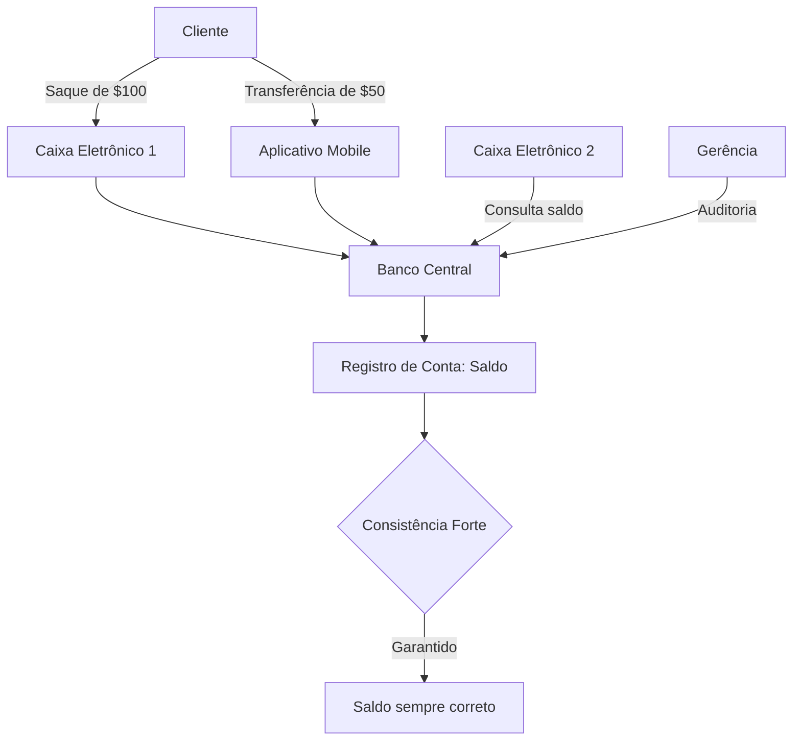
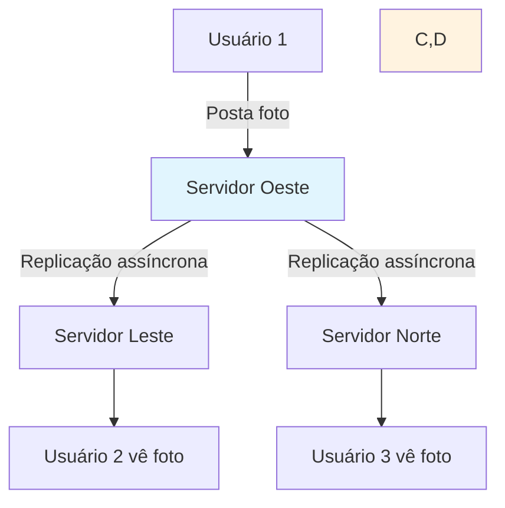

**Navegação:** [[MOC — TRILHA AVANÇADA]]
← [[PARTE 22 — DISTRIBUTED TRANSACTIONS]] | #trilha/avancada | [[PARTE 24 — CAP THEOREM]] →

---
# PARTE 23 — CONSISTENCY

> 🧠 **ESSENCIAL**
> Consistência em sistemas distribuídos refere-se à garantia de que todos os nós veem os mesmos dados ao mesmo tempo ou eventualmente convergem para o mesmo estado, apesar de falhas, latência e particionamento de rede.

> 🎯 **ENTREVISTA — ALTA FREQUÊNCIA**
> Perguntas sobre modelos de consistência (forte, eventual, causal), teorema CAP, PACELC, trade-offs entre consistência e disponibilidade, e implementação de consistência em bancos de dados distribuídos são extremamente comuns em entrevistas de arquitetura de software.

## O que é Consistência em Sistemas Distribuídos?

**Consistência** em sistemas distribuídos é a propriedade que garante que todas as réplicas de um dado ou todas as visões de um sistema estejam em acordo, ou que convergirão para acordo, apesar de operações concorrentes, falhas de nó e atrasos de rede.

Em um sistema distribuído, múltiplos nós mantêm cópias dos mesmos dados. Consistência define quando e como essas cópias devem ser idênticas ou relacionadas.

## Por que existe?

Em sistemas distribuídos, surgem desafios que tornam a consistência difícil de alcançar:

- **Latência de rede**: Comunicação entre nós leva tempo
- **Falhas parciais**: Alguns nós podem falhar enquanto outros continuam funcionando
- **Particionamento de rede**: A rede pode ser dividida, isolando grupos de nós
- **Operações concorrentes**: Múltiplas atualizações podem acontecer simultaneamente
- **Escalabilidade**: Adicionar mais nós aumenta a complexidade de manter consistência

Sem mecanismos de consistência, sistemas distribuídos podem apresentar:
- Dados diferentes em diferentes nós para o mesmo item
- Leituras obsoletas (stale reads)
- Conflitos de atualização que são difíceis de resolver
- Estado inconsistente que viola invariantes de negócio

## Problema que resolve

A consistência resolve vários problemas críticos em sistemas distribuídos:

1. **Integridade dos dados**: Garantir que os dados sejam corretos e confiáveis
2. **Previsibilidade**: Fazer com que o comportamento do sistema seja previsível para usuários e desenvolvedores
3. **Correção de negócio**: Manter invariantes de negócio (ex: saldo bancário não pode ser negativo)
4. **Experiência do usuário**: Evitar confusão quando usuários veem dados diferentes em diferentes momentos ou locais
5. **Facilidade de desenvolvimento**: Reduzir a carga cognitiva para desenvolvedores que não precisam lidar com inconsistências explícitas

## Como funciona internamente

Sistemas distribuídos implementam diversos modelos e protocolos para alcançar consistência:

### Modelos de Consistência

1. **Consistência Forte (Strong Consistency)**
   - Todos os nós veem o mesmo estado ao mesmo tempo
   - Após uma escrita, todas as leituras subsequentes veem esse valor (ou um mais recente)
   - Equivalente a comportamento de sistema single-threaded

2. **Consistência Eventual (Eventual Consistency)**
   - Se nenhuma nova atualização for feita, eventualmente todas as réplicas convergem para o mesmo estado
   - Permite janelas de inconsistência durante propagação
   - Alta disponibilidade e tolerância a particionamento

3. **Consistência Causal (Causal Consistency)**
   - Operações com relação de causa-efeito são vistas na mesma ordem por todos os nós
   - Operações simultâneas podem ser vistas em ordens diferentes
   - Mais fraco que consistência forte, mais forte que eventual

4. **Consistência de Leitura-Seu-Próprio-Escrever (Read-Your-Write)**
   - Uma entidade sempre vê suas próprias atualizações
   - Importante para experiência do usuário (ex: após postar, ver seu próprio post)

5. **Consistência Monotônica de Leitura/Gravação**
   - Leituras veem estado não-decrescente no tempo (não veem valores mais antigos depois de ver mais novos)
   - Gravações veem estado não-decrescente no tempo

### Protocolos e Técnicas

1. **Protocolos de Quorum**
   - Requer que um certo número de nós concordem com leituras e escritas
   - Configurável: R (quorum de leitura), W (quorum de escrita), N (número de réplicas)
   - Consistência forte quando R + W > N

2. **Replicação Estado da Máquina (State Machine Replication)**
   - Todos os réplicas começam no mesmo estado
   - Recebem os mesmos comandos na mesma ordem
   - Produzem os mesmos estados e saídas

3. **Controle de Versão e Vetores de Versão**
   - Cada dado tem um número de versão ou vetor de versão
   - Detecta conflitos e determina ordem causal

4. **Protocolos de Consenso (Paxos, Raft)**
   - Garantem que nós concordem sobre um valor ou sequência de valores
   - Base para muitos sistemas de consistência forte

5. **Antientropia e Reparação**
   - Processos background que detectam e corrigem inconsistências
   - Usado em sistemas eventual consistent

### Níveis de Consistência em Bancos de Dados

Bancos de dados distribuídos frequentemente oferecem níveis configuráveis:

- **STRONG**: Linearizabilidade, consistência imediata
- **BOUNDED_STALENESS**: Consistência dentro de um limite de tempo ou versões
- **SESSION**: Consistência dentro de uma sessão (inclui read-your-write, monotonic)
- **CONSISTENT_PREFIX**: Leituras veem prefixos consistentes de gravações
- **EVENTUAL**: Eventual consistency sem garantias adicionais

## Trade-offs: Teorema CAP

O teorema CAP (Consistency, Availability, Partition Tolerance) afirma que em presença de particionamento de rede, um sistema distribuído pode garantir apenas duas das três propriedades:

- **Consistência (C)**: Todos os nós veem os mesmos dados ao mesmo tempo
- **Disponibilidade (A)**: Toda requisição recebe uma resposta (não erro) em tempo finito
- **Tolerância a Particionamento (P)**: Sistema continua funcionando apesar de mensagens perdidas ou atrasadas entre nós

### Implicações do CAP

1. **CA Systems** (Consistência + Disponibilidade)
   - Não toleram particionamento de rede
   - Quando ocorre particionamento, sistemate indisponível ou inconsistente
   - Exemplos: Bancos de dados tradicionais de nó único, alguns sistemas de arquivo distribuídos

2. **CP Systems** (Consistência + Tolerância a Particionamento)
   - Sacrificam disponibilidade durante particionamento
   - Durante particionamento, podem recusar operações para manter consistência
   - Exemplos: Bancos de dados como MongoDB (em certas configurações), HBase, Redis Cluster

3. **AP Systems** (Disponibilidade + Tolerância a Particionamento)
   - Sacrificam consistência durante particionamento
   - Continuam disponíveis mas podem retornar dados inconsistentes ou obsoletos
   - Exemplos: Cassandra, DynamoDB, CouchDB, Riak

> ⚠️ **Observação Importante**: O teorema CAP é frequentemente mal interpretado. Ele só se aplica durante particionamento de rede. Em condições normais de rede, é possível ter as três propriedades.

## PACELC Theorem: Extendendo o CAP

O teorema PACELC estende o CAP considerando também trade-offs em condições normais de operação (sem particionamento):

- **Se particionamento (P)**, então escolha entre consistência (C) e disponibilidade (A)
- **Else (E)**, quando não há particionamento, escolha entre latência (L) e consistência (C)

Formally: **(P && (C vs A)) || (E && (L vs C))**

Isso significa que mesmo sem particionamento, há trade-offs entre consistência e latência/performance.

### Exemplos de PACELC

- **Sistemas que priorizam baixa latência**: Pode-se aceitar consistência mais fraca para reduzir latência de leitura/escrita
- **Sistemas que priorizam consistência**: Pode-se pagar latência maior para garantir consistência forte

## Implementação de Consistência

### Técnicas para Consistência Forte

1. **Two-Phase Commit (2PC)**
   - Como visto na parte anterior, garante atomicidade entre múltiplos nós
   - Pode ser usado para alcançar consistência forte em transações distribuídas

2. **Replicação Síncrona**
   - Escritas só são consideradas confirmadas quando réplicas suficientes confirmaram
   - Ex: Esperar por W réplicas antes de retornar sucesso de escrita

3. **Coordenação com Protocolos de Consenso**
   - Usar Raft ou Paxos para garantir que todos os nós concordem sobre ordem de operações
   - Base de sistemas como etcd, Consul, ZooKeeper

4. **Líder e Seguintes (Leader-Follower)**
   - Um nó líder recebe todas as escritas
   - Líder replica para seguidores de forma síncrona ou assíncrona
   - Leituras podem ir para líder (consistência forte) ou seguidores (possível stale)

### Técnicas para Consistência Eventual

1. **Replicação Assíncrona**
   - Escritas são confirmadas imediatamente e propagadas em background
   - Pode resultar em stale reads durante janela de propagação

2. **Resolução de Conflitos**
   - **Last-Writer-Wins (LWW)**: Usa timestamps para decidir (pode perder atualizações)
   - **Vetores de Versão**: Detecta conflitos simultâneos
   - **Replicação de Estado Conflitante Livre (CRDTs)**: Estruturas de dados que convergem automaticamente

3. **Anti-Entropia e Reparação**
   - Processos que comparam réplicas e corrigem diferenças
   - Pode ser baseado em árvores de Merkle para eficiência

### Consistência em Bancos de Dados Populares

1. **Amazon DynamoDB**
   - Oferece consistência forte e eventual configurável por leitura
   - Consistência forte: Lê líder ou quorum de réplicas
   - Consistência eventual: Lê de qualquer réplica (menor latência, maior chance de stale)

2. **Apache Cassandra**
   - Modelo ajustável de consistência baseado em quorum
   - Níveis: ANY, ONE, TWO, THREE, QUORUM, ALL, LOCAL_QUORUM, etc.
   - Permite trade-off fine-grained entre consistência, latência e disponibilidade

3. **Google Spanner**
   - Consistecia forte global usando relógios atômicos e GPS (TrueTime)
   - External consistency: Se transação T1 commit antes de T2 iniciar, T2 vê efeito de T1

4. **MongoDB**
   - Replica sets com opções de leitura: primary, primaryPreferred, secondary, secondaryPreferred, nearest
   - Write concerns: w: 1, w: majority, w: <número>, w: all

5. **Redis Cluster**
   - Particionamento com replicação assíncrona
   - Consistência eventual por padrão
   - Opções de síncrono com WAIT command

## Exemplos Práticos

### Exemplo 1: Sistema Bancário (Consistência Forte Necessária)

**Por que consistência forte?**
- Operações financeiras devem ser exatas
- Sobre-saque ou dinheiro desaparecido é inaceitável
- Regulamentações frequentemente exigem consistência ACID

### Exemplo 2: Rede Social (Consistência Eventual Aceitável)

**Por que consistência eventual aceitável?**
- Alguns segundos de atraso em ver nova postagem não afetam experiência significativamente
- Alta disponibilidade e performance são priorizadas
- Sistema pode continuar funcionando mesmo com partições de rede

### Exemplo 3: Sistema de Reserva de Hotéis (Modelo Híbrido)

**Abordagem híbrida:**
- Consistência forte para disponibilidade (evitar overbooking)
- Consistência eventual para métricas e analytics (tolerância a atraso)

## Quando Escolher Cada Modelo

### Consistência Forte Quando:
- Operações financeiras (transferências, pagamentos)
- Atualização de inventário onde over-selling causa perdas
- Sistemas onde consistência é requisito regulatório
- Operações que violariam invariantes de negócio se inconsistentes
- Experiência do usuário requer ver imediato de próprias ações

### Consistência Eventual Quando:
- Alto volume de leituras com tolerância a stale data
- Sistemas priorizando disponibilidade e performance
- Operações onde inconsistência temporária é aceitável (curtidas, visualizações)
- Sistemas geograficamente distribuídos com alta latência
- Workloads de leitura pesada onde eventual consistency melhora throughput

### Consistência Causal Quando:
- Necessário preservar relação de causa-efeito (ex: comentários em resposta a post)
- Mais forte que eventual mas com melhor performance que forte
- Aplicações de colaboração onde ordem de operações relacionadas importa

## Técnicas Avançadas

### Conflict-free Replicated Data Types (CRDTs)
- Estruturas de dados que garantem convergência automática sem coordenação
- Operações são comutativas, associativas e idempotentes
- Exemplos: Contadores, conjuntos, registros, maps, graphs
- Usados em sistemas como Riak, Redis with Redis Enterprise

### Read Repair e Anti-Entropy
- **Read Repair**: Durante leitura, detecta inconsistências e corrige réplicas obsoletas
- **Anti-Entropy**: Processo background que compara réplicas e resolve diferenças
- Frequentemente implementado usando Merkle trees para eficiência

### Version Vectors e Vector Clocks
- Rastreiam causalidade entre atualizações em diferentes réplicas
- Detectam atualizações concorrentes que precisam de resolução de conflito
- Mais eficiente que timestamps simples para detecção de concorrência

### Hybrid Logical Clocks (HLC)
- Combina vantagens de timestamps físicos e lógicos
- Mantém ordenação causal enquanto permite comparações baseadas em tempo
- Usado em sistemas como CockroachDB, Google Spanner

## Erros Comuns

### 1. Assumir que Bancos NoSQL São Sempre Eventual Consistent
- **Problema**: Muitos bancos NoSQL oferecem opções de consistência forte
- **Solução**: Verificar capacidades específicas e configurar adequadamente

### 2. Ignorar Janelas de Inconsistência em Sistemas Eventual
- **Problema**: Aplicação não trata possibilidade de ler dados obsoletos
- **Solução**: Implementar técnicas como leitura seguindo escrita, versionamento ou aceitar stale reads

### 3. Usar Consistência Forte Desnecessariamente
- **Problema**: Sobrecarga de performance e disponibilidade quando não necessário
- **Solução**: Avaliar requisitos reais e usar consistência mais fraca quando apropriado

### 4. Esquecer de Particionamento de Rede
- **Problema**: Sistema não projetado para lidar com falhas de rede
- **Solução**: Projetar para degradar graciosamente durante partições (escolher entre C e A no CAP)

### 5. Confundir Modelos de Consistência
- **Problema**: Aplicar erradamente consistência forte quando eventual seria suficiente (ou vice-versa)
- **Solução**: Entender profundamente as garantias de cada modelo e testar cenários de falha

## Como isso aparece em System Design

### Decisões sobre Consistência em Entrevistas de System Design

**Quando discutir consistência:**
- Sempre que houver menção a múltiplas cópias de dados ou réplicas
- Quando discutir bancos de dados distribuídos ou caches
- Antes de escolher entre diferentes soluções de armazenamento
- Quando estimar latência, disponibilidade ou correção de dados
- Ao analisar trade-offs entre consistência, performance e disponibilidade

**Como justificar escolhas de modelo de consistência:**
1. **Natureza dos dados**: Quão crítica é a precisão imediata?
2. **Padrão de acesso**: Leitura pesada vs escrita pesada?
3. **Experiência do usuário**: Usuários notarão inconsistências?
4. **Volume e escala**: Quantas operações por segundo e distribuição geográfica?
5. **Requisitos de negócio**: O que acontece se dados estiverem temporariamente inconsistentes?
6. **Disponibilidade requerida**: Sistema pode tolerar indisponibilidade para manter consistência?

**Exemplos de discussão em entrevistas:**
- "Para um sistema de leaderboard de jogo, usaremos consistência eventual pois pequenos atrasos na atualização de pontuação não afetam experiência significativamente, e queremos alta taxa de leitura global"
- "Para o módulo de transferência bancária, exigimos consistência forte pois até mesmo microssegundos de inconsistência podem levar a perda ou duplicação de dinheiro"
- "Para um sistema de comentários em rede social, usaremos consistência causal para garantir que respostas apareçam após seus posts pais, enquanto permitimos que comentários em diferentes threads sejam vistos em ordens diferentes"

### Perguntas de Entrevista Comuns

#### Básicas
- "O que é consistência forte vs consistência eventual?"
- "Explique o teorema CAP"
- "Qual a diferença entre consistência e disponibilidade?"

#### Intermediárias
- "Como você implementaria consistência forte em um banco de dados distribuído?"
- "Explique como o DynamoDB consegue oferecer tanto consistência forte quanto eventual"
- "Quais são as técnicas para resolver conflitos em sistemas eventual consistent?"

#### Avançadas
- "Como você projetaria um sistema que precisa consistência forte para algumas operações e eventual para outras?"
- "Discuta trade-offs entre usar quorum rígido vs quorum flexível para consistência"
- "Como você lida com o problema do relógio em sistemas distribuídos para manter consistência?"

#### Follow-ups Típicos
- "E se precisássemos consistência linearizável em escala global?"
- "Como você validaria que seu sistema está mantendo o modelo de consistência prometido?"
- "Qual seria sua estratégia para migrar de consistência eventual para forte sem downtime?"
- "E se a latência de rede entre data centers for muito alta para quorums tradicionais?"

## Checklist de Consistência

### Antes de Escolher um Modelo de Consistência
- [ ] Definir requisitos de consistência baseado na natureza dos dados e operações
- [ ] Avaliar tolerância a inconsistência temporária no contexto de negócio
- [ ] Determinar volume de leituras vs escritas e padrões de acesso
- [ ] Considerar distribuição geográfica e latência de rede esperada
- [ ] Avaliar requisitos de disponibilidade e performance
- [ ] Pesquisar capacidades de consistência das tecnologias candidatas
- [ ] Planejar testes para validar comportamento de consistência sob carga e falhas

### Durante Projeto e Implementação
- [ ] Configurar níveis de consistência apropriados para diferentes operações
- [ ] Implementar tratamento adequado de possíveis inconsistências (se usando eventual)
- [ ] Garantir que operações sejam idempotentes quando necessário
- [ ] Implementar monitoramento de métricas de consistência (stale reads, conflitos, etc.)
- [ ] Projetar para degradar graciosamente durante particionamento de rede
- [ ] Documentar decisões de consistência e razões por trás delas
- [ ] Implementar tracing distribuído para entender fluxo de dados entre réplicas

### Após Implementação e em Produção
- [ ] Monitorar taxa de stale reads e janelas de inconsistência
- [ ] Rastrear latência de operações em diferentes níveis de consistência
- [ ] Alertar sobre aumentos em conflitos ou falhas de resolução
- [ ] Verificar que SLAs de consistência estão sendo atendidos
- [ ] Testar periodicamente procedimentos de recuperação e consistência após falhas
- [ ] Revisar se escolha de modelo ainda é apropriada baseado em mudanças de uso ou volume
- [ ] Coletar feedback de usuários sobre percepção de consistência e correção

## Resumo

Consistência em sistemas distribuídos é um conceito fundamental que envolve trade-offs complexos entre correção, disponibilidade, performance e tolerância a falhas:

**Princípios-chave:**
1. Não existe solução única - escolha de modelo de consistência depende dos requisitos específicos
2. Teorema CAP descreve trade-offs durante particionamento de rede
3. Teorema PACELC estende o conceito para incluir trade-offs de latência mesmo sem particionamento
4. Sistemas modernos frequentemente usam abordagens híbridas (diferentes consistência para diferentes operações)
5. Tecnologia oferece diversos pontos no espectro entre consistência forte e eventual
6. Medir e monitorar consistência é crucial para garantir que o sistema se comporte como esperado
7. A consistência perfeita é aquela que atende aos requisitos de negócio com o menor custo possível em termos de disponibilidade, performance e complexidade

- [ ] Lembre-se: A escolha de modelo de consistência deve ser baseada em evidências de requisitos reais, não em preferências teóricas ou tendências da indústria