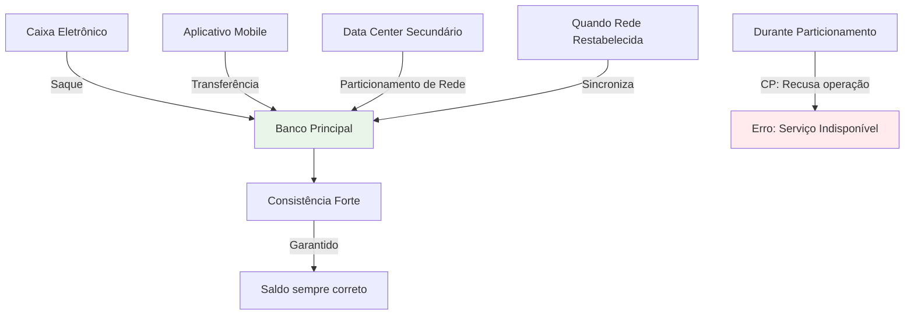
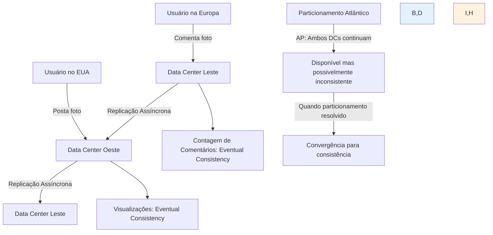
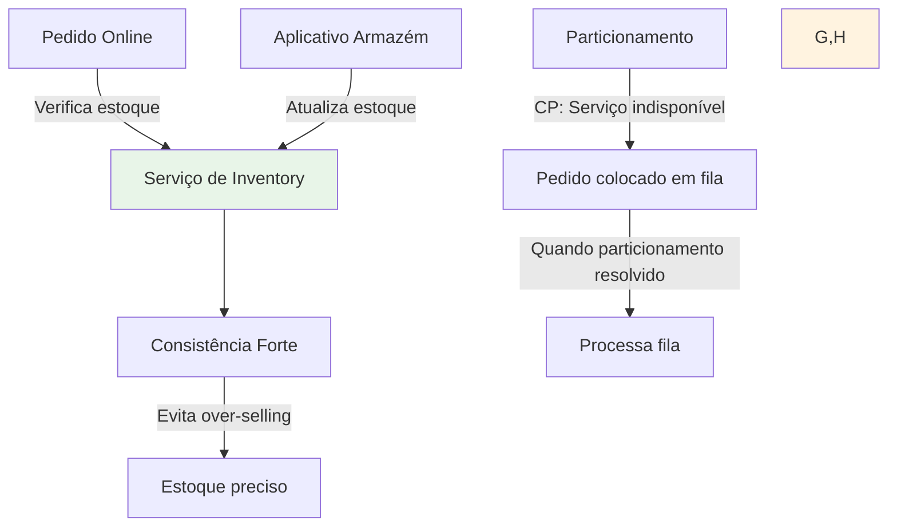
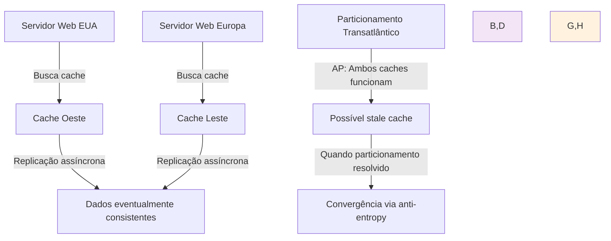

**Navegação:** [[MOC — TRILHA AVANÇADA]]
← [[PARTE 23 — CONSISTENCY]] | #trilha/avancada | [[PARTE 25 — PACELC]] →

---
# PARTE 24 — CAP TEOREM

> 🧠 **ESSENCIAL**
> O teorema CAP estabelece que em um sistema de armazenamento de dados distribuído, é possível garantir apenas duas das três propriedades: Consistência (Consistency), Disponibilidade (Availability) e Tolerância a Particionamento (Partition Tolerance) simultaneamente.

> 🎯 **ENTREVISTA — ALTA FREQUÊNCIA**
> Perguntas sobre o teorema CAP, suas implicações práticas, exemplos de sistemas CA, CP e AP, e como escolher entre trade-offs são extremamente comuns em entrevistas de arquitetura de software.

## O que é o Teorema CAP?

O teorema CAP, também conhecido como teorema de Brewer, foi proposto por Eric Brewer em 2000 e posteriormente provado por Seth Gilbert e Nancy Lynch em 2002. Ele estabelece limites fundamentais para sistemas distribuídos.

**Teorema CAP**: Em um sistema de armazenamento de dados distribuído, é impossível simultaneamente garantir mais que duas das seguintes três propriedades:

1. **Consistência (Consistency)**: Toda leitura recebe a escrita mais recente ou um erro
2. **Disponibilidade (Availability)**: Toda requisição recebe uma resposta (não erro) em tempo finito
3. **Tolerância a Particionamento (Partition Tolerance)**: O sistema continua funcionando apesar de perda arbitrária de mensagens entre nós devido a falha de rede

## Por que existe?

À medida que sistemas evoluíram para arquiteturas distribuídas, engenheiros perceberam que certas garantias são mutuamente exclusivas na presença de falhas de rede. O teorema CAP formaliza essa observação e ajuda arquitetos a fazerem escolhas conscientes sobre trade-offs.

### Contexto Histórico

- Antes dos sistemas distribuídos modernos, bancos de dados eram principalmente de nó único
- Com o crescimento da internet e aplicações web de escala, surgiu necessidade de distribuir dados
- Engenheiros inicialmente assumiram que poderia-se ter os três propriedades simultaneamente
- Experiência prática mostrou que em presença de partições de rede, trade-offs são inevitáveis
- O teorema CAP fornece um framework para entender esses limites fundamentais

## Problema que resolve

O teorema CAP resolve vários problemas de compreensão e projeto em sistemas distribuídos:

1. **Clarifica trade-offs fundamentais**: Mostra que não se pode ter tudo em sistemas distribuídos
2. **Orienta decisões de projeto**: Ajuda a escolher quais propriedades priorizar baseado nos requisitos
3. **Evita expectativas irrealistas**: Impede promessas de sistemas que são teoricamente impossíveis
4. **Fornece vocabulário comum**: Cria terminologia padronizada para discutir características de sistemas distribuídos
5. **Base para avaliação de tecnologias**: Permite comparar bancos de dados e sistemas distribuídos baseado em quais propriedades eles garantem

## Como funciona internamente

O teorema CAP é baseado em modelos formais de sistemas distribuídos e prova por contradição que não é possível satisfazer as três propriedades simultaneamente na presença de particionamento de rede.

### Definições Formais

Para entender o teorema, precisamos definir exatamente o que cada propriedade significa:

#### Consistência (Consistency)
- **Linearizabilidade**: Toda operação parece ter ocorrido instantaneamente em algum ponto entre sua invocação e resposta
- Após uma escrita bem-sucedida, todas as leituras subsequentes (por qualquer cliente) devem retornar esse valor ou um mais recente
- Equivalente a comportamento de um único nó atualizado atomicamente

#### Disponibilidade (Availability)
- Toda requisição recebida por um nó não falho deve resultar em uma resposta
- A resposta não pode ser um erro (como timeout ou falha)
- Deve ser concluída em tempo finito (não pode ficar esperando indefinidamente)
- Cada nó deve ser capaz de responder requisições mesmo quando outros nós estão indisponíveis

#### Tolerância a Particionamento (Partition Tolerance)
- O sistema continua a funcionar apesar de perdas arbitrárias de mensagens entre nós
- Particionamento de rede ocorre quando a rede se divide em duas ou mais partições que não conseguem se comunicar
- O serviço deve continuar disponível e consistente dentro de cada particionamento
- Não assume que a rede é confiável; parte do pressuposto de que partições podem acontecer

### Prova por Contradição (Esboço)

1. **Assumir** que existe um sistema que satisfaz Consistência, Disponibilidade e Tolerância a Particionamento
2. **Considerar** um particionamento de rede que divide os nós em dois grupos: G1 e G2
3. **Um cliente** escreve valor V1 em um nó em G1
4. **Devido ao particionamento**, G2 não pode receber a atualização imediatamente
5. **Para manter Disponibilidade**, um nó em G2 deve responder leituras (mesmo sem ter recebido V1)
6. **Para manter Consistência**, qualquer leitura após a escrita deve retornar V1 ou mais recente
7. **Contraditório**: Se G2 retorna valor antigo V0, viola Consistência; se G2 retorna erro ou espera, viola Disponibilidade
8. **Portanto**, não é possível satisfazer as três propriedades simultaneamente

### Implicações da Prova

- O teorema só se aplica **durante particionamentos de rede**
- Quando não há particionamento, é teoricamente possível ter as três propriedades
- A escolha entre as propriedades só precisa ser feita quando ocorre um particionamento
- Sistemas podem ser projetados para otimizar diferentes propriedades em diferentes condições

## Tipos de Sistemas Baseados no CAP

Com base no teorema CAP, sistemas distribuídos podem ser classificados em três categorias (embora na prática, muitos sistemas ofereçam configurações ajustáveis):

### 1. Sistemas CA (Consistência + Disponibilidade)
- **Não toleram particionamento de rede**
- Quando ocorre particionamento, o sistema se torna indisponível ou inconsistente
- Geralmente são sistemas de nó único ou clusters com rede confiável
- **Exemplos**: 
  - Bancos de dados relacionais tradicionais (PostgreSQL, MySQL em nó único)
  - Alguns sistemas de arquivo distribuídos com rede de backend confiável
  - Sistemas onde toda a infraestrutura está em um único data center com rede redundante

#### Características dos Sistemas CA
- Fornecem consistência forte e alta disponibilidade quando a rede está íntegra
- Durante particionamento, podem recusar operações ou retornar erros
- Simples de entender e raciocinar (comportamento semelhante a sistema single-node)
- Vulneráveis a falhas de rede que afetam a disponibilidade

### 2. Sistemas CP (Consistência + Tolerância a Particionamento)
- **Sacrificam disponibilidade durante particionamento**
- Durante particionamento, podem recusar operações para manter consistência
- Garantem que dados sejam consistentes dentro de cada particionamento
- **Exemplos**:
  - MongoDB (em certas configurações de write concern e read preference)
  - HBase
  - Redis Cluster
  - etcd
  - ZooKeeper
  - Google Spanner (oferece consistência forte global)

#### Características dos Sistemas CP
- Priorizam corretude dos dados sobre disponibilidade durante partições
- Durante particionamento, algumas partições podem ficar indisponíveis
- Mais complexos devido aos mecanismos de consenso necessários
- Adequados para aplicações onde consistência é crítica (financeira, inventário)

### 3. Sistemas AP (Disponibilidade + Tolerância a Particionamento)
- **Sacrificam consistência durante particionamento**
- Continuam disponíveis mas podem retornar dados inconsistentes ou obsoletos
- Eventualmente convergem para consistência quando particionamento é resolvido
- **Exemplos**:
  - Apache Cassandra
  - Amazon DynamoDB (configuração padrão)
  - CouchDB
  - Riak
  - Elasticsearch

#### Características dos Sistemas AP
- Priorizam disponibilidade e tolerância a falhas
- Durante particionamento, continuam aceitando leituras e escritas (possivelmente conflitantes)
- Requerem mecanismos de resolução de conflito quando partições se reunem
- Adequados para aplicações onde disponibilidade é crítica e alguma inconsistência é tolerável

## MAL-ENTENDIDOS COMUNS SOBRE O TEOREMA CAP

É importante esclarecer alguns mal-entendidos comuns sobre o teorema CAP:

### 1. "CAP significa que você deve escolher exatamente duas propriedades"
- **Correção**: Durante particionamento, você pode ter no máximo duas propriedades
- Quando não há particionamento, é possível ter as três propriedades
- A escolha só é relevante durante particionamentos de rede

### 2. "Todos os nós devem ter o mesmo comportamento em relação ao CAP"
- **Correção**: Diferentes nós no mesmo sistema podem ter comportamentos diferentes
- Alguns sistemas permitem configuração por operação ou por cliente
- Ex: DynamoDB permite escolher consistência forte ou eventual por leitura

### 3. "CAP se aplica a todos os tipos de sistemas distribuídos"
- **Correção**: CAP se aplica especificamente a sistemas de armazenamento de dados distribuídos
- Outros tipos de sistemas distribuídos (sistemas de computação, sistemas de mensagens) podem ter diferentes trade-offs

### 4. "Consistência no CAP é a mesma que consistência ACID"
- **Correção**: Consistência no CAP se refere à linearizabilidade (consistência forte)
- É mais forte que alguns níveis de consistência ACID, mas não abrange todas as propriedades ACID
- Sistemas podem ser consistentes no sentido CAP mas não transacionais ACID

### 5. "Depois de escolher um tipo CAP, você fica preso com ele para sempre"
- **Correção**: Muitos sistemas modernos oferecem ajustabilidade
- Ex: Cassandra permite níveis de consistência configuráveis por operação
- Ex: DynamoDB permite escolher entre consistência forte e eventual por leitura

## EXEMPLOS PRÁTICOS E ESTUDOS DE CASO

### Exemplo 1: Sistema Bancário (Escolha CP)

**Por que CP?**
- Consistência forte é crítica para evitar sobre-saque ou duplicação de transações
- Durante particionamento, preferir indisponibilidade a correção incorreta de dados
- Clientes podem tentar novamente ou usar alternativa quando serviço estiver disponível

### Exemplo 2: Plataforma de Mídia Social (Escolha AP)

**Por que AP?**
- Disponibilidade global é crítica para experiência do usuário
- Alguns segundos de inconsistência em contagem de visualizações/comentários são toleráveis
- Sistema continua funcionando mesmo com problemas de rede intercontinental

### Exemplo 3: Sistema de Inventory em Tempo Real (Escolha CP com otimizações)

**Por que CP?**
- Over-selling causa perdas financeiras diretas e insatisfação do cliente
- Durante particionamento, melhor recusar venda do que vender item não disponível
- Filas de pedido permitem recuperação graceful quando particionamento ends

### Exemplo 4: Sistema de Cache Distribuído (Escolha AP)

**Por que AP?**
- Stale cache geralmente resulta em desempenho ligeiramente reduzido, não falha crítica
- Disponibilidade de cache é mais importante que perfeição imediata
- Mecanismos de anti-entropy garantem convergência eventual

## QUANDO ESCOLHER CADA MODELO

### Escolha CA quando:
- Todo o sistema está em um único local com rede altamente confiável
- Falhas de rede são raras e podem ser tratadas como eventos catastróficos
- Simplicidade de operação e compreensão é prioridade máxima
- Exemplos: Sistemas legados migrados para nuvem sem mudança de arquitetura, bancos de dados de nó único com réplicas de backup síncronas

### Escolha CP quando:
- Consistência dos dados é mais importante que disponibilidade
- Operações financeiras, atualizações de inventário, ou qualquer situação onde inconsistência causa perda direta
- Sistema pode tolerar indisponibilidade temporária durante partições de rede
- Exemplos: Sistemas bancários, processamento de pagamentos, gestão de inventory crítico

### Escolha AP quando:
- Disponibilidade é mais importante que consistência imediata
- Sistema deve continuar funcionando apesar de falhas de rede
- Inconsistência temporária é tolerável ou pode ser resolvida posteriormente
- Exemplos: Plataformas de conteúdo, métricas e analytics, sistemas de recomendação, caches distribuídos

## O TEOREMA CAP NA PRÁTICA: CONFIGURABILIDADE E NÍVEIS

Muitos sistemas distribuídos modernos não se encaixam rigidamente em uma categoria CAP, mas oferecem configurabilidade:

### Níveis de Consistência Ajustáveis

#### Apache Cassandra
- Níveis: ANY, ONE, TWO, THREE, QUORUM, ALL, LOCAL_QUORUM, EACH_QUORUM, SERIAL, LOCAL_SERIAL
- Permite trade-off fine-grained por operação
- Ex: QUORUM para consistência forte, ONE para baixa latência e maior disponibilidade

#### Amazon DynamoDB
- Leitura consistente forte vs eventual (consistência forte consome mais capacidade de leitura)
- Write sempre consistente forte dentro da região de escrita
- Configurável por operação de leitura

#### MongoDB
- Write concern: w: 1, w: majority, w: <número>
- Read preference: primary, primaryPreferred, secondary, secondaryPreferred, nearest
- Permite ajustar consistência vs latência vs disponibilidade

### Consistência Eventual com Garantias

Muitos sistemas AP oferecem garantias além da consistência eventual básica:

- **Leitura seguindo escrita (Read-your-write)**: Garante que uma entidade veja suas próprias escritas
- **Leitura monotônica**: Garante que leituras vejam estado não-decrescente no tempo
- **Consistência de sessão**: Garantias dentro de uma sessão de cliente
- **Consistência com limite de temporalidade**: Garante consistência dentro de um intervalo de tempo

## O TEOREMA PACELC: EXTENDENDO O CAP

Como mencionado anteriormente, o teorema PACELC estende o CAP considerando também trade-offs em condições normais de operação:

**PACELC**: Se particionamento (P), então escolha entre consistência (C) e disponibilidade (A); senão (E), escolha entre latência (L) e consistência (C).

Isso reconhece que mesmo sem particionamento, há trade-offs entre consistência e latência/performance.

### Exemplos de PACELC em Ação

#### Sistema que prioriza baixa latência (PA/EL)
- Durante particionamento: Prioriza disponibilidade (A)
- Sem particionamento: Prioriza baixa latência (L) sobre consistência (C)
- Ex: Sistema de líderboard de jogo onde pequenos atrasos na atualização são aceitáveis

#### Sistema que prioriza consistência (PC/EC)
- Durante particionamento: Prioriza consistência (C)
- Sem particionamento: Prioriza consistência (C) sobre baixa latência (L)
- Ex: Sistema de transações financeiras onde consistência sempre é prioridade

## IMPACTO EM DIFERENTES ASPECTOS DO SISTEMA

### Performance
- **CP**: Latência potencialmente maior devido a requisitos de quorum e coordenação
- **AP**: Geralmente menor latência para leituras (pode ler de réplica mais próxima)
- **CA**: Performance depende da implementação, mas pode ser otimizado quando rede é confiável

### Escalabilidade
- **CP**: Escalabilidade de escrita pode ser limitada por requisitos de coordenação
- **AP**: Geralmente melhor escalabilidade de escrita e leitura
- **CA**: Escalabilidade limitada pela confiabilidade da rede subjacente

### Disponibilidade
- **CP**: Reduzida durante particionamentos (algumas partições podem ficar indisponíveis)
- **AP**: Alta disponibilidade mesmo durante particionamentos
- **CA**: Alta disponibilidade quando rede está íntegra, zero disponibilidade durante particionamento

### Complexidade Operacional
- **CP**: Mais complexa devido a necessidade de lidar com partições indisponíveis e recuperação
- **AP**: Complexidade em resolução de conflito e tratamento de inconsistência
- **CA**: Mais simples quando rede confiável, mas requer planejamento para falhas de rede

## COMO ISSO APARECE EM SYSTEM DESIGN

### Quando discutir CAP em entrevistas de system design:
- Sempre que houver menção a múltiplos data centers ou distribuição geográfica
- Quando discutir bancos de dados distribuídos ou sistemas de armazenamento
- Antes de escolher entre diferentes soluções de tecnologia (Cassandra vs MongoDB vs PostgreSQL, etc.)
- Quando estimar requisitos de disponibilidade, consistência ou tolerância a falhas
- Ao analisar trade-offs entre performance, disponibilidade e correção

### Como justificar escolhas baseadas no CAP:
1. **Natureza das operações**: Quão crítica é a consistência imediata vs disponibilidade?
2. **Padrão de falhas esperadas**: Quão provável é particionamento de rede?
3. **Experiência do usuário**: O que acontece se o sistema ficar indisponível vs retornar dados inconsistentes?
4. **Volume e escala**: Quantas operações por segundo e distribuição geográfica?
5. **Requisitos de negócio**: Qual o custo de inconsistência vs indisponibilidade?
6. **Localização geográfica**: Usuários distribuídos globalmente vs concentração regional?

### Exemplos de discussão em entrevistas:
- "Para um sistema de reservas de hotéis global, escolhemos CP porque overbooking causa perdas financeiras diretas e insatisfação do cliente, e preferimos indisponibilidade temporária a vender quartos que não temos"
- "Para um sistema de contagem de visualizações de vídeos, escolhemos AP porque pequenos atrasos na contagem são toleráveis e queremos que o sistema continue funcionando mesmo com problemas de rede entre data centers"
- "Para um cache distribuído de conteúdo estático, escolhemos AP porque stale content geralmente resulta apenas em desempenho ligeiramente reduzido, e a disponibilidade de cache é crítica para performance do site"

## PERGUNTAS DE ENTREVISTA COMUNS

### Básicas
- "O que é o teorema CAP e quais são suas três propriedades?"
- "Você pode ter um sistema que seja CA, CP e AP ao mesmo tempo? Explique."
- "Explique a diferença entre consistência forte e eventual consistente."

### Intermediárias
- "Como você explicaria o teorema CAP para um gerente de produto não-técnico?"
- "Dê exemplos de sistemas reais que se enquadram em cada categoria CA, CP e AP."
- "Como o teorema PACELC estende o teorema CAP?"

### Avançadas
- "Como você projetaria um sistema que precisa se comportar como CP em algumas operações e AP em outras?"
- "Discuta as limitações do teorema CAP na prática moderna de sistemas distribuídos."
- "Como você lida com o teorema CAP em sistemas de múltiplos modelos (multi-model databases)?"

### Follow-ups Típicos
- "E se precisássemos de consistência linearizável em escala global com baixa latência?"
- "Como você validaria que seu sistema está se comportando como esperado sob particionamento de rede?"
- "Qual seria sua estratégia para migrar de um sistema AP para um CP sem downtime?"
- "E se a latência entre data centers for tão alta que quorums tradicionais sejam impraticáveis?"

## CHECKLIST DE APLICAÇÃO DO TEOREMA CAP

### Antes de Projetar um Sistema Distribuído
- [ ] Entender claramente os requisitos de consistência, disponibilidade e tolerância a falhas
- [ ] Analisar padrões esperados de particionamento de rede na infraestrutura alvo
- [ ] Avaliar o custo de negócio de inconsistência vs indisponibilidade
- [ ] Determinar se o sistema precisa se comportar diferente durante vs fora de particionamento
- [ ] Pesquisar tecnologias candidatas e suas garantias CAP
- [ ] Planejar testes para validar comportamento sob particionamento de rede simulado

### Durante Projeto e Implementação
- [ ] Escolher tecnologia ou configurar níveis de consistência apropriados aos requisitos
- [ ] Implementar monitoramento para detectar particionamentos de rede e respostas do sistema
- [ ] Documentar decisões de trade-off CAP e razões por trás delas
- [ ] Projetar tratamento adequado de casos de particionamento (falha graciosa, filas, etc.)
- [ ] Se usando sistema configurável, implementar mecanismos para ajustar comportamento dinamicamente
- [ ] Implementar tracing distribuído para entender comportamento durante partições

### Após Implementação e em Produção
- [ ] Monitorar métricas de disponibilidade, latência e taxas de erro
- [ ] Rastrear ocorrências de particionamento de rede e respostas do sistema
- [ ] Alertar sobre desvios do comportamento CAP esperado (ex: sistema AP recusando operações durante particionamento)
- [ ] Testar periodicamente procedimentos de recuperação e comportamento pós-particionamento
- [ ] Revisar se escolhas de trade-off CAP ainda são apropriadas baseado em mudanças de uso, volume ou requisitos de negócio
- [ ] Coletar feedback de usuários sobre percepção de disponibilidade e correção

## RESUMO

O teorema CAP é um conceito fundamental em sistemas distribuídos que estabelece limites teóricos sobre o que é possível alcançar em termos de consistência, disponibilidade e tolerância a particionamento:

**Princípios-chave:**
1. Durante particionamentos de rede, um sistema distribuído pode garantir no máximo duas das três propriedades CAP
2. A escolha entre consistência e disponibilidade durante particionamentos é uma decisão de negócio crítica
3. Muitos sistemas modernos oferecem configurabilidade para ajustar trade-offs baseado nas necessidades específicas
4. O teorema PACELC estende o conceito para incluir trade-offs de latência mesmo sem particionamento
5. Sistemas do mundo real frequentemente exibem comportamento híbrido ou adaptável baseado nas condições
6. Entender o CAP ajuda arquitetos a fazerem escolhas informadas e evitarem expectativas irrealistas
7. O teorema CAP não é uma sentença de destino, mas um framework para entender trade-offs fundamentais

- [ ] Lembre-se: O teorema CAP descreve o que é possível durante particionamentos de rede; engenheiros experientes sabem que a arte do projeto de sistemas distribuídos está em como lidar com essas limitações de forma criativa e pragmática para atender aos requisitos de negócio reais.