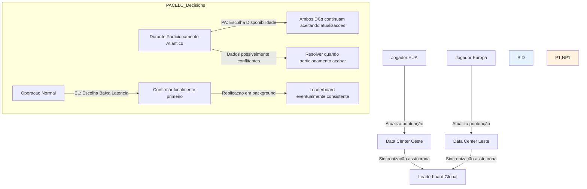
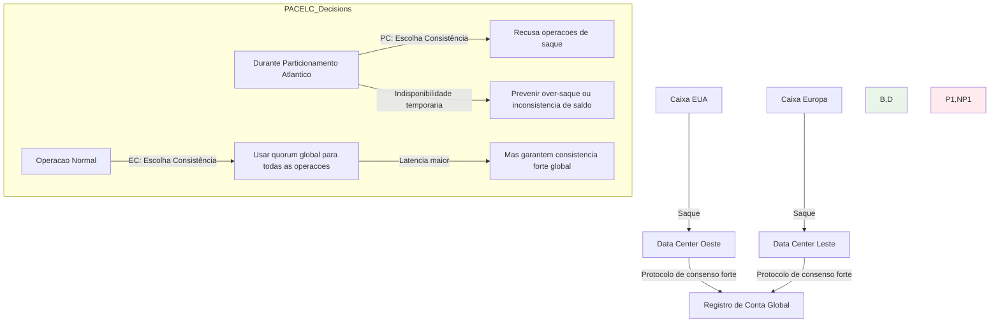
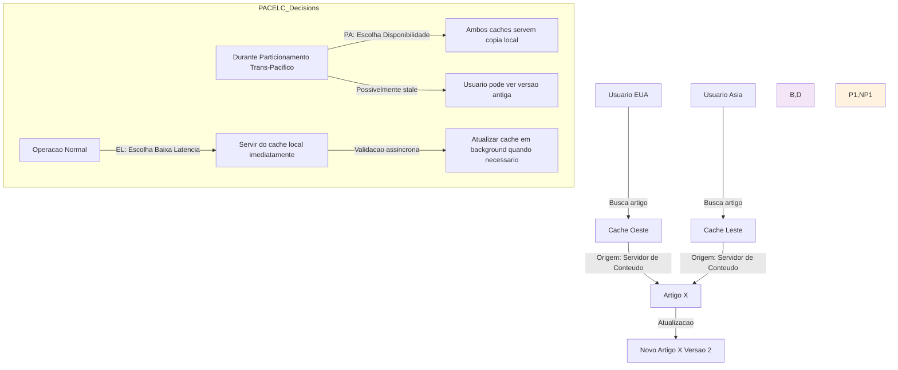

**Navegação:** [[MOC — TRILHA AVANÇADA]]
← [[PARTE 24 — CAP THEOREM]] | #trilha/avancada | [[PARTE 26 — DISTRIBUTED SYSTEMS]] →

---
# PARTE 25 — PACELC

> 🧠 **ESSENCIAL**
> O teorema PACELC estende o teorema CAP considerando também trade-offs entre latência e consistência em condições normais de operação (sem particionamento de rede), além do trade-off entre consistência e disponibilidade durante particionamentos.

> 🎯 **ENTREVISTA — MÉDIA FREQUÊNCIA**
> Perguntas sobre o teorema PACELC, suas diferenças em relação ao CAP, e como ele afeta decisões de projeto em sistemas distribuídos são comuns em entrevistas de arquitetura de software, especialmente para cargos sênior.

## O que é o Teorema PACELC?

O teorema PACELC foi proposto por Daniel Abadi em 2009 como uma extensão do teorema CAP. Ele aborda uma limitação do CAP: o fato de que o teorema CAP só se aplica durante particionamentos de rede, deixando de descrever trade-offs que ocorrem mesmo quando o sistema está funcionando normalmente.

**Teorema PACELC**: Se particionamento (P) ocorre, então escolha entre consistência (C) e disponibilidade (A); senão (E), quando o sistema está operando normalmente sem particionamento, escolha entre latência (L) e consistência (C).

Formally: **(P ∧ (C vs A)) ∨ (¬P ∧ (L vs C))**

Isso significa que existem dois tipos de trade-offs que os arquitetos de sistemas distribuídos precisam considerar:
1. **Durante particionamento de rede**: Trade-off entre consistência e disponibilidade (mesmo que no CAP)
2. **Durante operação normal (sem particionamento)**: Trade-off entre latência e consistência

## Por que existe?

O teorema PACELC existe porque o teorema CAP, embora fundamental, não conta toda história sobre trade-offs em sistemas distribuídos. Enquanto o CAP descreve o que acontece durante falhas de rede, o PACELC descreve o que acontece durante a operação normal do sistema.

### Limitações do CAP que o PACELC aborda:

1. **CAP só se aplica durante particionamentos**: Muitos sistemas gastam a maior parte do tempo operando normalmente, sem particionamentos de rede
2. **Não descreve trade-offs de desempenho**: Mesmo sem particionamentos, há trade-offs entre consistência e latência/performance
3. **Assumir binariedade durante particionamento**: Na prática, durante particionamentos, sistemas podem ter comportamentos mais complexos do que simplesmente escolher C ou A
4. **Não considera diferentes tipos de consistência**: O PACELC permite pensar em níveis de consistência além da dicotomia forte/eventual

## Problema que resolve

O teorema PACELC resolve vários problemas de compreensão e projeto em sistemas distribuídos:

1. **Fornece visão mais completa**: Descreve trade-offs tanto durante falhas quanto durante operação normal
2. **Orienta otimizações de desempenho**: Ajuda a entender como consistência afeta latência mesmo em sistemas saudáveis
3. **Permite ajustes finos**: Em vez de escolher entre apenas três categorias rígidas (CA, CP, AP), permite pensar em pontos ao longo de espectros
4. **Melhor alinhamento com realidade prática**: Reflete melhor como sistemas distribuídos modernos se comportam e são configurados
5. **Base para tomada de decisão mais informada**: Ajuda arquitetos a fazerem escolhas baseadas em requisitos específicos de latência vs consistência

## Como funciona internamente

O teorema PACELC é baseado na observação de que em sistemas distribuídos, existem dois contextos diferentes onde trade-offs ocorrem:

### Contexto 1: Durante Particionamento de Rede (P)
Quando ocorre um particionamento de rede, o teorema CAP se aplica:
- É necessário escolher entre consistência (C) e disponibilidade (A)
- Sistemas CP recusam operações para manter consistência
- Sistemas AP continuam disponíveis mas podem retornar dados inconsistentes

### Contexto 2: Durante Operação Normal (Sem Particionamento) (¬P)
Quando não há particionamento de rede, ainda existem trade-offs:
- É necessário escolher entre latência (L) e consistência (C)
- Maior consistência geralmente requer mais coordenação, aumentando latência
- Menor latência pode ser alcançada reduzindo requisitos de consistência

### A Intuição Por Trás do PACELC

Mesmo em sistemas perfeitamente funcionando (sem perdas de pacotes, atrasos ou particionamentos), há razões fundamentais pelas quais consistência e latência estão em tensão:

1. **Coordenamento é caro**: Para garantir consistência forte, nós frequentemente precisam se comunicar e concordar antes de prosseguir
2. **Leis da física**: Sinais levam tempo para propagar-se através da rede; esperar por confirmações de nós distantes aumenta latência
3. **Trade-off de protocolo**: Protocolos que garantem consistência forte (como 2PC, Paxos, Raft) envolvem múltiplas rodadas de comunicação
4. **Escalabilidade vs consistência**: Sistemas altamente consistentes frequentemente têm gargalos de coordenação que limitam escalabilidade

## Exemplo Ilustrativo do PACELC

Considere um banco de dados distribuído com réplicas em múltiplos data centers:

### Durante Particionamento (P):
- Se o link entre data centers cair:
  - **Escolha C (Consistência)**: Sistema recusa escritas até que particionamento seja resolvido (indisponibilidade)
  - **Escolha A (Disponibilidade)**: Sistema permite escritas em cada data center independentemente (risco de conflito)

### Durante Operação Normal (¬P):
- Quando todos os links estão funcionando:
  - **Escolha C (Consistência)**: Esperar por confirmação de todas as réplicas antes de confirmar escrita (latência maior)
  - **Escolha L (Latência)**: Confirmar escrita assim que réplica local aceitar (latência menor, risco de stale reads)

## Exemplos Práticos de Aplicação do PACELC

### Exemplo 1: Sistema de Leaderboard de Jogo (PA/EL)

**Decisões PACELC:**
- **Durante particionamento (PA)**: Prioriza disponibilidade (A) - continua aceitando atualizações em ambos os data centers
- **Durante operação normal (EL)**: Prioriza baixa latência (L) - confirma atualizações localmente primeiro, replicando em background

**Por quê?**
- Pequenos atrasos na atualização do leaderboard global são toleráveis
- Jogadores esperam resposta imediata quando atualizam sua pontuação
- Sistema pode lidar com conflitos de leaderboard quando particionamento ends

### Exemplo 2: Sistema Bancário Global (PC/EC)

**Decisões PACELC:**
- **Durante particionamento (PC)**: Prioriza consistência (C) - recusa operações de saque
- **Durante operação normal (EC)**: Prioriza consistência (C) - usa quorum global para garantir consistência forte

**Por quê?**
- Consistência forte é crítica para evitar sobre-saque ou perda de dinheiro
- Latência maior é aceitável dada a criticalidade das operações financeiras
- Clientes preferem indisponibilidade temporária a incorreção em suas contas

### Exemplo 3: Sistema de Cache de Conteúdo (PA/EL)

**Decisões PACELC:**
- **Durante particionamento (PA)**: Prioriza disponibilidade (A) - continua servindo do cache local
- **Durante operação normal (EL)**: Prioriza baixa latência (L) - serve do cache imediatamente, valida em background

**Por quê?**
- Stale conteúdo geralmente resulta apenas em desempenho ligeiramente reduzido, não falha crítica
- Latência de cache é crítica para experiência do usuário
- Mecanismos de validação assíncrona mantêm o cache razoavelmente atualizado

## QUANDO APLICAR CADA COMBINAÇÃO PACELC

### PA/EL (Particionamento→Disponibilidade, Normal→Latência)
- **Característica**: Prioriza disponibilidade durante particionamentos e baixa latência durante operação normal
- **Quando usar**: 
  - Aplicações onde experiência do usuário é crítica (resposta rápida importante)
  - Inconsistência temporária é tolerável
  - Exemplos: Leaderboards, feeds de redes sociais, contagens de visualizações, caches, sistemas de recomendação

### PC/EC (Particionamento→Consistência, Normal→Consistência)
- **Característica**: Prioriza consistência tanto durante particionamentos quanto durante operação normal
- **Quando usar**:
  - Aplicações onde consistência é absolutamente crítica
  - Disponibilidade pode ser sacrificada para garantir correção
  - Exemplos: Sistemas bancários, processamento de pagamentos, gestão de inventory crítico, sistemas de reserva

### PA/EC (Particionamento→Disponibilidade, Normal→Consistência)
- **Característica**: Prioriza disponibilidade durante particionamentos mas consistência durante operação normal
- **Quando usar**:
  - Sistemas que querem consistência forte quando possível mas degradam graciosamente durante falhas
  - Exemplos: Alguns bancos de dados com failover automático, sistemas com leitura réplica secundária para disponibilidade

### PC/EL (Particionamento→Consistência, Normal→Latência)
- **Característica**: Prioriza consistência durante particionamentos mas baixa latência durante operação normal
- **Quando usar**:
  - Sistemas que normalmente priorizam performance mas não podem tolerar inconsistência durante falhas
  - Menos comum, mas possível em sistemas com mecanismos especiais de recuperação

## IMPACTO EM DIFERENTES ASPECTOS DO SISTEMA

### Performance e Latência
- **PA/EL e PC/EL**: Projetados para baixa latência durante operação normal
- **PA/EC e PC/EC**: Podem ter latência maior devido a requisitos de consistência forte
- **Impacto de particionamento**: PA/* continuarão disponíveis (possivelmente com stale data), PC/* podem ficar indisponíveis

### Escalabilidade
- **PA/EL e PC/EL**: Geralmente melhor escalabilidade devido a menor coordenação
- **PA/EC e PC/EC**: Escalabilidade pode ser limitada por requisitos de coordenação para consistência
- **Escalabilidade de leitura**: Sistemas que permitem leituras locais (PA/EL, PA/EC) escalam melhor para leituras ge distribuídas

### Disponibilidade
- **PA/***: Alta disponibilidade durante particionamentos
- **PC/***: Potencialmente reduzida disponibilidade durante particionamentos (dependendo da implementação)

### Complexidade Operacional
- **PA/EL**: Simpler during operation, requires conflict resolution during/after partitions
- **PC/EC**: Complex due to coordination protocols, simpler failure model
- **PA/EC and PC/EL**: Moderate complexity, depends on specific implementation

## Como isso aparece em System Design

### Quando discutir PACELC em entrevistas de system design:
- Sempre que houver menção a trade-offs entre performance/latência e consistência
- Quando discutir sistemas que se comportam diferente durante falhas vs operação normal
- Antes de escolher entre diferentes configuracoes de bancos de dados distribuídos
- Quando estimar requisitos de latência vs consistência para diferentes operacoes
- Ao analisar como um sistema deve degradar durante falhas de rede

### Como justificar escolhas baseadas no PACELC:
1. **Padrão de uso**: O sistema é mais leitura-escrita pesada? Quais operacoes são criticas?
2. **Expectativas de latencia**: Quanto tempo usuarios estao dispostos a esperar por diferentes operacoes?
3. **Tolerancia a inconsistencia**: Que tipos de inconsistencia sao toleraveis e por quanto tempo?
4. **Historico de falhas**: Quao frequentes e duradureos sao particionamentos de rede na infraestrutura alvo?
5. **Experiencia do usuario**: O que acontece se o sistema ficar indisponivel vs retornar dados ligeiramente desatualizados?
6. **Volume e distribuicao geografica**: Onde os usuarios estao localizados e qual e o padrao de acesso?

### Exemplos de discussão em entrevistas:
- "Para um sistema de analytics em tempo real, escolhemos PA/EL porque queremos que o sistema continue ingestindo eventos mesmo com problemas de rede entre data centers, e podemos processar dados ligeiramente desatualizados por alguns minutos sem impacto significativo"
- "Para o modulo de confirmacao de pedido de e-commerce, escolhemos PC/EC porque consistencia forte é critica para evitar venda de itens sem estoque, e estamos dispostos a aceitar indisponibilidade temporaria durante particionamentos de rede"
- "Para um CDN interno de assets estaticos, escolhemos PA/EL porque stale assets geralmente resultam apenas em desempenho ligeiramente reduzido, e a disponibilidade do CDN e critica para performance do site"

## PERGUNTAS DE ENTREVISTA COMUNS

### Básicas
- "O que é o teorema PACELC e como ele se diferencia do teorema CAP?"
- "Explique as duas partes do PACELC: o que acontece durante particionamento e o que acontece durante operação normal."
- "Voce pode dar exemplos de sistemas que se encaixam em cada uma das quatro combinacoes PACELC?"

### Intermediárias
- "Como o teorema PACELC influencia a escolha entre diferentes tecnologias de banco de dados distribuido?"
- "Discuta como voce projetaria um sistema que precisa se comportar como PA/EL para algumas operacoes e PC/EC para outras."
- "Como voce lidaria com o teorema PACELC em um sistema que tem requisitos diferentes para leituras e escritas?"

### Avançadas
- "Como voce validaria empiricamente que um sistema esta se comportando como esperado segundo o teorema PACELC?"
- "Discute as limitacoes do teorema PACELC na pratica moderna de sistemas distribuidos com microservicos e service mesh."
- "Como o teorema PACELC se aplica a sistemas de computacao distribuida (como processamento de stream) além de sistemas de armazenamento?"

### Follow-ups Típicos
- "E se precisássemos de consistencia linearizável global mas com latência de leitura menor que 10ms?"
- "Como você projetaria um sistema que muda dinamicamente seu comportamento PACELC baseado na carga ou na saúde da rede?"
- "Qual seria sua estratégia para testar o comportamento de um sistema sob diferentes condições de particionamento de rede?"
- "E se a latencia entre data centers for tão alta que mesmo operacoes locais tenham latencia inaceitavel para requisitos de consistencia forte?"

## CHECKLIST DE APLICAÇÃO DO TEOREMA PACELC

### Antes de Projetar um Sistema Distribuido
- [ ] Entender claramente os requisitos de latencia, consistencia e disponibilidade para diferentes operacoes
- [ ] Analisar padroes esperados de particionamento de rede na infraestrutura alvo
- [ ] Avaliar o custo de negocio de latencia alta vs inconsistencia vs indisponibilidade
- [ ] Determinar se diferentes operacoes dentro do mesmo sistema tem requisitos diferentes
- [ ] Pesquisar tecnologias candidatas e suas garantias e configurabilidades relacionados ao PACELC
- [ ] Planejar testes para validar comportamento tanto durante quanto fora de particionamentos de rede

### Durante Projeto e Implementacao
- [ ] Escolher tecnologia ou configurar niveis apropriados aos requisitos PACELC identificados
- [ ] Implementar monitoramento para detectar particionamentos de rede e medir latencia/consistência/disponibilidade
- [ ] Documentar decisões de trade-off PACELC e razões por tras delas para diferentes operacoes ou componentes
- [ ] Projetar tratamento adequado de casos de particionamento (falha graciosa, filas, comportamento degradado)
- [ ] Se usando sistema configuravel, implementar mecanismos para ajustar comportamento dinamicamente baseado em condiciones de rede
- [ ] Implementar tracing distribuido para entender comportamento durante particionamentos e operacao normal

### Depois de Implementacao e em Producao
- [ ] Monitorar metricas de latencia, taxas de erro e disponibilidade
- [ ] Rastrear ocorrencias de particionamento de rede e respostas do sistema (mudanca de comportamento?)
- [ ] Alertar sobre desvios do comportamento PACELC esperado (ex: sistema PA/EL recusando operacoes durante particionamento)
- [ ] Testar periodicamente procedimentos de recupera��o e comportamento apos particionamento
- [ ] Revisar se escolhas de trade-off PACELC ainda sao apropriadas baseado em mudancas de uso, volume ou requisitos de negocio
- [ ] Coletar feedback de usuarios sobre percepcao de latencia e correcao

## RESUMO

O teorema PACELC é uma extensão importante do teorema CAP que fornece uma visão mais completa dos trade-offs em sistemas distribuidos:

**Princípios-chave:**
1. O PACELC descreve dois tipos de trade-offs: durante particionamento (C vs A, como no CAP) e durante operacao normal (L vs C)
2. Isso reconhece que mesmo sistemas perfeitamente funcionando enfrentam tensao entre consistencia e latencia/performance
3. Muitos sistemas distribuidos modernos oferecem configurabilidade para ajustar esses trade-offs baseado nas necessidades especificas
4. O PACELC ajuda arquitetos a fazerem escolhas mais informadas considerando tanto comportamento durante falhas quanto durante operacao normal
5. Sistemas do mundo real frequentemente exibem comportamento hibridamente otimizado para diferentes operacoes ou condições
6. Entender o PACELC evita a simplificacao excessiva de escolher apenas entre categorias CAP rigidamente definidas
7. O teorema PACELC reflete melhor a realidade de projetos de sistemas distribuidos onde trade-offs sao sutis e dependentes do contexto

- [ ] Lembre-se: O teorema PACELC nos lembra que o projeto de sistemas distribuidos nao e apenas sobre como lidar com falhas, mas também sobre como otimizar o comportamento durante o tempo que o sistema esta funcionando normalmente - que e, afinal, quando ele passa a maior parte do tempo.
