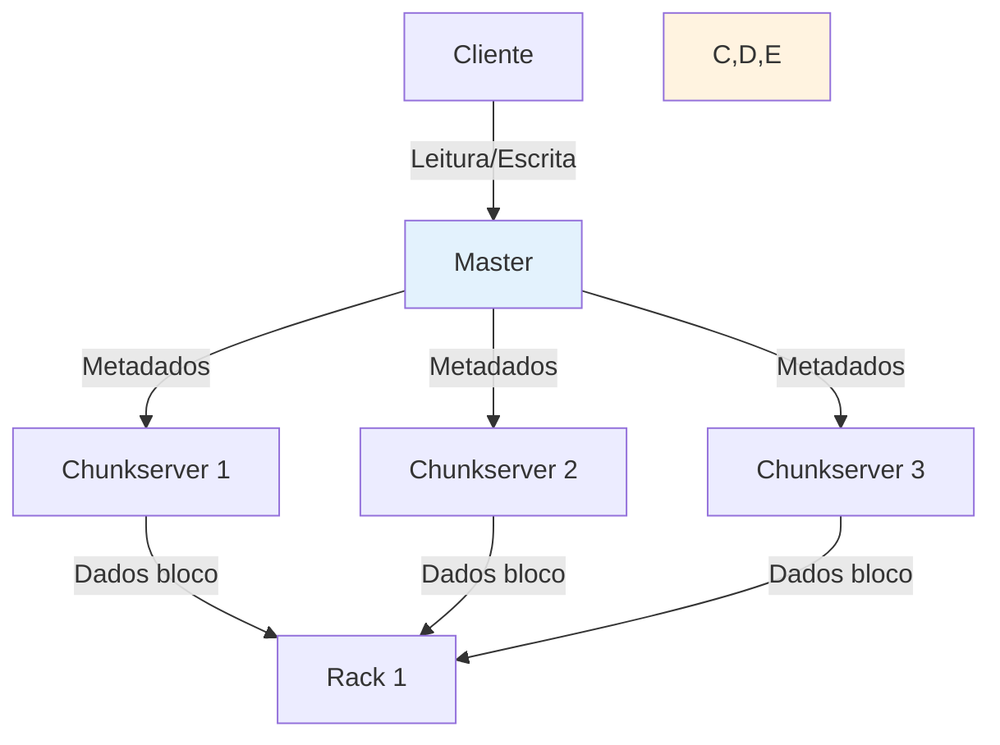
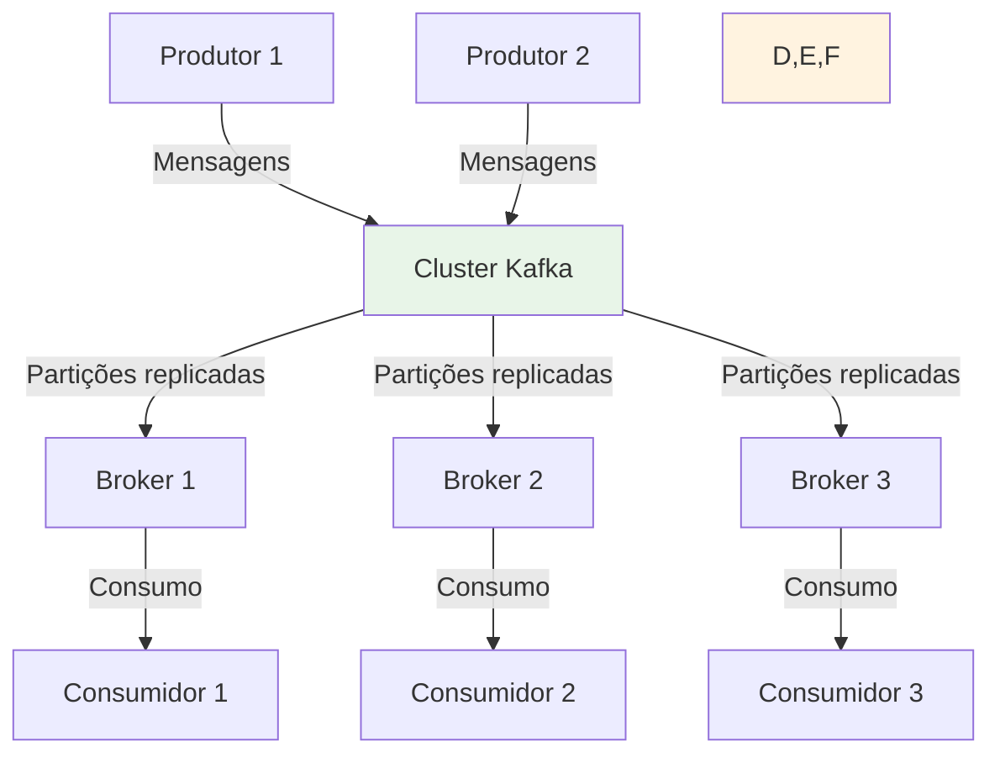
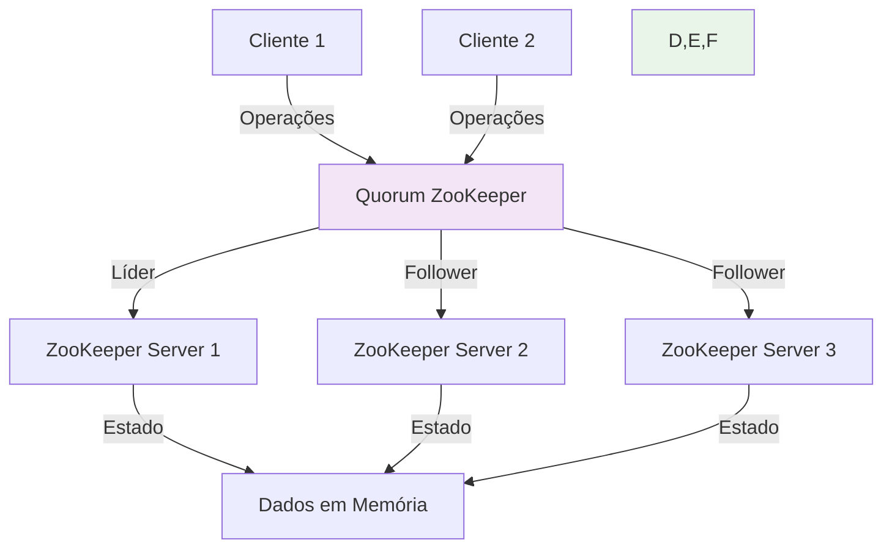
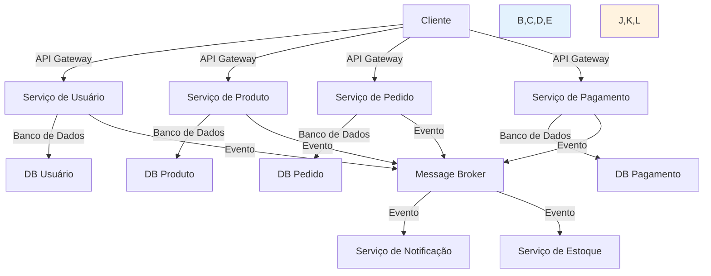

**Navegação:** [[MOC — TRILHA AVANÇADA]]
← [[PARTE 25 — PACELC]] | #trilha/avancada | [[PARTE 27 — REPLICATION]] →

---
# PARTE 26 — DISTRIBUTED SYSTEMS

> 🧠 **ESSENCIAL**
> Sistemas distribuídos são coleções de nós independentes que aparecem aos usuários como um único sistema coerente, coordenando suas ações através de troca de mensagens em uma rede.

> 🎯 **ENTREVISTA — ALTA FREQUÊNCIA**
> Perguntas sobre desafios de sistemas distribuídos (consistência, disponibilidade, particionamento, falhas parciais), leis fundamentais (CAP, PACELC, Lei de Amdahl, Lei de Gustafson), e trade-offs de projeto são extremamente comuns em entrevistas de arquitetura de software.

## O que são Sistemas Distribuídos?

Um **sistema distribuído** é um modelo em que componentes localizados em nós de rede comunicam e coordenam suas ações apenas através de passagem de mensagem para alcançar um objetivo comum.

### Características Fundamentais

1. **Concorrência**: Componentes executam simultaneamente
2. **Falta de relógio global**: Não há um relógio compartilhado para ordenar eventos
3. **Falhas independentes**: Falhas são parciais - alguns componentes podem falhar enquanto outros continuam funcionando
4. **Escalabilidade**: Capacidade de aumentar recursos de processamento adicionando mais nós
5. **Transparência**: O sistema deve aparecer como um único sistema coerente para o usuário

### Definição Formal

Um sistema distribuído é uma coleção de entidades independentes que:
- Cada uma tem seu próprio estado privado
- Comunicam-se exclusivamente através de troca de mensagens
- Pode falhar independentes umas das outras
- Não há assumição de confiabilidade na rede de comunicação

## Por que existem Sistemas Distribuídos?

Sistemas distribuídos existem para atender a necessidades que sistemas centralizados não podem satisfazer adequadamente:

### 1. Escalabilidade de Performance
- **Horizontal**: Adicionar mais nós para aumentar capacidade de processamento
- **Geográfica**: Distribuir carga próximamente aos usuários para reduzir latência
- **Carga de trabalho**: Distribuir diferentes tipos de trabalho para nós especializados

### 2. Disponibilidade e Tolerância a Falhas
- **Redundância**: Múltiplas cópias de serviços e dados
- **Isolamento de falhas**: Falha em um não derruba todo o sistema
- **Manutenção**: Possibilidade de atualizar componentes sem downtime total

### 3. Compartilhamento de Recursos
- **Hardware**: Compartilhar processamento, memória, armazenamento
- **Dados**: Acesso compartilhado a informações entre localizações
- **Serviços**: Reutilização de funcionalidades entre diferentes aplicações

### 4. Colaboração
- **Trabalho em equipe**: Permitir colaboração entre usuários geograficamente distribuídos
- **Integração de sistemas**: Conectar sistemas existentes de diferentes organizações
- **Compartilhamento de carga**: Distribuir tarefas complexas entre múltiplos processadores

## Problema que resolve

Sistemas distribuídos resolvem vários problemas fundamentais de computação:

### 1. Limitações de Hardware Único
- **Limite de clock**: Velocidade de processadores tem limites físicos
- **Limite de memória**: Quantidade máxima addressável em uma máquina
- **Limite de I/O**: Taxa máxima de transferência de dados de um único nó
- **Limite de falhas**: Ponto único de falha derruba todo o sistema

### 2. Demandas de Escala Moderna
- **Milhões de usuários simultâneos**: Redes sociais, plataformas de streaming
- **Petabytes de dados**: Análise de big data, logs de aplicação
- **Milhares de transações por segundo**: Sistemas financeiros, e-commerce
- **Resposta em milissegundos**: Aplicações de trading, jogos online

### 3. Distribuição Geográfica
- **Usuários globais**: Serviços acessíveis mundialmente
- **Requisitos de localização**: Dados devem permanecer em ciertas jurisdições
- **Recuperação de desastres**: Capacidade de sobreviver à perda de um data center inteiro
- **Conformidade regulatória**: Armazenamento e processamento em locais específicos

### 4. Heterogeneidade
- **Legado**: Integração com sistemas existentes
- **Diversidade tecnológica**: Diferentes linguagens, plataformas, protocolos
- **Evolução**: Capacidade de atualizar partes do sistema independentemente

## Como funciona internamente

Sistemas distribuídos implementam diversos mecanismos para coordenar ações entre nós independentes:

### Modelos de Comunicação

1. **Passagem de Mensagem (Message Passing)**
   - **Síncrona**: Remetente bloqueia até receber resposta
   - **Assíncrona**: Remetente continua imediatamente após envio
   - **Unicast**: Mensagem para um destinatário específico
   - **Multicast/Broadcast**: Mensagem para múltiplos destinatários

2. **Memória Compartilhada Distribuída (Distributed Shared Memory)**
   - Abstração de memória uniforme apesar de distribuição física
   - Consistência mantida através de protocolos de coerência
   - Menos comum devido à complexidade de implementação

3. **Objetos Distribuídos (Distributed Objects)**
   - Abstração de procedimento remoto (RPC/RMI)
   - Objetos podem ser invocados como se fossem locais
   - Exemplos: CORBA, DCOM, Java RMI, gRPC

### Modelos de Arquitetura

1. **Cliente-Servidor**
   - Clientes solicitam serviços, servidores fornecem serviços
   - Pode ser em camadas (n-tier)
   - Exemplos: Web (HTTP), bancos de dados, email

2. **Peer-to-Peer (P2P)**
   - Todos os nós têm capacidades semelhantes
   - Nenhum nó tem autoridade central
   - Exemplos: BitTorrent, blockchain, sistemas de compartilhamento de arquivos

3. **Middleware**
   - Camada de software que fornece serviços comuns
   - Abstrai complexidade de comunicação distribuída
   - Exemplos: Message queues, RPC frameworks, service meshes

4. **Arquitetura de Microserviços**
   - Aplicação como coleção de serviços pequenos e acoplados fracamente
   - Cada serviço executável independentemente
   - Comunicação através de APIs bem definidas

### Mecanismos de Coordenação

1. **Relógios Lógicos e Vetores de Versão**
   - Ordenam eventos sem relógio físico global
   - Detectam causalidade entre eventos distribuídos

2. **Algoritmos de Consenso (Paxos, Raft, Zab)**
   - Garantem que nós concordem sobre um valor ou sequência
   - Base para sistemas de coordenação como ZooKeeper, etcd

3. **Protocolos de Commit Distribuído (2PC, 3PC)**
   - Garantem atomicidade entre múltiplos recursos
   - Como visto na parte sobre transações distribuídas

4. **Algoritmos de Eleição de Líder**
   - Selecionam um nó coordenador entre participantes iguais
   - Usado quando é necessário um ponto de coordenação temporário

### Tratamento de Falhas

1. **Detecção de Falha**
   - **Heartbeats**: Mensagens periódicas indicando vida
   - **Timeouts**: Ausência de resposta indica possível falha
   - **Verificação ativa**: Ping ou requisições de teste

2. **Mascaramento de Falha (Fault Masking)**
   - **Replicação**: Múltiplas cópias toleram falhas de algumas
   - **Quorum**: Operações requerem acordo de maioria
   - **Estado estável**: Sistema retorna a estado conhecido bom após falha

3. **Recuperação de Falha**
   - **Checkpointing**: Salvamento periódico de estado
   - **Logging**: Registro de operações para replay
   - **Estado estável**: Recuperação a partir de estado conhecido consistente

## Desafios Fundamentais

Sistemas distribuídos introduzem desafios que não existem em sistemas centralizados:

### 1. Heterogeneidade
- Diferente hardware, sistemas operacionais, linguagens de programação
- Diferentes protocolos de comunicação e estruturas de dados
- Necessidade de intermediários ou adaptações para interoperabilidade

### 2. Abertura
- Capacidade de ser estendido e reimplementado de várias maneiras
- Interface pública para permitir que novos componentes se conectem
- Trade-off entre padronização e flexibilidade

### 3. Segurança
- Confidencialidade: Proteção contra escuta não autorizada
- Integridade: Proteção contra modificação não autorizada
- Disponibilidade: Proteção contra negação de serviço
- Autenticação: Verificação de identidade de remetentes
- Autorização: Controle de acesso a recursos

### 4. Escalabilidade
- **Escalabilidade de carga**: Lidar com aumento na quantidade de trabalho
- **Escalabilidade geográfica**: Expansão para novas localizações
- **Escalabilidade administrativa**: Gestão de aumento no número de nós
- **Gargalos**: Pontos que limitam escalabilidade apesar de recursos adicionais

### 5. Gerenciamento de Falha
- **Detecção**: Identificar que uma falha ocorreu
- **Localização**: Determinar onde e por que a falha ocorreu
- **Recuperação**: Restaurar operação correta após falha
- **Reinicialização**: Reiniciar componentes falhos de forma segura

### 6. Concorrência
- **Condições de corrida**: Resultados dependentes da ordem de execução
- **Deadlock**: Espera circular por recursos
- **Fome**: Alguns processos nunca conseguem acesso a recursos
- **Consistência**: Manter visão coerente de estado apesar de atualizações concorrentes

### 7. Transparência
O ideal de sistemas distribuídos é oferecer várias formas de transparência:
- **Acesso**: Diferença de acesso local vs remoto não perceptível
- **Localização**: Onde o recurso está fisicamente não relevante
- **Migração**: Recurso pode mover-se sem afetar usuários
- **Relocação**: Recurso pode ser acessado enquanto está se movendo
- **Replicação**: Múltiplas cópias aparecem como uma única
- **Concorrência**: Concorrência entre usuários é ocultada
- **Falha**: Falhas são mascaradas e recuperadas automaticamente
- **Persistência**: Recurso termina apenas quando usuário decide

## Leis e Princípios Fundamentais

### Lei de Amdahl
Define o limite máximo de aceleração possível através de paralelização:
```
Speedup ≤ 1 / [(1 - p) + p/n]
```
Onde:
- p = proporção do programa que pode ser paralelizada
- n = número de processadores

**Implicação**: Mesmo com infinito processadores, há limite devido à parte sequencial

### Lei de Gustafson
Reframeia o problema considerando aumento do problema com recursos:
```
Speedup = n - α(n - 1)
```
Onde:
- n = número de processadores
- α = fração do tempo gasto em parte sequencial

**Implicação**: Com problema maior, mais processadores podem ser efetivamente utilizados

### Princípio do Ponto Único de Falha (SPOF)
Qualquer componente cuja falha causa falha total do sistema é um SPOF.
Objetivo: Eliminar ou mitigar SPOFs através de redundância e failover.

### Princípio da Idempotência
Operações podem ser aplicadas múltiplas vezes sem efeitos colaterais além da primeira aplicação.
Crítico para tratamento seguro de retransmissões e falhas.

### Princípio da Comunicabilidade Assíncrona
Sistemas devem continuar funcionando mesmo quando mensagens são atrasadas, perdidas ou duplicadas.

## Trade-offs Fundamentais

### Consistência vs Disponibilidade vs Latência
Como visto em CAP e PACELC, há trade-offs fundamentais:
- Maior consistência geralmente requer mais coordenação → maior latência
- Alta disponibilidade durante partições pode requerer sacrifiçar consistência
- Baixa latência pode requerer reduzir garantias de consistência

### Performance vs Custo
- Mais nós = melhor performance potencialmente, mas maior custo
- Hardware especializado (GPUs, FPGAs) pode melhorar performance para workloads específicos
- Complexidade de gerenciamento aumenta com número de nós

### Complexidade vs Funcionalidade
- Soluções mais simples são mais fáceis de entender, depurar e manter
- Soluções complexas podem oferecer melhor performance, escalabilidade ou funcionalidade
- Trade-off entre investimento inicial e benefício a longo prazo

### Latência vs Throughput
- Otimizar para baixa latência pode reduzir throughput máximo
- Otimizar para alto throughput pode aumentar latência individual
- Depende do padrão de carga (muitas requisições pequenas vs poucos trabalhos grandes)

## Exemplos Práticos de Sistemas Distribuídos

### Exemplo 1: Sistema de Arquivos Distribuído (Google File System)



**Características distribuídas:**
- Master gerencia metadados (nome-arquivo → chunks)
- Chunkservers armazenam blocos de dados (64MB cada)
- Dados replicados em múltiplos chunkservers para tolerância a falhas
- Cliente lê/escreve diretamente dos chunkservers após obter metadados

### Exemplo 2: Sistema de Mensagens (Apache Kafka)



**Características distribuídas:**
- Brokers formam cluster para escalabilidade e tolerância a falhas
- Tópicos particionados entre brokers para paralelismo
- Réplicas de partições para durabilidade
- Consumidores podem escalar horizontalmente dentro de grupos de consumo

### Exemplo 3: Sistema de Coordenação (Apache ZooKeeper)



**Características distribuídas:**
- Servidores formam quorum usando protocolo de consenso Zab
- Líder processa escritas, seguidores replicam estado
- Quorum garante disponibilidade desde que maioria esteja ativa
- Fornece primitivos de coordenação como locks, barreiras, eleições

### Exemplo 4: Sistema de Microserviços (Plataforma de E-commerce)



**Características distribuídas:**
- Serviços pequenos e independentes, cada um com seu banco de dados
- Comunicação através de APIs síncronas (REST/gRPC) ou assíncronas (mensagens)
- API Gateway fornece ponto de entrada unificado
- Cada serviço pode ser desenvolvido, implantado e escalado independentemente

## Quando Usar Sistemas Distribuídos

### Use sistemas distribuídos quando:
- **Precisa de escalabilidade além de um único nó**: Carga de trabalho excede capacidade de hardware único
- **Requisitos de disponibilidade alta**: Sistema deve permanecer operacional apesar de falhas de componentes
- **Distribuição geográfica necessária**: Usuários ou fontes de dados espalhados globalmente
- **Tolerância a falhas crítica**: Sistema deve sobreveter à perda de data centers inteiros
- **Requisitos regulatórios**: Dados devem permanecer em certas jurisdições
- **Integração com sistemas existentes**: Necessidade de conectar sistemas legados ou de terceiros
- **Workload heterogêneo**: Diferentes tipos de processamento requerem arquiteturas diferentes

### Não use sistemas distribuídos quando:
- **Carga de trabalho cabe confortavelmente em um único nó**: Sobrecarga de complexidade não justificada
- **Latência ultrabaixa crítica**: Comunicação de rede adiciona latência significativa
- **Consistência transacional estrita necessária**: Overhead de coordenação pode ser proibitivo
- **Equipe pequena ou inexperiente**: Complexidade operacional pode superar benefícios
- **Orçamento limitado**: Custos de infraestrutura e operacional podem ser altos
- **Simplicidade é prioridade**: Manutenção, depuração e evolução são mais simples em sistemas centralizados

## Desafios de Operação em Sistemas Distribuídos

### 1. Monitoramento e Observabilidade
- **Traces distribuídos**: Rastrear requisições através de múltiplos serviços
- **Agregação de logs**: Coletar e correlacionar logs de dezenas ou centenas de nós
- **Métricas de sistema**: Latência, taxa de erro, utilização de recursos por componente
- **Alertas inteligentes**: Evitar falsos positivos devido à natureza probabilística de falhas distribuídas

### 2. Deploy e Gerenciamento de Configuração
- **Deploy coordenado**: Atualizar múltiplos serviços interdependentes sem downtime
- **Gerenciamento de configuração**: Garantir que todos os nós tenham configuração consistente
- **Rollback**: Reverter mudanças quando problemas são detectados
- **Versionamento**: Lidar com múltiplas versões de serviços rodando simultaneamente

### 3. Segurança
- **Autenticação entre serviços**: Verificar identidade de microserviços que se comunicam
- **Autorização granular**: Controle refinado de acesso a recursos e operações
- **Criptografia de dados em trânsito**: Proteger comunicações entre nós
- **Gerenciamento de segredos**: Armazenar e rotacionar senhas, chaves, certificados de forma segura

### 4. Escalabilidade Automática
- **Políticas de escala**: Definir quando e como adicionar/remover instâncias
- **Inicialização lenta**: Lidar com delay entre decisão de escala e disponibilidade real
- **Oscilação**: Evitar ciclos de escala para cima e para baixo devido a flutuações
- **Estado durante escala**: Migrar estado de forma segura ao aumentar ou diminuir capacidade

### 5. Testes
- **Testes de integração**: Verificar comportamento entre múltiplos serviços
- **Testes de falha**: Injetar falhas de rede, nós, serviços para validar resiliência
- **Testes de desempenho**: Medir latência e throughput sob carga realista
- **Ambientes de teste**: Reproduzir fielmente a complexidade de produção em escala menor

## Exemplos de Tecnologias e Frameworks

### Comunicação
- **gRPC**: RPC eficiente usando HTTP/2 e Protocol Buffers
- **Apache Thrift**: Framework de serviços de linguagem cruzada
- **REST/HTTP**: Arquitetura baseada em recursos amplamente adotada
- **Message Queues**: RabbitMQ, Apache Kafka, Amazon SQS para comunicação assíncrona
- **Service Meshes**: Istio, Linkerd, Consul Connect para gerenciamento de tráfego entre serviços

### Coordenação e Consenso
- **Apache ZooKeeper**: Serviço de coordenação para sistemas distribuídos
- **etcd**: Armazenamento chave-valor consistente para configuração e descoberta de serviço
- **Consul**: Descoberta de serviço, configuração e segmentação de rede
- **Amazon ECS/EKS, Kubernetes**: Orquestração de containers

### Armazenamento Distribuído
- **Apache Cassandra**: Banco de dados wide-column eventual consistent ajustável
- **MongoDB**: Banco de dados documento com replica sets e sharding
- **Amazon DynamoDB**: Banco de dados chave-valor e documento gerenciado
- **Google Spanner**: Banco de dados relacional globalmente consistente
- **HBase**: Banco de dados wide-column baseado em HDFS
- **Redis Cache**: Armazenamento em memória com replicação e partição

### Processamento de Stream
- **Apache Kafka**: Plataforma de streaming de eventos distribuída
- **Apache Storm**: Processamento de stream em tempo real distribuído
- **Apache Flink**: Processamento de stream e batch com tolerância a falhas
- **Apache Spark Streaming**: Extensão do Spark para processamento de stream

### Orquestração e Gerenciamento
- **Kubernetes**: Orquestração de containers para deploy, scaling e gerenciamento
- **Docker Swarm**: Orquestração de containers nativa do Docker
- **Apache Mesos**: Camada de abstração para gerenciamento de recursos de cluster
- **HashiCorp Nomad**: Orquestrador de aplicações simples e flexível

## Como isso aparece em System Design

### Quando discutir sistemas distribuídos em entrevistas de system design:
- Sempre que houver menção a escala grande (milhões de usuários, alto throughput)
- Quando discutir requisitos de disponibilidade alta ou tolerância a falhas
- Antes de escolher entre arquiteturas monolítica vs microserviços vs serverless
- Quando estimar requisitos de latência, consistência ou volume de dados
- Ao analisar trade-offs entre diferentes tecnologias de armazenamento ou comunicação
- Quando discutir integração com sistemas externos ou legado

### Como justificar escolhas de arquitetura distribuída:
1. **Requisitos de escala**: Quantos usuários, transações por segundo, volume de dados?
2. **Disponibilidade necessária**: Qual o tempo de inatividade aceitável? Que níveis de SLA?
3. **Latência aceitável**: Quanto tempo usuários estão dispostos a esperar por operações?
4. **Consistência requerida**: Quão crítica é a consistência imediata vs eventual tolerável?
5. **Restrições geográficas**: Onde os usuários e fontes de dados estão localizados?
6. **Experiência da equipe**: Quão familiar a equipe está com tecnologias distribuídas?
7. **Orçamento e recursos**: Quais são os limites de custo e capacidade operacional?
8. **Requisitos regulatórios**: Há restrições sobre onde dados podem ser armazenados ou processados?

### Exemplos de discussão em entrevistas:
- "Para uma plataforma de streaming de vídeo com milhões de usuários simultâneos, escolhemos arquitetura de microserviços com Kubernetes para permitir escalonamento independente de serviços de transcodificação, recomendação e gerenciamento de sessão"
- "Para um sistema de processamento de pagamentos que requer consistência forte e disponibilidade elevada, usamos um banco de dados distribuído como Google Spanner com replicação multi-regional"
- "Para um sistema de IoT que coleta milhões de leituras por segundo de sensores, escolhemos Apache Kafka para ingestão seguido por Apache Spark Streaming para processamento em tempo real"
- "Para uma aplicação de finanças pessoais com requisitos moderados de escala, começamos com uma arquitetura monolítica simples e planejamos migrar para microserviços apenas quando necessário"

## Perguntas de Entrevista Comuns

### Básicas
- "O que é um sistema distribuído e quais são suas características principais?"
- "Explique a diferença entre sistemas distribuídos e sistemas paralelos."
- "Quais são as principais vantagens e desvantagens de sistemas distribuídos?"

### Intermediárias
- "Como você lidaria com falhas parciais em um sistema distribuído?"
- "Explique o conceito de eventual consistência e onde ela é apropriada."
- "Como você projetaria um sistema para detectar e se recuperar de falhas de nós distribuídos?"

### Avançadas
- "Como você equilibraria consistência, disponibilidade e performance em um sistema distribuído de grande escala?"
- "Discuta trade-offs entre usar arquitetura de microserviços versus monolítica para um determinado problema."
- "Como você lidaria com o problema do relógio em sistemas distribuídos para manter consistência de eventos?"

### Follow-ups Típicos
- "E se precisássemos de consistência linearizável global com latência de leitura abaixo de 5ms?"
- "Como você validaria que seu sistema distribuído está se comportando como esperado sob carga e falhas?"
- "Qual seria sua estratégia para migrar de uma arquitetura monolítica para distribuída sem downtime?"
- "E se a latência entre data centers for tão alta que quorums tradicionais sejam impraticáveis para suas necessidades de consistência?"

## Checklist de Projeto de Sistemas Distribuídos

### Antes de Começar o Projeto
- [ ] Definir claramente os requisitos de escala, disponibilidade, latência e consistência
- [ ] Analisar padrões de carga esperados (volume, pico, distribuição temporal)
- [ ] Avaliar restrições geográficas e regulatórias aplicáveis
- [ ] Determinar tolerância a falhas necessária (MTBF, RTO, RPO)
- [ ] Pesquisar tecnologias candidatas para comunicação, armazenamento e coordenação
- [ ] Planejar estratégias para monitoramento, logging e observabilidade
- [ ] Definir abordagens para deploy, testing e gerenciamento de configuração

### Durante o Projeto e Implementação
- [ ] Escolher arquitetura apropriada (cliente-servidor, P2P, microserviços, etc.)
- [ ] Definir fronteiras de serviço e responsabilidades claras
- [ ] Implementar comunicação confiável com timeout, retry e circuit breaker
- [ ] Projetar para falhas com detecção, mascaramento e recuperação apropriada
- [ ] Implementar mecanismos de consistência apropriados ao nível necessário
- [ ] Garantir segurança através de autenticação, autorização e criptografia
- [ ] Planejar escalabilidade horizontal e vertical conforme necessário
- [ ] Implementar tracing distribuído e correlação de logs

### Depois da Implementação e em Produção
- [ ] Monitorar métricas de performance (latência, throughput, taxa de erro)
- [ ] Rastrear ocorrências de falhas e eficácia de mecanismos de recuperação
- [ ] Alertar sobre degradação de performance ou aumento de taxas de erro
- [ ] Testar periodicamente procedimentos de failover e recuperação de desastre
- [ ] Revisar e atualizar documentação de arquitetura e procedimentos operacionais
- [ ] Coletar feedback de usuários e operações para melhorias contínuas
- [ ] Planejar atualizações de tecnologia e evolução arquitetural baseado em mudanças de requisitos

## RESUMO

Sistemas distribuídos são fundamentais para computação moderna de escala, mas introduzem complexidade significativa que requer cuidadoso projeto e gerenciamento:

**Princípios-chave:**
1. Sistemas distribuídos permitem escalar além dos limites de hardware único através de adição de nós
2. Eles introduzem desafios fundamentais como falhas parciais, falta de relógio global e necessidade de coordenação através de rede não confiável
3. Trade-offs entre consistência, disponibilidade, latência e custos são centrais no projeto de sistemas distribuídos
4. Muitas leis e princípios (Amdahl, Gustafson, CAP, PACELC) ajudam a entender limites e possibilidades
5. Escolher quando usar sistemas distribuídos requer análise cuidadosa de requisitos reais vs percepções de necessidade
6. Operação eficaz requer investimento em monitoramento, automação e práticas de gerenciamento sofisticadas
- [ ] Lembre-se: O objetivo de um sistema distribuído não é simplesmente usar tecnologia distribuída por si mesma, mas sim atender aos requisitos de negócio de escala, disponibilidade e performance de forma econômica e confiável, aceitando apenas a complexidade necessária para alcançar esses objetivos.