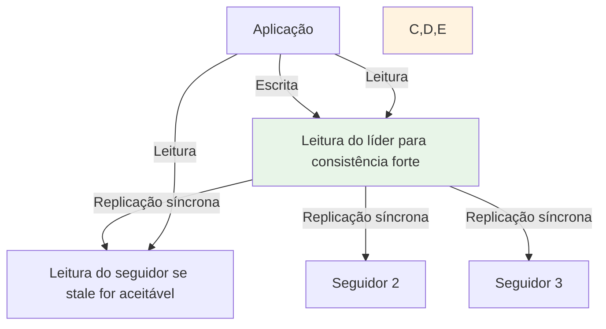
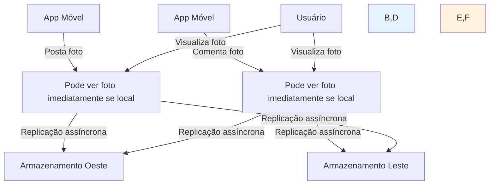
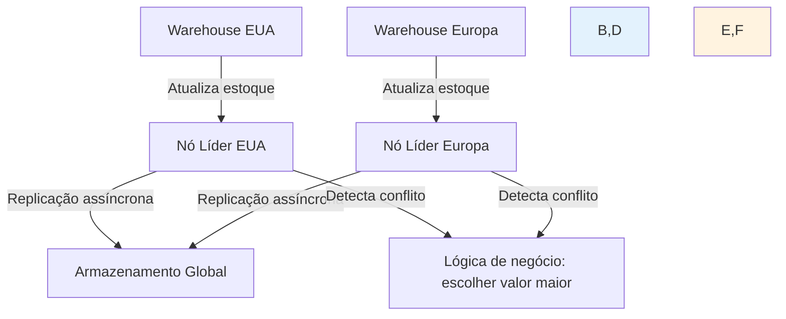
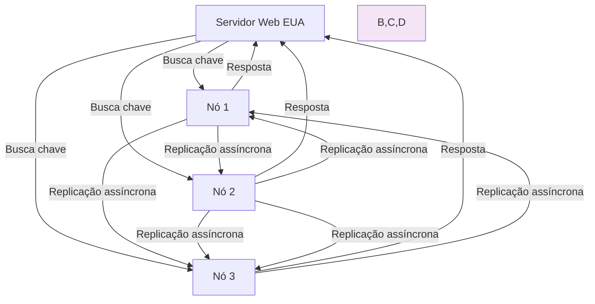

**Navegação:** [[MOC — TRILHA AVANÇADA]]
← [[PARTE 26 — DISTRIBUTED SYSTEMS]] | #trilha/avancada | [[PARTE 28 — SHARDING — PARTITIONING]] →

---
# PARTE 27 — REPLICATION

> 🧠 **ESSENCIAL**
> Replicação é o processo de manter cópias idênticas de dados em múltiplos nós para melhorar disponibilidade, tolerância a falhas, desempenho de leitura e distribuição geográfica.

> 🎯 **ENTREVISTA — ALTA FREQUÊNCIA**
> Perguntas sobre tipos de replicação (síncrona vs assíncrona, líder-siguidor vs multi-líder), consistência em sistemas replicados, conflitos de replicação, e algoritmos de consenso são extremamente comuns em entrevistas de arquitetura de software.

## O que é Replicação?

**Replicação** é a técnica de manter múltiplas cópias dos mesmos dados em diferentes nós de um sistema distribuído. O objetivo principal é aumentar a disponibilidade e tolerância a falhas, permitindo que o sistema continue operando mesmo quando alguns nós falham.

### Por que replicar dados?

1. **Disponibilidade**: Se um nó falhar, outros podem continuar servindo as solicitações
2. **Tolerância a falhas**: Proteção contra perda de dados devido a falhas de hardware ou software
3. **Desempenho de leitura**: Leituras podem serem distribuídas entre múltiplas réplicas
4. **Distribuição geográfica**: Dados podem ficar fisicamente próximos aos usuários
5. **Escalabilidade de leitura**: Mais réplicas = maior capacidade de atender leituras simultâneas
6. **Backup e recuperação**: Cópias adicionais facilitam procedimentos de backup

## Tipos de Replicação

### 1. Por Timing (Quando a cópia é atualizada)

#### Replicação Síncrona
- **Como funciona**: A escrita só é considerada confirmada quando todas as réplicas confirmaram o recebimento e armazenamento dos dados
- **Garantia**: Forte consistência - todas as réplicas têm os mesmos dados no mesmo momento
- **Trade-off**: Maior latência de escrita (precisa aguardar todas as confirmações)
- **Exemplo**: Bancos de dados com compromisso de escrita fuerte (w: majority em MongoDB, quorum em Cassandra)

#### Replicação Assíncrona
- **Como funciona**: A escrita é considerada confirmada assim que o nó primário a recebe; as réplicas são atualizadas em background
- **Garantia**: Eventual consistência - há um atraso entre escrita primária e atualização das réplicas
- **Trade-off**: Menor latência de escrita, mas risco de stale reads
- **Exemplo**: Replicação padrão do MySQL, Redis assíncrono

#### Replicação Semi-síncrona
- **Como funciona**: Escrita é confirmada quando pelo menos uma réplica (além do primário) confirma o recebimento
- **Garantia**: Melhor que assíncrona pura, menor latência que síncrona total
- **Trade-off**: Balanceamento entre consistência e latência
- **Exemplo**: MySQL semi-synchronous replication

### 2. Por Arquitetura (Como os nós são organizados)

#### Líder-Siguidor (Leader-Follower / Master-Slave)
- **Como funciona**: Um nó designado como líder recebe todas as escritas; seguidores replicam do líder
- **Escrita**: Apenas no líder (ou com conflito resolvido pelo líder)
- **Leitura**: Pode ser feita em líder ou seguidores (dependendo do nível de consistência requerido)
- **Failover**: Quando líder falha, um seguidor é eleito novo líder
- **Exemplo**: Replicação do MongoDB, Redis replication, PostgreSQL streaming replication

#### Multi-Líder (Multi-Master)
- **Como funciona**: Múltiplos nós podem aceitar escritas simultaneamente
- **Escrita**: Qualquer nó pode aceitar escritas
- **Conflito**: Requer mecanismo de detecção e resolução de conflito quando mesmas chaves são atualizadas em diferentes líderes
- **Exemplo**: Cassandra com múltiplos datacenters, CouchDB, alguns sistemas de CRM distribuído

#### Leaderless (Sem Líder)
- **Como funciona**: Qualquer nó pode aceitar escritas e leituras; consistência alcançada através de quorums
- **Escrita**: Qualquer nó (desde que alcance quorum de escrita)
- **Leitura**: Qualquer nó (desde que alcance quorum de leitura)
- **Conflito**: Resolvido através de mecanismos como vetores de versão ou timestamps
- **Exemplo**: DynamoDB, Cassandra, Riak

### 3. Por Escopo (O que está sendo replicado)

#### Replicação de Estado Total (State Machine Replication)
- **Como funciona**: Todo o estado do nó é replicado; todos os nós começam no mesmo estado e recebem as mesmas entradas na mesma ordem
- **Garantia**: Todos os nós produzem a mesma saída
- **Exemplo**: Sistemas baseados em Paxos/Raft como ZooKeeper, etcd

#### Replicação de Dados (Data Replication)
- **Como funciona**: Apenas os dados armazenados são replicados (não o estado completo do nó)
- **Exemplo**: Bancos de dados replicados, sistemas de arquivos distribuídos

#### Replicação de Log (Log Replication)
- **Como funciona**: Apenas o log de operações é replicado; cada nó reexecuta o log para atualizar seu estado
- **Exemplo**: Replicação de transações em bancos de dados, Kafka

## Como funciona internamente

### Processo Básico de Replicação Líder-Siguidor

1. **Cliente envia escrita** para o nó líder
2. **Líder aplica a escrita** localmente
3. **Líder envia a atualização** para todos os seguidores
4. **Seguidores aplicam a atualização** localmente
5. **Seguidores enviam acknowledgment** ao líder
6. **Líder confirma a escrita** ao cliente (dependendo do nível de consistência)

### Mecanismos de Consistência em Sistemas Replicados

#### Modelo de Visualização (Read Models)
- **Leitura do líder**: Sempre vê os dados mais recentes (se líder não falhou)
- **Leitura de seguidores com lag**: Pode ver dados obsoletos (stale reads)
- **Leitura com quorum**: Esperar por respostas de múltiplas réplicas para garantir consistência

#### Vetores de Versão e Relógios Vetoriais
- Cada nó mantém um vetor que conta atualizações de cada réplica
- Permite detectar atualizações concorrentes que precisam de resolução
- Mais eficiente que timestamps simples para detecção de concorrência

#### Última Escrita Vence (Last-Writer-Wins - LWW)
- Usa timestamps (físicos ou lógicos) para determinar qual atualização prevalece
- Simples mas pode perder atualizações se os relógios não estiverem sincronizados
- Comum em sistemas como Cassandra com clocks sincronizados

#### Estruturas de Dados Convergentemente Livre de Conflito (CRDTs)
- Estruturas de dados projetadas para convergir automaticamente sem coordenação
- Operações são comutativas, associativas e idempotentes
- Exemplos: Contadores, conjuntos, registros, maps
- Usado em sistemas como Riak, Redis with Redis Enterprise

## Algoritmos de Consenso para Replicação

Muitos sistemas de replicação usam algoritmos de consenso para garantir que os seguidores concordem com a ordem das atualizações:

### Paxos
- Família de protocolos para consenso em nós que podem falhar
- Garante que, se qualquer proposta for escolhida, então todas as propostas escolhidas são iguais
- Mais complexo de entender e implementar
- Usado em sistemas como Google Chubby

### Raft
- Projetado para ser mais fácil de entender que Paxos
- Separa liderança, replicação e segurança
- Líder eleito, seguidores replicam log do líder
- Usado em sistemas como etcd, Consul

### Zab (ZooKeeper Atomic Broadcast)
- Protocolo usado pelo Apache ZooKeeper
- Similar ao Paxos otimizado para uso primário em sistemas de coordenção
- Garante ordem total e entrega confiável de mensagens

## Desafios da Replicação

### 1. Lag de Replicação (Replication Lag)
- **Problema**: Seguidores ficam para trás do líder devido a latência de rede ou carga
- **Impacto**: Leituras em seguidores podem retornar dados obsoletos
- **Soluções**: 
  - Monitorar lag e redirecionar leituras quando muito alto
  - Usar leituras com condição (ler apenas se réplica estiver atualizada até certo ponto)
  - Aceitar stale reads quando apropriado para o negócio

### 2. Conflitos de Escrita (Write Conflicts)
- **Problema**: Em sistemas multi-líder ou leaderless, duas atualizações podem modificar os mesmos dados simultaneamente
- **Impacto**: Perda de dados ou inconsistência se não resolvido corretamente
- **Soluções**:
  - Última escrita vence (LWW)
  - Vetores de versão para detecção de conflito
  - Lógica de negócio específica para resolução (ex: escolher o valor maior)
  - Replicação de estado convergente livre de conflito (CRDTs)

### 3. Falha de Nó e Failover
- **Problema**: Quando o líder falha, precisa eleger um novo líder rapidamente
- **Impacto**: Período de indisponibilidade se failover for lento
- **Soluções**:
  - Algoritmos de eleição de líder rápidos (Raft, Zab)
  - Heartbeats e timeouts configuráveis
  - Pré-votar seguidores como candidatos elegíveis

### 4. Escalabilidade da Replicação
- **Problema**: À medida que número de réplicas aumenta, carga no líder para enviar atualizações também aumenta
- **Impacto**: Gargalo no líder, latência maior
- **Soluções**:
  - Replicação em árvore (líder envia para alguns, que enviam para outros)
  - Replicação em etapas ou pipeline
  - Sharding combinado com replicação (cada shard tem seu próprio conjunto de réplicas)

## Modelos de Consistência em Sistemas Replicados

### 1. Consistência Forte (Strong Consistency)
- Todas as leituras veem a escrita mais recente
- Requer quorum de leitura e escrita tal que R + W > N (onde N = número de réplicas)
- Exemplo: Quorum em Cassandra, leitura do líder em sistemas líder-siguidor síncronos

### 2. Consistência Monotônica
- **Monotonic Read**: Se uma leitura vê um determinado valor para um dado, leituras subsequentes nunca verão um valor mais antigo
- **Monotonic Write**: Escritas de um mesmo processo são vistas na mesma ordem por todos
- Exemplo: Configurações de sessão em alguns bancos de dados

### 3. Consistência de Sessão (Session Consistency)
- Dentro de uma sessão de cliente: leitura seguindo escrita, leitura monotônica, escrita monotônica
- Fora da sessão: comportamento pode ser eventual consistente
- Exemplo: Consistência de sessão no Amazon DynamoDB

### 4. Prefixo Consistente (Consistent Prefix)
- Se uma sequência de escritas é feita em uma ordem específica, qualquer leitura vê um prefixo dessa sequência
- Útil para manter ordem de eventos relacionados
- Exemplo: Alguns sistemas de mensagens

### 5. Eventual Consistency (Eventual Consistency)
- Se nenhuma nova atualização for feita, eventualmente todas as réplicas convergem para o mesmo estado
- Não há garantia de quando isso acontecerá
- Exemplo: Sistemas DNS, caches distribuídos, muitos sistemas NoSQL

## Quando Usar Cada Tipo de Replicação

### Líder-Siguidor Síncrono Quando:
- Consistência forte é crítica (ex: transações financeiras)
- Número de réplicas é pequeno (para evitar alta latência de escrita)
- Latência de escrita pode ser sacrificada por consistência
- Exemplo: Bancos de dados de transações, sistemas de inventory crítico

### Líder-Siguidor Assíncrono Quando:
- Desempenho de escrita é mais importante que consistência imediata
- Leituras podem tolerar algum grau de stale data
- Sistema precisa de alta disponibilidade de escrita
- Exemplo: Plataformas de mídia social (feeds, contagens), sistemas de logging

### Multi-Líder Quando:
- Múltiplos locais precisam aceitar escritas localmente (ex: escritórios globais)
- Alta disponibilidade de escrita é crítica mesmo com falhas de rede entre locais
- Conflitos são raros ou podem ser resolvidos com lógica de negócio simples
- Exemplo: Bancos de dados globais com escrita em múltiplos data centers, alguns sistemas de CRM

### Leaderless Quando:
- Alta disponibilidade e tolerância a particionamento são prioridades
- Sistema pode lidar com conflitos de escrita através de mecanismos automáticos
- Escala horizontal de leitura e escrita é necessária
- Exemplo: Bancos de dados de escala global como Cassandra, DynamoDB

## Exemplos Práticos

### Exemplo 1: Banco de Dados Transacional (Líder-Siguidor Síncrono)

**Quando usar**: Sistema bancário onde consistência forte é crítica para evitar sobre-saque ou perda de dinheiro.

### Exemplo 2: Plataforma de Mídia Social (Líder-Siguidor Assíncrono)

**Quando usar**: Plataforma onde alguns segundos de atraso na visualização de conteúdo são toleráveis, mas resposta imediata para ações do usuário é importante.

### Exemplo 3: Sistema de Inventory Global (Multi-Líder com Resolução de Conflito)

**Quando usar**: Sistema onde atualizações de inventory ocorrem em múltiplos locais geograficamente distribuídos, e conflitos podem ser resolvidos escolhendo o valor mais recente ou maior.

### Exemplo 4: Cache Distribuído (Leaderless)

**Quando usar**: Cache onde stale content geralmente resulta apenas em desempenho ligeiramente reduzido, e disponibilidade de cache é crítica.

## Replicação em Bancos de Dados Populares

### MySQL
- **Replicação assíncrona padrão**: Líder-siguidor com lag potencial
- **Replicação semi-síncrona**: Disponível via plugin
- **Grupos de replicação MySQL**: Líder-siguidor com consenso baseado em Paxos
- **Nível de consistência**: Configurável através de semissync e wait_timeout

### PostgreSQL
- **Replicação assíncrona**: Padrão, baseada em WAL (Write-Ahead Log)
- **Replicação síncrona**: Disponível através de synchronous_standby_names
- **Replicação lógica**: Permite replicar subset de objetos ou operações
- **Ferramentas**: pgBaseBackup, Slony-I, Bucardo

### MongoDB
- **Replica Sets**: Líder-siguidor com eleições automáticas
- **Nível de escrita**: w: 0, w: 1, w: majority, w: <número>, w: all
- **Nível de leitura**: primary, primaryPreferred, secondary, secondaryPreferred, nearest
- **Sharding**: Combina sharding com replicação para escalabilidade horizontal

### Apache Cassandra
- **Arquitetura leaderless**: Qualquer nó pode aceitar escritas e leituras
- **Nível de consistência ajustável**: ANY, ONE, TWO, THREE, QUORUM, ALL, LOCAL_QUORUM, etc.
- **Estratégia de replicação**: SimpleStrategy, NetworkTopologyStrategy
- **Detecção de conflito**: Última escrita vence (LWW) com timestamps sincronizados
- **Repair**: Processo anti-entropia para corrigir inconsistências

### Amazon DynamoDB
- **Arquitetura leaderless**: Baseada em paper do Dynamo
- **Leitura consistente forte**: Lê líder ou quorum (custo maior de capacidade de leitura)
- **Leitura eventual**: Lê de qualquer réplica (menor custo)
- **Write**: Sempre consistente forte dentro da região de escrita
- **Replicação global**: DynamoDB Global Tables para replicação multi-regional

### Redis
- **Replicação assíncrona padrão**: Líder-siguidor
- **Redis Sentinel**: Sistema de monitoramento e failover automático
- **Redis Cluster**: Partições com replicação (cada shard tem seu próprio conjunto de réplicas)
- **WAIT command**: Permite aguardar por réplicas para consistência mais forte

## Algoritmos de Eleição de Líder

Quando o líder falha em um sistema líder-siguidor, é necessário eleger um novo líder rapidamente:

### Algoritmo de Bully
- Nós com ID maior têm prioridade
- Quando líder falha, nó com maior ID entre os disponíveis vence
- Simples mas pode gerar múltiplas eleições se nós falharem durante o processo

### Algoritmo do Anel (Ring-based)
- Nós organizados em lógico anel
- Mensagem de eleição passa pelo anel; nó com maior ID vence
- Mais previsível que Bully em termos de mensagens trocadas

### Algoritmos Baseados em Consenso (Raft, Zab)
- Usam quorum para garantir que apenas um líder seja eleito
- Líder precisa de votos da maioria dos nós
- Mais robusto contra partições de rede
- Exemplo: Raft requer maioria para eleição e compromisso de entradas

## Técnicas Avançadas

### Sharding com Replicação
- **Como funciona**: Dados particionados (sharded) e cada shard tem seu próprio conjunto de réplicas
- **Benefício**: Escalabilidade horizontal tanto de escrita (através de sharding) quanto de leitura/tolerância a falhas (através de replicação)
- **Exemplo**: MongoDB sharded clusters, Vitess para MySQL

### Replicação em Camadas (Cascading Replication)
- **Como funciona**: A → B → C, onde A replica para B, B replica para C
- **Benefício**: Reduz carga no líder primário
- **Trade-off**: Aumenta lag para réplicas mais distantes
- **Exemplo**: Alguns setups de replicação do PostgreSQL

### Replicação Seletiva (Partial Replication)
- **Como funciona**: Só replicar subconjunto de dados baseado em critérios
- **Benefício**: Reduz requisitos de armazenamento e rede
- **Trade-off**: Complexidade aumentada para determinar o que replicar
- **Exemplo**: Replicar apenas dados de usuários ativos, ou dados de determinada região geográfica

### Anti-Entropia e Repair
- **Como funciona**: Processos background que comparam réplicas e corrigem diferenças
- **Implementação**: Frequentemente usando Merkle trees para eficiência
- **Exemplo**: nodetool repair em Cassandra, pgcrypto em PostgreSQL

## Quando NÃO Usar Replicação

### 1. Quando consistência forte é exigida e lag é inaceitável
- **Alternativa**: Usar um único nó com backup frequente ou considerar transações distribuídas (2PC/3PC)

### 2. Quando o overhead de rede supera os benefícios
- **Alternativa**: Manter dados localmente e sincronizar periodicamente via batch

### 3. Quando conflitos de escrita são frequentes e difíceis de resolver
- **Alternativa**: Arquitetura de eventosourcing ou CQRS com tratamento explícito de conflitos

### 4. Quando requisitos de latência de escrita são ultrabaixos
- **Alternativa**: Escrever em log local e fazer batch assíncrono para replicação

### 5. Quando custo de armazenamento e largura de banda é proibitivo
- **Alternativa**: Técnicas de compressão, deduplication ou arquivamento agressivo

## Exemplos de Uso em System Design

### Quando discutir replicação em entrevistas de system design:
- Sempre que houver menção a requisitos de disponibilidade alta ou tolerância a falhas
- Quando discutir bancos de dados distribuídos ou sistemas de armazenamento
- Antes de escolher entre diferentes soluções de tecnologia de dados
- Quando estimar requisitos de leitura vs escrita volume
- Ao analisar trade-offs entre consistência, disponibilidade e performance

### Como justificar escolhas de estratégia de replicação:
1. **Volume de leitura vs escrita**: Sistema é leitura-escrita pesado?
2. **Latência de escrita aceitável**: Quanto tempo podemos aguardar por confirmação de escrita?
3. **Tolerância a stale reads**: Quão obsoletos os dados podem ser para leituras?
4. **Distribuição geográfica**: Onde os usuários estão localizados?
5. **Número de réplicas necessárias**: Quantas falhas simultâneas queremos tolerar?
6. **Experiência com tecnologia**: Quão familiar a equipe está com a solução de replicação escolhida?
7. **Orçamento**: Qual é o custo de armazenamento, largura de banda e operação?

### Exemplos de discussão em entrevistas:
- "Para um sistema de líderboard de jogo global, usamos líder-siguidor assíncrono porque queremos baixa latência de escrita para atualizações de pontuação, e podemos tolerar alguns segundos de atraso na visualização do leaderboard global"
- "Para o módulo de processamento de pedidos de e-commerce, escolhemos líder-siguidor síncrono com w: majority porque consistência forte é crítica para evitar venda de itens sem estoque"
- "Para um sistema de sensores IoT que grava milhões de leituras por segundo, escolhemos arquitetura leaderless com nível de consistência QUORUM para balancear desempenho e durabilidade"
- "Para um cache interno de dados de sessão, usamos líder-siguidor assíncrono porque stale sessões geralmente resultam apenas em necessidade de re-login, e a disponibilidade de cache é crítica para performance"

## Perguntas de Entrevista Comuns

### Básicas
- "O que é replicação e quais são seus principais objetivos?"
- "Explique a diferença entre replicação síncrona e assíncrona."
- "Quais são os tipos comuns de arquitetura de replicação (líder-siguidor, multi-líder, leaderless)?"

### Intermediárias
- "Como você lidaria com lag de replicação em um sistema líder-siguidor assíncrono?"
- "Explique como vetores de versão ajudam a detectar conflitos de replicação."
- "Como você projetaria um sistema para detectar e se recuperar de falhas de nó em um conjunto de réplicas?"

### Avançadas
- "Como você equilibraria consistência, disponibilidade e performance em um sistema de replicação de grande escala?"
- "Discuta trade-offs entre usar arquitetura de líder-siguidor versus leaderless para diferentes workloads."
- "Como você lidaria com o problema do relógio em sistemas de replicação para manter consistência de eventos?"

### Follow-ups Típicos
- "E se precisássemos de consistência linearizável global com latência de leitura abaixo de 10ms?"
- "Como você validaria que seu sistema de replicação está se comportando como esperado sob carga e falhas?"
- "Qual seria sua estratégia para migrar de uma arquitetura de líder-siguidor para leaderless sem downtime?"
- "E se a latência entre data centers for tão alta que quorums tradicionais sejam impraticáveis para suas necessidades de consistência?"

## Checklist de Projeto de Sistemas Replicados

### Antes de Começar o Projeto
- [ ] Definir claramente os requisitos de consistência, disponibilidade e latência
- [ ] Analisar padrões de carga esperados (volume de leitura vs escrita, distribuição temporal)
- [ ] Avaliar tolerância a lag de replicação e stale reads
- [ ] Determinar número de réplicas necessárias para tolerância a falhas desejada
- [ ] Pesquisar tecnologias candidatas para replicação e suas garantias
- [ ] Planejar estratégias para monitoramento de lag, detecção de conflito e failover
- [ ] Definir abordagens para backup, recuperação e testes de caos

### Durante o Projeto e Implementação
- [ ] Escolher estratégia de replicação apropriada ao nível de consistência necessário
- [ ] Implementar detecção e resolução de conflito adequada ao tipo de dados
- [ ] Configurar timeouts, heartbeats e limites de lag apropriados
- [ ] Garantir segurança através de autenticação entre nós de replicação
- [ ] Planejar escalabilidade horizontal considerando tanto particionamento quanto replicação
- [ ] Implementar tracing distribuído para entender fluxo de atualizações entre réplicas

### Depois da Implementação e em Produção
- [ ] Monitorar métricas de lag de replicação e taxa de erro
- [ ] Rastrear ocorrências de conflitos de escrita e eficácia de resolução
- [ ] Alertar sobre degradação de performance ou aumento de taxas de erro
- [ ] Testar periodicamente procedimentos de failover e recuperação de desastre
- [ ] Revisar e atualizar documentação de arquitetura e procedimentos operacionais
- [ ] Coletar feedback de usuários e operações para melhorias contínuas
- [ ] Planejar atualizações de tecnologia e evolução arquitetural baseado em mudanças de requisitos

## RESUMO

Replicação é uma técnica fundamental em sistemas distribuídos para alcançar disponibilidade, tolerância a falhas e desempenho de leitura, mas introduce complexidade significativa relacionada à consistência, lag e resolução de conflitos:

**Princípios-chave:**
1. Replicação permite que o sistema continue operando apesar de falhas de nós através de redundância
2. Existe um trade-off fundamental entre latência de escrita e consistência de leitura
3. Diferentes arquiteturas de replicação (líder-siguidor, multi-líder, leaderless) atendem a diferentes requisitos de disponibilidade, latência e consistência
4. Mecanismos como vetores de versão, CRDTs e algoritmos de consenso ajudam a gerenciar consistência em sistemas replicados
5. Monitoramento cuidadoso de lag, conflitos e saúde das réplicas é essencial para operação eficaz
6. A escolha de estratégia de replicação deve ser baseada em análise cuidadosa de requisitos reais de consistência, disponibilidade e performance
- [ ] Lembre-se: A replicação perfeita é aquela que fornece a disponibilidade e tolerância a falhas necessárias com o menor impacto possível na consistência, latência e complexidade operacional, aceitando apenas o lag ou o risco de conflito que o negócio pode tolerar.