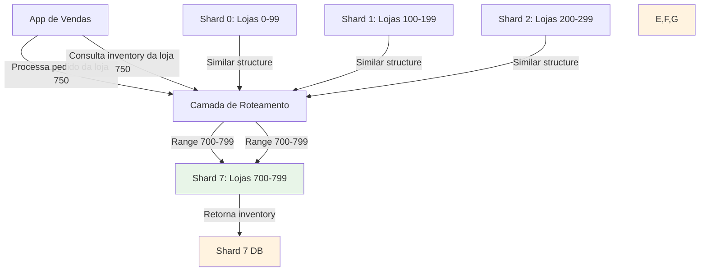
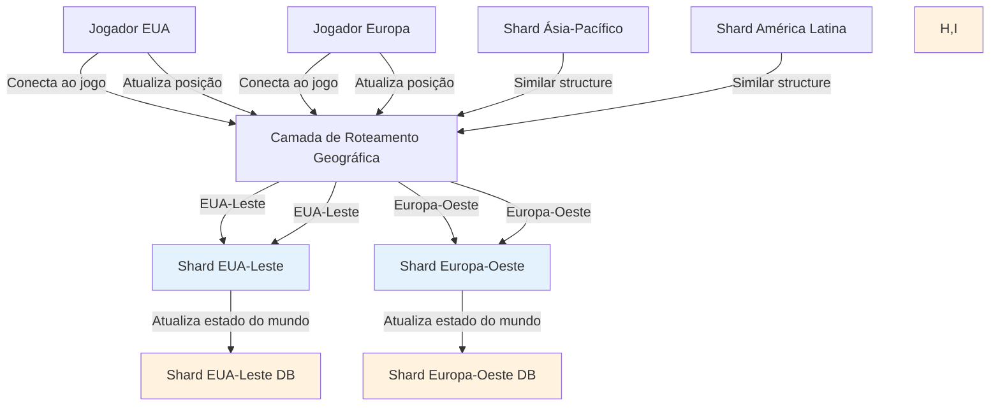
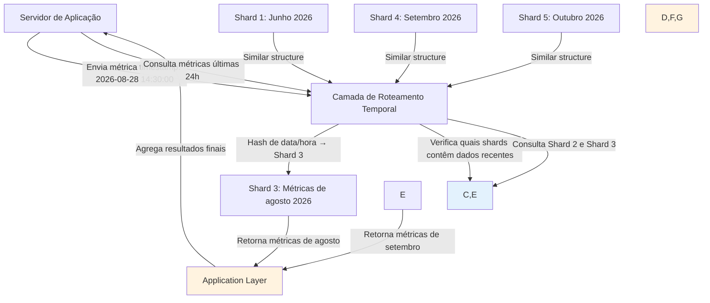

**Navegação:** [[MOC — TRILHA AVANÇADA]]
← [[PARTE 27 — REPLICATION]] | #trilha/avancada | [[PARTE 29 — CONSISTENT HASHING]] →

---
# PARTE 28 — SHARDING / PARTITIONING

> 🧠 **ESSENCIAL**
> Sharding (ou particionamento) é a técnica de dividir um conjunto de dados em partes menores e mais gerenciáveis chamadas shards, distribuídas entre múltiplos nós para alcançar escalabilidade horizontal.

> 🎯 **ENTREVISTA — ALTA FREQUÊNCIA**
> Perguntas sobre estratégias de sharding (range-based, hash-based, directory-based), escolha de chave de sharding, rebalanceamento de shards, e problemas comuns como hot spots e joins entre shards são extremamente comuns em entrevistas de arquitetura de software.

## O que é Sharding/Partitioning?

**Sharding** (também chamado de particionamento horizontal) é o processo de dividir um grande banco de dados em partes menores, mais rápidas e mais fáceis de gerenciar chamadas shards. Cada shard contém um subconjunto dos dados total e é armazenado em um nó de banco de dados separado.

### Por que fazer sharding?

1. **Escalabilidade horizontal**: Permite adicionar mais máquinas para lidar com aumento de dados e tráfego
2. **Performance melhorada**: Consultas operam em subconjuntos menores de dados
3. **Redução de custos**: Usa hardware commodity em vez de servidores verticais caros
4. **Isolamento de falhas**: Falha em um shard afeta apenas aquele subconjunto de dados
5. **Distribuição geográfica**: Shards podem estar localizados fisicamente próximos aos usuários que acessam aqueles dados
6. **Paralelismo**: Operações podem ser executadas em paralelo em múltiplos shards

### Diferença entre particionamento vertical e horizontal

- **Particionamento Vertical**: Divide uma tabela colocando colunas diferentes em tabelas diferentes (menos comum)
- **Particionamento Horizontal (Sharding)**: Divide uma tabela colocando linhas diferentes em tabelas diferentes baseado em algum critério (o que nos referimos como sharding)

## Como funciona internamente

### Processo Básico de Sharding

1. **Chave de Sharding (Shard Key)**: Um campo ou conjunto de campos usado para determinar em qual shard um dado deve ser armazenado
2. **Função de Hash ou Algoritmo de Roteamento**: Determina qual shard receberá um dado baseado na chave de sharding
3. **Roteamento de Consultas**: O sistema determina quais shards precisam ser consultados baseado na consulta
4. **Agregação de Resultados**: Resultados de múltiplos shards são combinados (quando necessário)

### Componentes de um Sistema Sharded

1. **Camada de Roteamento**: Determina para qual shard uma consulta deve ser enviada
2. **Shards Individuais**: Bancos de dados físicos que armazenam subconjuntos de dados
3. **Metadados/Configuração**: Informação sobre como os dados estão distribuídos (frequentemente armazenada em um serviço de coordenação como ZooKeeper ou etcd)
4. **Mecanismo de Rebalanceamento**: Processo para mover dados entre shards quando a distribuição se torna desequilibrada

## Estratégias de Sharding

### 1. Sharding por Faixa (Range-Based Sharding)

- **Como funciona**: Dados são distribuídos baseado em intervalos de valores da chave de sharding
- **Exemplo**: Chave de sharding = ID do usuário
  - Shard 0: IDs 0-999
  - Shard 1: IDs 1000-1999
  - Shard 2: IDs 2000-2999
- **Vantagens**:
  - Simples de entender e implementar
  - Consultas de faixa eficientes (se a chave de sharding for usada na cláusula WHERE)
  - Ordenação natural dos dados
- **Desvantagens**:
  - Risco de distribuição desigual (hot spots) se os dados não estiverem uniformemente distribuídos
  - Rebalanceamento complexo quando intervalos precisam ser ajustados
  - Pior caso: todos os novos dados vão para o mesmo shard (ex: timestamps sempre aumentando)

### 2. Sharding por Hash (Hash-Based Sharding)

- **Como funciona**: Aplica uma função hash na chave de sharding para determinar o shard
- **Exemplo**: Chave de sharding = ID do usuário, hash(ID) % número_de_shards
- **Vantagens**:
  - Distribuição uniforme de dados (se a função hash for boa)
  - Simples de calcular o shard para qualquer dado
  - Boa performance para consultas de ponto (equality)
- **Desvantagens**:
  - Consultas de faixa são ineficazes (precisam consultar todos os shards)
  - Rebalanceamento requer remapeamento de todos os dados quando número de shards muda
  - Adicionar/remover shards causa movimentação significativa de dados

### 3. Sharding Diretório (Directory-Based / Lookup Service Sharding)

- **Como funciona**: Um serviço de lookup mantém um mapeamento de chaves de sharding para shards
- **Exemplo**: Tabela de consulta: {chave_de_sharding: ID_do_shard}
- **Vantagens**:
  - Mais flexível - pode usar qualquer estratégia de atribuição
  - Fácil de adicionar/remover shards (apenas atualiza o serviço de lookup)
  - Permite estratégias de atribuição complexas ou heterogêneas
- **Desvantagens**:
  - Ponto único de falha (o serviço de lookup)
  - Overhead adicional para cada consulta (consulta ao serviço de lookup)
  - Complexidade aumentada do sistema

### 4. Sharding por Entidade ou Relacionamento (Entity/Relationship Sharding)

- **Como funciona**: Relaciona entidades relacionadas no mesmo shard baseado em relações
- **Exemplo**: Todos os dados de um cliente (pedidos, pagamentos, perfil) vão para o mesmo shard
- **Vantagens**:
  - Minimiza joins entre shards para dados relacionados
  - Mantém consistência transacional dentro de um shard para dados relacionados
- **Desvantagens**:
  - Requer compreensão profunda do modelo de dados e padrões de acesso
  - Difícil de rebalancear quando relacionamentos mudam
  - Pode levar a distribuição desigual se algumas entidades tiverem muito mais dados relacionadas

### 5. Sharding Geográfico

- **Como funciona**: Dados são distribuídos baseado na localização geográfica
- **Exemplo**: Usuários da América do Norte vão para shards na região EUA-Leste, da Europa para EUA-Oeste, etc.
- **Vantagens**:
  - Reduz latência ao manter dados próximos aos usuários
  - Pode atender a requisitos de soberania de dados
  - Distribuição natural baseada em onde os usuários estão localizados
- **Desvantagens**:
  - Pode levar a distribuição desigual se a base de usuários não for uniforme geograficamente
  - Consulta entre regiões pode ser lenta
  - Rebalanceamento complexo quando padrões de migração de usuários mudam

## Escolha da Chave de Sharding

A escolha da chave de sharding é provavelmente a decisão mais crítica em um sistema sharded:

### Características de uma Boa Chave de Sharding

1. **Alta Cardinalidade**: Muitos valores distintos para distribuir carga uniformemente
2. **Distribuição Uniforme**: Valores distribuídos de forma relativamente igual para evitar hot spots
3. **Estática ou Pouco Mutável**: Valores que não mudam frequentemente (evita necessidade de mover dados entre shards)
4. **Relevante para Consultas**: Usada frequentemente em cláusulas WHERE para permitir roteamento eficiente
5. **Não Sequencial**: Evita padrões de inserção que levam a hot spots (use hash se necessário)

### Exemplos de Boas e Más Chaves de Sharding

#### Boas Chaves de Sharding
- ID de usuário em sistema multi-tenant
- ID de loja em plataforma de e-commerce com muitas lojas
- Código postal ou região geográfica em sistema de entregas
- Timestamp hashado (para evitar sequência) em sistema de logs
- Categoria de produto em sistema de inventário com distribuição uniforme

#### Más Chaves de Sharding
- Boolean ou enum com poucos valores (baixa cardinalidade)
- Timestamp não hashado (leva a inserções sempre no mesmo shard)
- Campo com muitos valores nulos ou vazios
- Campo que muda frequentemente (requer movimentação de dados)
- Chave primária auto-incremental sem hash (cria hot spot de inserção)

## Desafios do Sharding

### 1. Joins entre Shards

- **Problema**: Consultas que precisam de dados de múltiplos shards são caras e complexas
- **Soluções**:
  - Desnormalizar dados para evitar joins
  - Executar joins na camada de aplicação (pode ser caro)
  - Usar consultas paralelas e agregar resultados
  - Evitar o padrão de dados que requer joins frequentes entre shards
  - Usar referências fracos e buscar dados separados quando necessário

### 2. Transações entre Shards

- **Problema**: Transações ACID que abrangem múltiplos shards são difíceis de implementar
- **Soluções**:
  - Evitar transações entre shards através de design cuidadoso de dados
  - Usar transações eventualmente consistentes (Saga pattern)
  - Implementar commit em duas fases (2PC) entre shards (complexo e caro)
  - Limitar escopo de transações a dentro de um único shard sempre que possível

### 3. Rebalanceamento de Shards (Resharding)

- **Problema**: Quando a distribuição de dados se torna desigual ou se precisa mudar o número de shards
- **Soluções**:
  - Rebalanceamento offline (manutenção programada)
  - Rebalanceamento online com cópia incremental
  - Usar consistent hashing para minimizar movimentação durante rebalanceamento
  - Planejar capacidade de crescimento desde o início (over-provision inicialmente)

### 4. Consistência e Atomicidade

- **Problema**: Garantir consistência quando dados relacionados estão em shards diferentes
- **Soluções**:
  - Modelagem cuidadosa de dados para manter relacionados juntos
  - Uso de eventos e processamento assíncrono para consistência eventual
  - Distributed transactions quando absolutamente necessário (com custos significativos)

### 5. Escassez de Recursos em Shards Específicos (Hot Spots)

- **Problema**: Alguns shards recebem desproporcionalmente mais tráfego ou dados
- **Soluções**:
  - Escolha cuidadosa da chave de sharding
  - Monitoramento de uso de shards
  - Rebalanceamento proativo
  - Técnicas como sharding adaptativo ou split/merge de shards

## Estratégias Avançadas

### Consistent Hashing

- **Como funciona**: Mapeia tanto dados quanto shards para um espaço de hash circular; cada shard é responsável por um segmento do círculo
- **Vantagem**: Quando shards são adicionados ou removidos, apenas uma fração mínima de dados precisa ser movida
- **Desvantagem**: Mais complexo de implementar e monitorar
- **Exemplo**: Usado em sistemas como Cassandra, DynamoDB, memcached

### Sharding Adaptativo

- **Como funciona**: Sistema monitora carga e divide ou mergeia shards automaticamente baseado em padrões de acesso
- **Vantagem**: Otimiza automaticamente distribuição de carga
- **Desvantagem**: Complexidade significativa; risco de oscilação
- **Exemplo**: Alguns sistemas de banco de dados NoSQL comerciais

### Composite Sharding Keys

- **Como funciona**: Usa múltiplos campos combinados como chave de sharding
- **Exemplo**: (região, ID_do_cliente) para sharding geográfico com isolamento de cliente
- **Vantagem**: Permite estratégias de sharding mais sofisticadas
- **Desvantagem**: Mais complexo de gerenciar e consultar

### Sharding por Nível de Serviço

- **Como funciona**: Dados de diferentes níveis de serviço (gratuito, premium, enterprise) vão para shards diferentes com características diferentes
- **Exemplo**: Usuários premium vão para shards com SSD e mais memória
- **Vantagem**: Permite otimização de custo e performance baseado em valor do usuário
- **Desvantagem**: Aumenta complexidade de gerenciamento

## Exemplos Práticos

### Exemplo 1: Plataforma de Mídia Social (Hash-Based Sharding por ID de Usuário)

```mermaid
graph TD
    A[App Móvel] -->|Busca perfil usuário 12345| B[Camada de Roteamento]
    B -->|hash(12345) % 4 = 1| C[Shard 1: Usuários com IDs terminando em 1,5,9...]
    A -->|Posta nova foto| B
    B -->|hash(12345) % 4 = 1| C
    C -->|Armazena foto e atualiza contadores| D[Shard 1 DB]
    style C fill:#e3f2fd
    style D fill:#fff3e0
    
    %% Outros shards
    E[Shard 0 DB] -->|Similar structure| F[Camada de Roteamento]
    G[Shard 2 DB] -->|Similar structure| F
    H[Shard 3 DB] -->|Similar structure| F
    style E,G,H fill:#fff3e0
```

**Quando usar**: Sistema onde a maioria das operações é específica por usuário (perfil, feed, configurações) e distribuição de usuários é relativamente uniforme.

### Exemplo 2: Sistema de E-commerce Multi-Loja (Range-Based por ID da Loja)



**Quando usar**: Sistema onde dados são naturalmente particionáveis por loja/tenant e consultas são majoritariamente dentro de uma loja específica.

### Exemplo 3: Plataforma de Jogos Global (Geographic Sharding)



**Quando usar**: Sistema onde latência é crítica e jogadores interagem principalmente com outros da mesma região geográfica.

### Exemplo 4: Sistema de Métricas e Monitoring (Time-Based Sharding)



**Quando usar**: Sistema onde dados são quase sempre consultados por intervalos de tempo recentes e dados mais antigos são acessados menos frequentemente.

## Sharding em Bancos de Dados Populares

### MySQL
- **Sharding manual**: Implementado na camada de aplicação ou usando middleware como Vitess, MySQL Cluster (NDB)
- **Vitess**: Solução completa de sharding para MySQL com rebalanceamento online
- **MySQL Cluster**: Arquitetura compartilhada-nada com partições automáticas
- **Limitação**: Não há sharding nativo no MySQL padrão

### PostgreSQL
- **Sharding manual**: Implementado na camada de aplicação ou usando extensões como Citus
- **Citus**: Extensão que transforma PostgreSQL em banco de dados distribuído com sharding
- **PostgreSQL-BDR**: Bi-Directional Replication para sharding multi-master
- **Foreign Data Wrappers**: Permite consultar shards externos como tabelas locais

### MongoDB
- **Sharding nativo**: Arquitetura baseada em shards com mongos (roteador), shards servers, e config servers
- **Chave de sharding**: Escolhida ao criar collection sharded
- **Balancer**: Processo background que migra chunks entre shards para balancear carga
- **Zone Sharding**: Permite associar shards a zonas específicas (geografia, tipo de hardware, etc.)

### Apache Cassandra
- **Arquitetura leaderless com particionamento automático**: Baseada em consistent hashing
- **Partition key**: Determina quais dados ficam no mesmo nó
- **Clustering key**: Determina ordenação dentro da partição
- **Virtual nodes (vnodes)**: Melhoram distribuição e simplificam rebalanceamento
- **Repair**: Processo anti-entropia para manter consistência entre réplicas

### Amazon DynamoDB
- **Particionamento automático gerenciado**: Partições são gerenciadas automaticamente pela AWS
- **Partition key**: Determina partição onde item é armazenado
- **Sort key**: Determina ordenação dentro da partição
- **Escalabilidade automática**: Partições são divididas conforme necessário baseado em carga
- **Limites**: Limite de tamanho e throughput por partição (gerenciado automaticamente)

### Google Cloud Spanner
- **Sharding automático**: Partições são divididas e mescladas automaticamente baseado em carga
- **Key range**: Partições são atribuídas com base em intervalos de chaves lexicográficas
- **Transações globais**: Suporte para transações ACID entre partições
- **Escalabilidade horizontal**: Adiciona capacidade automaticamente dividindo partições

## Quando Usar Sharding

### Indicadores de que é hora de considerar sharding:

1. **Limite de escrita atingido**: Um único banco de dados não consegue mais lidar com volume de writes
2. **Limite de tamanho atingido**: Banco de dados cresceu além da capacidade de hardware único viável
3. **Performance de consulta degradando**: Mesmo com índices adequados, consultas estão lentas devido ao tamanho dos dados
4. **Requisitos de alta disponibilidade**: Precisa distribuir dados geograficamente para tolerar falhas de região
5. **Custo de hardware vertical proibitivo**: Fazer upgrade em servidores únicos está se tornando muito caro comparado a adicionar nós commodity

### Quando NÃO fazer sharding:

1. **Conjunto de dados ainda cabe confortavelmente em um único nó**: Overhead de sharding supera benefícios
2. **Joins complexos frequentes entre entidades**: Sharding tornaria joins proibitivamente caros
3. **Transações ACID críticas entre muitos tipos de dados**: Overhead de distributed transactions é inaceitável
4. **Equipe falta experiência com sistemas distribuídos**: Complexidade operacional pode superar benefícios
5. **Padrões de acesso não se beneficiam de particionamento**: Ex: análises que sempre precisam do conjunto completo de dados

## Trade-offs e Considerações

### Benefícios do Sharding
- Escalabilidade horizontal praticamente ilimitada
- Melhor performance de leitura e escrita para escopo de shard
- Isolamento de falhas
- Distribuição geográfica de dados
- Uso eficiente de hardware commodity

### Custos e Complexidades do Sharding
- Complexidade aumentada na camada de aplicação
- Dificuldade de realizar joins entre shards
- Complexidade de transações distribuídas
- Overhead de roteamento e metadados
- Desafios de backup e recuperação
- Complexidade de rebalanceamento
- Necessidade de monitoramento e управління mais sofisticado

## Perguntas de Entrevista Comuns

### Básicas
- "O que é sharding e por que ele é usado?"
- "Quais são as diferenças entre particionamento vertical e horizontal?"
- "Explique as três principais estratégias de sharding: range-based, hash-based e directory-based."

### Intermediárias
- "Como você escolheria uma boa chave de sharding para um sistema de e-commerce?"
- "Quais são os desafios de realizar joins entre shards e como você os mitigaria?"
- "Como você lidaria com o problema de hot spots em um sistema sharded?"
- "Explique como o consistent hashing melhora o rebalanceamento em comparação com hash-based sharding tradicional."

### Avançadas
- "Como você projetaria um sistema para permitir rebalanceamento online sem downtime significativo?"
- "Discuta trade-offs entre usar uma solução de sharding manual versus um banco de dados com sharding nativo."
- "Como você lidaria com transações que precisam abranger múltiplos shards em um sistema de alta consistência?"
- "Descreva como você monitoraria e diagnosticaria problemas de desempenho em um sistema sharded."

### Follow-ups Típicos
- "E se precisássemos mudar nossa estratégia de sharding após o sistema estar em produção?"
- "Como você validaria que sua escolha de chave de sharding está proporcionando distribuição uniforme sob carga real?"
- "Qual seria sua estratégia para migrar de um banco de dados não sharded para uma arquitetura sharded sem downtime?"
- "E se descobríssemos que nossos padrões de acesso mudaram significativamente após o sharding estar implementado?"

## Checklist de Projeto de Sistemas Sharded

### Antes de Começar o Projeto
- [ ] Analisar padrões de acesso atuais e esperados (volume de leitura/escrita, distribuição)
- [ ] Identificar entidades e relacionamentos críticos no modelo de dados
- [ ] Avaliar necessidade de joins entre shards e impacto potencial
- [ ] Determinar requisitos de consistência e transações
- [ ] Pesquisar estratégias de sharding adequadas ao tipo de dados e padrões de acesso
- [ ] Escolher e validar chave de sharding através de análise de distribuição
- [ ] Planejar estratégia de rebalanceamento e crescimento futuro
- [ ] Definir requisitos de monitoramento, alertas e troubleshooting
- [ ] Planejar estratégias de backup e recuperação para ambiente sharded

### Durante o Projeto e Implementação
- [ ] Implementar camada de roteamento eficiente e tolerante a falhas
- [ ] Escolher tecnologia de sharding (manual, middleware, ou banco de dados nativo)
- [ ] Implementar detecção e mitigação de hot spots
- [ ] Configurar metadados e serviço de coordenação (se necessário)
- [ ] Planejar e testar procedimentos de failover e recuperação de desastre
- [ ] Implementar estratégias para lidar com joins entre shards (desnormalização, consulta paralela, etc.)
- [ ] Garantir segurança através de isolamento e criptografia entre shards
- [ ] Testar extensivamente sob carga simulada e padrões de acesso real

### Depois da Implementação e em Produção
- [ ] Monitorar distribuição de carga e tamanho dos shards
- [ ] Alertar sobre shards com uso desproporcional de recursos (hot spots)
- [ ] Rastrear eficácia de rebalanceamento e planejar ajustes
- [ ] Monitorar latência de roteamento e taxa de erro
- [ ] Testar periodicamente procedimentos de failover e recuperação
- [ ] Revisar e atualizar documento de arquitetura sharding baseado em aprendizados operacionais
- [ ] Coletar feedback de usuários de negócio e operações para melhorias contínuas
- [ ] Planejar atualizações de tecnologia e evolução arquitetural baseado em mudanças de requisitos

## RESUMO

Sharding é uma técnica poderosa para alcançar escalabilidade horizontal em sistemas de dados, mas introduz significativa complexidade operacional relacionada à distribuição de dados, consultas entre shards, transações distribuídas e rebalanceamento:

**Princípios-chave:**
1. Sharding particiona dados horizontalmente para distribuir carga entre múltiplos nós
2. A escolha da chave de sharding é crítica para evitar hot spots e garantir distribuição uniforme
3. Diferentes estratégias de sharding (range, hash, directory) atendem a diferentes padrões de acesso e requisitos
4. Sharding complica joins, transações e consistência, requerendo cuidadoso modelagem de dados
5. Rebalanceamento é inevitável e requer planejamento cuidadoso para minimizar impacto
6. Monitoramento, alertas e procédures operacionais sofisticados são essenciais para sucesso em produção
- [ ] Lembre-se: O sharding bem-sucedido requer não apenas uma boa chave de sharding, mas também um entendimento profundo dos padrões de acesso do seu aplicativo, disposição para investir em complexidade operacional, e uma estratégia clara para lidar com as limitações inerentes aos sistemas de dados particionados.