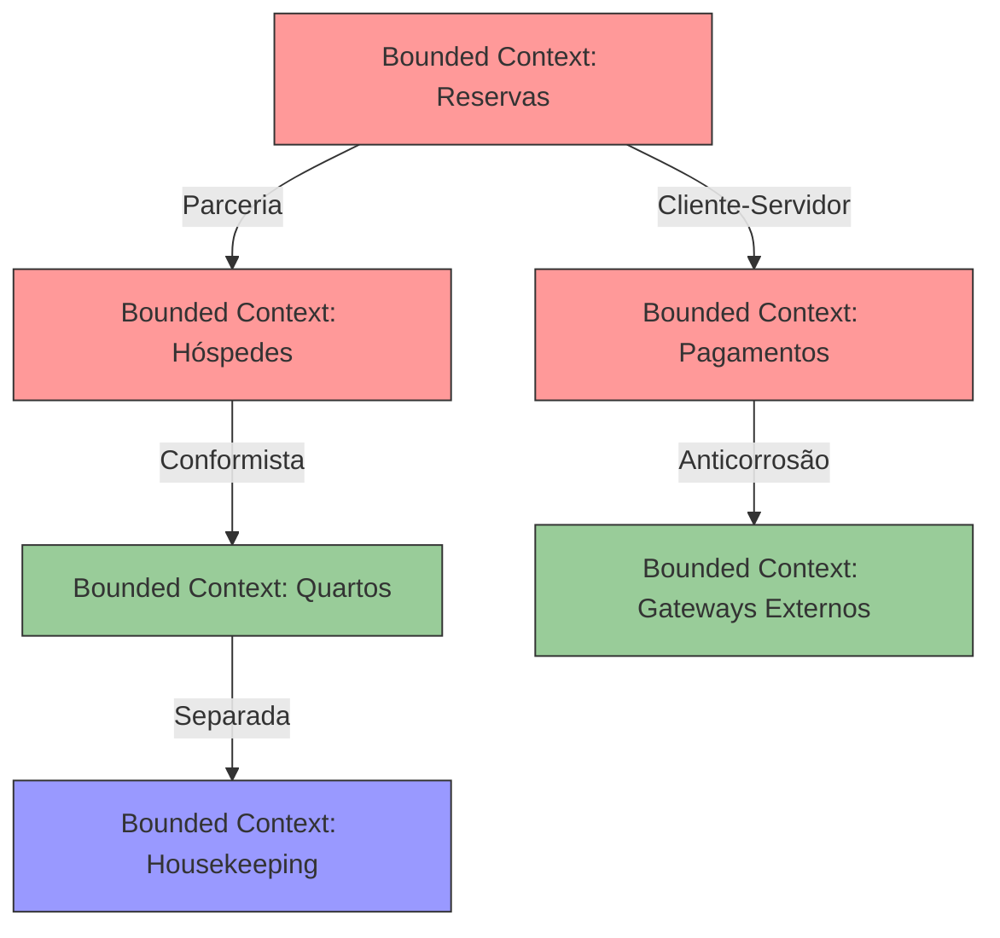
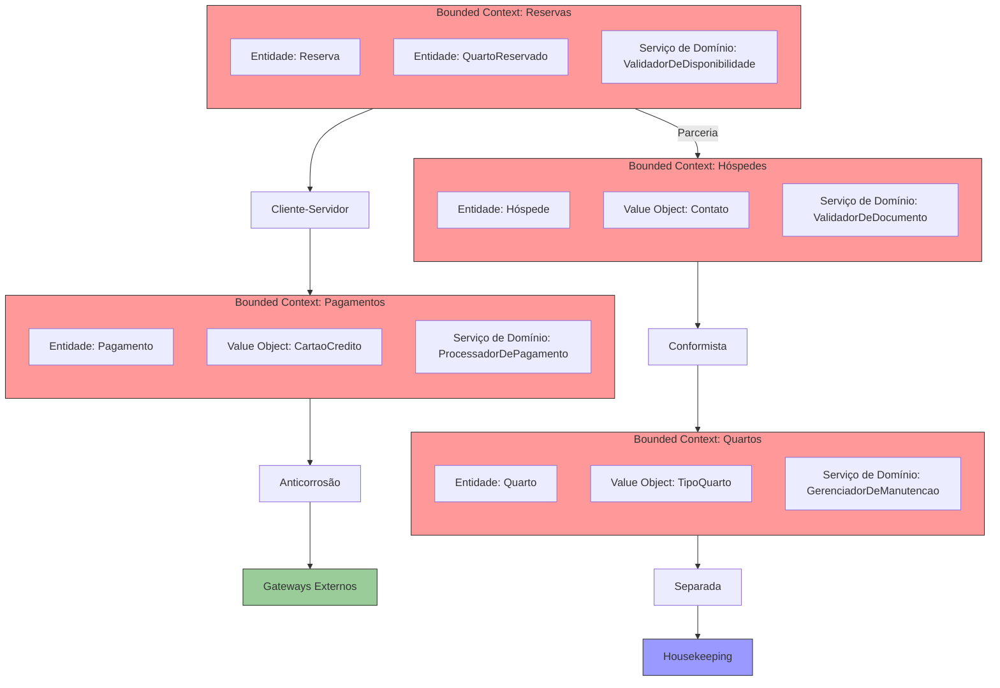

**Navegação:** [[MOC — TRILHA INTERMEDIÁRIA]]
← [[PARTE 7 — ONION ARCHITECTURE]] | #trilha/intermediaria | [[PARTE 12 — ARCHITECTURAL PATTERNS]] →

---
# PARTE 8 — DOMAIN-DRIVEN DESIGN

> 🧠 **ESSENCIAL**
> 
> Domain-Driven Design (DDD) é uma abordagem de desenvolvimento de software que foca no domínio de negócio central e complexo, colocando o domínio no coração do projeto e mantendo um modelo de software rico que expressa esse domínio.

## O que é Domain-Driven Design?
Domain-Driven Design é uma coleção de princípios e padrões para desenvolver sistemas de software complexos, colocando o foco principal no domínio de negócio e na lógica que nele reside. Baseia-se na ideia de que para sistemas complexos, o domínio deve ser o coração do projeto, e o código deve refletir profundamente esse domínio.

### Por que existe?
Como resposta à dificuldade de desenvolver sistemas complexos onde a lógica de negócio fica espalhada, mal compreendida ou difícil de manter devido à falta de uma linguagem comum entre desenvolvedores e especialistas de negócio.

### Qual problema resolve?
- Falha de comunicação entre desenvolvedores e especialistas de negócio devido à falta de linguagem ubíqua
- Lógica de negócio espalhada por múltiplas camadas dificultando compreensão e manutenção
- Modelos de dados anêmicos que não capturam a riqueza do domínio de negócio
- Dificuldade em evoluir o sistema conforme o domínio de negócio muda
- Acoplamento desnecessário entre diferentes partes do sistema
- Falta de limites claros entre diferentes áreas do negócio

### Como funciona internamente?
DDD se divide em duas áreas principais:
1. **Tactical DDD** - Padrões de construção para modelar o domínio (Entities, Value Objects, Aggregates, Repositories, Domain Services, etc.)
2. **Strategic DDD** - Princípios para estruturação de grandes domínios (Bounded Contexts, Context Maps, Ubiquitous Language, etc.)

O núcleo do DDD é o **modelo de domínio rico** que representa conceitos de negócio com comportamento, não apenas dados. Este modelo é desenvolvido em colaboração constante com especialistas de negócio usando uma **linguagem ubíqua** compartilhada.

### Como implementar?
1. **Colaborar com especialistas de negócio** para entender o domínio profundamente
2. **Desenvolver uma linguagem ubíqua** que seja usada por desenvolvedores e especialistas de negócio
3. **Identificar o núcleo do domínio** (Core Domain) que diferencia o negócio
4. **Aplicar padrões táticos** para modelar o domínio (Entities, Value Objects, Aggregates, etc.)
5. **Definir limites claros** usando Bounded Contexts para diferentes áreas do negócio
6. **Mapear relações entre contextos** usando Context Maps
7. **Implementar o modelo** usando uma linguagem de programação orientada a objeto
8. **Refatorar continuamente** o modelo à medida que o entendimento do domínio evolui

### Quais são as alternativas?
- Abordagem centrada em dados (modelagem apenas de estruturas de dados)
- Abordagem centrada em serviços (lógica em serviços sem modelo de domínio rico)
- Abordagem centrada em tela (lógica nos controllers ou apresentadores)
- Arquitetura em camadas tradicional sem foco especial no domínio
- Desenvolvimento guiado por banco de dados (modelagem começando pelas tabelas)

### Quais são os trade-offs?
**Vantagens do DDD:**
- Melhor alinhamento entre software e necessidades de negócio
- Modelo de domínio rico que captura comportamento e regras de negócio
- Comunicação melhorada entre desenvolvedores e especialistas de negócio
- Limites claros entre diferentes áreas do sistema (Bounded Contexts)
- Facilidade de evoluir o sistema conforme o domínio muda
- Código mais expressivo e intuitivo que reflete o negócio
- Redução de ambiguidades e mal-entendidos sobre regras de negócio

**Desvantagens do DDD:**
- Sobrehead inicial de aprendizado e colaboração com especialistas de negócio
- Pode parecer excessivamente complexo para domínios simples
- Requer maturidade da equipe e disciplina para aplicar corretamente
- Pode levar a overengineering se aplicado a domínios triviais
- Curva de aprendizado íngreme para equipes unfamiliarizadas com o conceito
- Dificuldade em medir o sucesso imediatamente (benefícios aparecem a longo prazo)

### Quando usar?
- Domínios de negócio complexos com regras de negócio intrincadas
- Quando o sucesso do depende fortemente da correta implementação das regras de negócio
- Quando há necessidade de evolução frequente do software conforme o negócio muda
- Quando múltiplas equipes ou partes do sistema precisam trabalhar em áreas diferentes do mesmo negócio
- Quando se quer maximizar a qualidade e manutenibilidade a longo prazo
- Quando se está construindo um sistema onde o domínio é o ativo mais valioso

### Quando não usar?
- Domínios de negócio muito simples ou triviais
- Protótipos ou provas de conceito onde velocidade é a única prioridade
- Quando o overhead de modelagem de domínio não traz benefício proporcional
- Equipes que rejeitam fortemente a ideia de modelagem de domínio rica
- Quando se está em um ambiente altamente restrito onde cada classe conta
- Quando o projeto é de curta duração e será descartado rapidamente

### Quais são os erros mais comuns?
- Aplicar DDD a domínios simples onde não traz benefício
- Focar apenas nos padrões táticos sem entender os estratégicos
- Criar modelos de domínio anêmicos (apenas getters/setters)
- Violentar limites de Bounded Contexts (acoplamento entre contextos)
- Não desenvolver ou manter uma linguagem ubíqua verdadeira
- Separar desenvolvedores de especialistas de negócio durante o desenvolvimento
- Fazer o modelo de domínio depender de detalhes de infraestrutura
- Não refatorar o modelo à medida que o entendimento do domínio evolui
- Tratar DDD como uma metodologia rígida em vez de uma abordagem adaptativa

### Como isso afeta:
- *performance:* Impacto mínimo; depende mais da implementação específica do que do DDD em si
- *escalabilidade:* Similar a outras abordagens; o DDD não impõe limitações de escalabilidade
- *disponibilidade:* Nenhum impacto direto
- *consistência:* Melhora pois limites claros (Bounded Contexts) ajudam a gerenciar consistência
- *segurança:* Similar; o DDD não afeta diretamente preocupações de segurança
- *custo:* Custo inicial pode ser maior devido ao overhead de modelagem, mas custo de manutenção a longo prazo tende a ser menor
- *observabilidade:* Similar a outras abordagens; pode ser instrumentada normalmente
- *complexidade operacional:* Pode reduzir devido a melhor modularização e limites claros

### Exemplos reais de aplicação
- Sistemas financeiros complexos onde regras de negócio são cruciais e mudam frequentemente
- Sistemas de saúde onde lógica clínica deve ser precisamente modelada
- Sistemas de comércio eletrônico com regras complexas de preços, descontos e promoções
- Sistemas de logística e cadeia de suprimentos com múltiplas restrições de negócio
- Sistemas de jogos onde regras de jogo são centrais para a experiência
- Sistemas de reservas e agendamento com múltiplas regras de negócio complexas

### Exemplo simplificado
Modelo de domínio rico para um sistema de leilão:
```java
// ✅ CORRETO: Entidade rica com comportamento de negócio
public class Leilao {
    private String id;
    private String descricao;
    private LocalDateTime dataInicio;
    private LocalDateTime dataFim;
    private Lance lanceVencedor;
    private final List<Lance> lances;
    private EstadoLeilao estado;
    
    public Leilao(String id, String descricao, LocalDateTime inicio, LocalDateTime fim) {
        this.id = id;
        this.descricao = descricao;
        this.dataInicio = inicio;
        this.dataFim = fim;
        this.lances = new ArrayList<>();
        this.estado = EstadoLeilao.NAO_INICIADO;
    }
    
    public void darLance(Usuario usuario, BigDecimal valor) {
        // Regras de negócio encapsuladas na entidade
        if (estado != EstadoLeilao.EM_ANDAMENTO) {
            throw new IllegalStateException("Leilão não está em andamento");
        }
        if (valor.compareTo(BigDecimal.ZERO) <= 0) {
            throw new IllegalArgumentException("Valor do lance deve ser positivo");
        }
        if (lanceVencedor != null && valor.compareTo(lanceVencedor.getValor()) <= 0) {
            throw new IllegalArgumentException("Lance deve ser maior que o lance atual");
        }
        
        Lance lance = new Lance(usuario, valor, LocalDateTime.now());
        lances.add(lance);
        lanceVencedor = lance;
    }
    
    public void iniciar() {
        if (LocalDateTime.now().isAfter(dataInicio)) {
            throw new IllegalStateException("Não é possível iniciar leilão no passado");
        }
        this.estado = EstadoLeilao.EM_ANDAMENTO;
    }
    
    public void encerrar() {
        if (estado != EstadoLeilao.EM_ANDAMENTO) {
            throw new IllegalStateException("Só é possível encerrar leilão em andamento");
        }
        if (LocalDateTime.now().isBefore(dataFim)) {
            throw new IllegalStateException("Leilão ainda não terminou seu período");
        }
        this.estado = EstadoLeilao.ENCERRADO;
    }
    
    // Getters apenas para informações necessárias
    public String getId() { return id; }
    public String getDescricao() { return descricao; }
    public Lance getLanceVencedor() { return lanceVencedor; }
    public EstadoLeilao getEstado() { return estado; }
}
```

### Exemplo de sistema de produção
Sistema de gestão de hospital:
- **Core Domain:** Gestão de pacientes, consultas, prontuários e procedimentos médicos
- **Subdomínios:** 
  - Agendamento (Core)
  - Prontuário Eletrônico (Core)
  - Faturamento (Supporting)
  - Gestão de Estoque (Supporting)
  - Integração com Laboratórios (Generic)
- **Bounded Contexts:** 
  - Contexto de Agendamento: gerencia consultas, disponibilidade de médicos e recursos
  - Contexto de Prontuário: gerencia históricos médicos, prescrições e resultados de exames
  - Contexto de Faturamento: gerencia contas, convênios e procedimentos de cobrança
  - Contexto de Estoque: gerencia medicamentos, materiais e suprimentos
- **Linguagem Ubíqua:** termos como "prontuário", "consulta", "procedimento", "convênio" usados consistentemente por desenvolvedores e médicos
- **Entidades Ricas:** Paciente com métodos como `getIdade()`, `podeFazerProcedimento(TipoProcedimento)`, `temAlergiaAo(Medicamento)`
- **Value Objects:** Cpf, Crm, Dosagem, HorarioDeFuncionamento
- **Aggregates:** Prontuário como raiz contendo consultas, prescrições e exames
- **Domain Services:** Servicio de detecção de interações medicamentosas, serviço de validação de agenda
- **Repositories:** Interfaces para persistência de cada aggregate
- **Application Services:** Orquestram casos de uso como agendar consulta, dar alta ao paciente, gerar fatura

### Como esse assunto pode aparecer em uma entrevista.
> 🎯 **ENTREVISTA — ALTA FREQUÊNCIA**
> 
> "Explique como você aplicaria Domain-Driven Design a um sistema de reservas de hotéis."
> 
> **Armadilha:** Focar apenas nos padrões técnicos (Entidades, Repositories) sem mencionar a colaboração com especialistas de negócio ou a linguagem ubíqua.
> 
> **Como raciocinar:** Descrever o processo de colaboração com especialistas de hotelaria para entender o domínio, desenvolvimento de linguagem ubíqua (termos como "diária", "tarifa", "política de cancelamento", "overbooking"), identificação do core domain (gestão de reservas e quartos), definição de bounded contexts (reservas, hóspedes, tarifas, housekeeping), aplicação de padrões táticos (entidades como Reserva, Quarto, Hóspede com comportamento de negócio, value objects como Cpf, Cnpj, Período de Hospedagem), e explicação de como isso resulta em um modelo de software que reflete fielmente o negócio de hotéis.

## Tactical DDD

> 🎯 **ENTREVISTA — ALTA FREQUÊNCIA**
> 
> Tactical DDD contém os padrões de construção para modelar o domínio de negócio; entrevistadores querem ver se você entende os building blocks básicos.

### definição
Tactical DDD refere-se aos padrões de construção e building blocks usados para modelar o domínio de negócio de forma rica e expressiva. Estes incluem Entities, Value Objects, Aggregates, Repositories, Domain Services, Factories, Domain Events e Specifications.

### Por que existe?
Para fornecer um vocabulário comum e um conjunto de padrões que permitem aos desenvolvedores criar modelos de domínio que expressam com fidelidade as regras e conceitos de negócio, indo além de meras estruturas de dados.

### Como funciona internamente?
- **Entities:** Objetos com identidade que continuam sendo os mesmos mesmo quando seu estado muda
- **Value Objects:** Objetos imutáveis que são definidos apenas por seus atributos, não por identidade
- **Aggregates:** Clusters de objetos associados que são tratados como uma unidade para mudanças de dados
- **Aggregate Root:** A entidade principal de um aggregate que controla o acesso aos seus membros
- **Repositories:** Mecanismos para encapsular lógica de armazenamento, recuperação e busca
- **Domain Services:** Operações de negócio que não pertencem naturalmente a uma entidade ou value object
- **Factories:** Encapsulam a lógica de criação de objetos complexos ou aggregates
- **Domain Events:** Representam algo que aconteceu no domínio de negócio que outras partes podem estar interessadas
- **Specifications:** Encapsulam regras de negócio para verificar se um objeto cumpre certos critérios

### Como implementar?
1. **Entities:** Identificar objetos que precisam de identidade única ao longo do tempo e implementar métodos de negócio
2. **Value Objects:** Identificar conceitos imutáveis definidos por seus atributos e torná-los imutáveis
3. **Aggregates:** Agrupar objetos relacionados que sempre devem ser consistentes juntos e definir um aggregate root
4. **Repositories:** Criar interfaces para acesso a aggregates e implementações específicas de tecnologia
5. **Domain Services:** Identificar operações de negócio que envolvem múltiplas entidades e colocá-las em serviços de domínio
6. **Factories:** Criar fábricas para objetos complexos cuja criação envolve regras de negócio
7. **Domain Events:** Definir eventos para representar mudanças significativas no domínio
8. **Specifications:** Criar especificações reutilizáveis para regras de negócio complexas de validação

### Quais são as alternativas?
- Modelos de domínio anêmicos (apenas estruturas de dados com getters/setters)
- Lógica de negócio em serviços de aplicação ou controllers
- Modelos centrados em tela ou em dados
- Uso direto de estruturas de dados sem encapsulamento
- Serviços genéricos que contêm toda a lógica de negócio

### Quais são os trade-offs?
**Vantagens do Tactical DDD bem aplicado:**
- Modelo de domínio expressivo que captura comportamento de negócio
- Encapsulamento de regras de negócio onde elas naturalmente pertencem
- Limites claros de consistência através de aggregates
- Facilidade de testar lógica de negócio isoladamente
- Redução de duplicação de regras de negócio
- Melhor compreensão do domínio através da exploração do código

**Desvantagens/custos:**
- Sobrehead de criação de objetos adicionais (value objects, aggregates)
- Pode parecer indireto para desenvolvedores acostumados com acesso direto a dados
- Requer disciplina para manter o modelo puro (nenhuma lógica de aplicação nas entidades)
- Pode haver debate sobre o que pertence a cada building block
- Necessidade de refatorar conforme o entendimento do domínio evolui

### Quando usar?
- Sempre que se estiver modelando um domínio de negócio não trivial
- Quando se quer garantir que regras de negócio estejam localizadas corretamente
- Quando múltiplas partes do sistema precisam usar os mesmos conceitos de negócio
- Quando se quer facilitar o teste e manutenção do modelo de negócio
- Quando se está construindo um sistema onde o modelo de domínio é um ativo valioso

### Quando não usar?
- Quando o domínio é tão simples que não há comportamento de negócio significativo para modelar
- Quando se está prototipando e velocidade é a única prioridade
- Quando o overhead de modelagem de domínio não traz benefício proporcional
- Quando se está em um contexto onde desempenho crítico exige acesso direto a estruturas de dados
- Quando se está construindo uma camada de apresentação pura onde não há necessidade de modelo de domínio

### Quais são os erros mais comuns?
- Fazer entidades anêmicas (apenas dados, toda lógica em serviços)
- Fazer value objects mutáveis (violando o princípio de imutabilidade)
- Não definir claramente o aggregate root, levando a atualizações inconsistentes
- Expor referências internas do aggregate através de getters (violando encapsulamento)
- Colocar lógica de aplicação nos domain services (deve ficar apenas lógica de negócio puro)
- Fazer repositórios conhecerem detalhes específicos de apresentação ou aplicação
- Não publicar domain events quando algo significativo acontece no domínio
- Criar especificações que são muito específicas ou muito gerais

### Como isso afeta:
- *performance:* Impacto mínimo devido a encapsulamento e chamadas de método (geralmente insignificante)
- *escalabilidade:* Nenhum impacto direto
- *disponibilidade:* Nenhum impacto direto
- *consistência:* Melhora significativamente devido a limites claros de aggregate e transações consistentes
- *segurança:* Melhora pois entidades podem aplicar validação e controle de acesso intrínseco
- *custo:* Similar; foco em onde a lógica de negócio reside ao invés de adicionar ou remover código
- *observabilidade:* Melhora pois domain events fornecem pontos claros para logging e monitoring
- *complexidade operacional:* Similar; pode reduzir bugs devido a melhor encapsulamento e menos efeito colateral

### Exemplos reais de aplicação
- Entidade `ContaBancaria` em sistema financeiro com métodos como `sacar(BigDecimal valor)`, `depositar(BigDecimal valor)`, `transferirPara(ContaBancaria destino, BigDecimal valor)`
- Value Object `Money` que encapsula valor e moeda com operações aritméticas seguras
- Aggregate `Pedido` contendo `ItemPedido` como entidades filhas, com `Pedido` como aggregate root
- Repository `PedidoRepository` com métodos como `salvar(Pedido pedido)`, `buscarPorId(String id)`, `listarPorCliente(String clienteId)`
- Domain Service `CalculadoraDeFrete` que calcula frete baseado em peso, destino e tipo de serviço
- Factory `PedidoFactory` que cria pedidos com validação de negócio complexa
- Domain Event `PedidoConfirmado` que é disparado quando um pedido é confirmado
- Specification `ClientePremiumSpecification` que verifica se um cliente é premium baseado em múltiplos critérios

### Exemplo simplificado
Entidade anêmica (errada):
```java
// ❌ ERRADO: Apenas dados, toda lógica ficaria em serviços
public class Produto {
    private String id;
    private String nome;
    private BigDecimal preco;
    private int quantidadeEstoque;
    
    // Getters e setters públicos
    public String getId() { return id; }
    public void setId(String id) { this.id = id; }
    public String getNome() { return nome; }
    public void setNome(String nome) { this.nome = nome; }
    public BigDecimal getPreco() { return preco; }
    public void setPreco(BigDecimal preco) { this.preco = preco; }
    public int getQuantidadeEstoque() { return quantidadeEstoque; }
    public void setQuantidadeEstoque(int quantidadeEstoque) { this.quantidadeEstoque = quantidadeEstoque; }
}
```

Entidade rica (correta):
```java
// ✅ CORRETO: Contém regras de negócio intrínsecas
public class Produto {
    private String id;
    private String nome;
    private BigDecimal preco;
    private int quantidadeEstoque;
    private final List<Promocao> promocoesAtivas;
    
    public Produto(String id, String nome, BigDecimal preco, int quantidadeEstoque) {
        this.id = id;
        this.nome = nome;
        this.preco = preco;
        this.quantidadeEstoque = quantidadeEstoque;
        this.promocoesAtivas = new ArrayList<>();
    }
    
    // Métodos de negócio encapsulados
    public boolean estaDisponivel(int quantidade) {
        return quantidadeEstoque >= quantidade;
    }
    
    public void adicionarEstoque(int quantidade) {
        if (quantidade <= 0) {
            throw new IllegalArgumentException("Quantidade deve ser positiva");
        }
        this.quantidadeEstoque += quantidade;
    }
    
    public void reservarEstoque(int quantidade) {
        if (!estaDisponivel(quantidade)) {
            throw new IllegalStateException("Estoque insuficiente para reserva");
        }
        this.quantidadeEstoque -= quantidade;
    }
    
    public void aplicarPromocao(Promocao promocao) {
        if (!promocao.isValidaPara(this)) {
            throw new IllegalArgumentException("Promoção não se aplica a este produto");
        }
        promocoesAtivas.add(promocao);
    }
    
    public BigDecimal calcularPrecoComPromocao(int quantidade) {
        BigDecimal precoBase = preco.multiply(new BigDecimal(quantidade));
        BigDecimal descontoTotal = promocoesAtivas.stream()
                .map(promocao -> promocao.calcularDesconto(precoBase))
                .reduce(BigDecimal.ZERO, BigDecimal::add);
        return precoBase.subtract(descontoTotal);
    }
    
    // Getters apenas (não setters públicos para preço e estoque diretos)
    public String getId() { return id; }
    public String getNome() { return nome; }
    public BigDecimal getPreco() { return preco; }
    public int getQuantidadeEstoque() { return quantidadeEstoque; }
    public List<Promocao> getPromocoesAtivas() { return Collections.unmodifiableList(promocoesAtivas); }
}
```

### Exemplo de sistema de produção
Sistema de gestão de biblioteca:
- **Entidades:** Livro, Usuário, Empréstimo, Reserva
  - Livro: métodos como `estaDisponivel()`, `reservarPara(Usuario usuario)`, `emprestarPara(Usuario usuario, LocalDate dataDevolucaoPrevista)`
  - Usuário: métodos como `podeEmprestar()`, `temMultasPendentes()`, `getLimiteEmprestimos()`
  - Empréstimo: métodos como `estaAtrasado()`, `calcularMulta()`, `renovarPor(int dias)`
  - Reserva: métodos como `estaAtiva()`, `canBeFulfilledBy(Livro livro)`
- **Value Objects:** ISBN, CódigoBarras, DataDeDevolução
- **Aggregates:** 
  - Livro como aggregate root (contém exemplares físicos)
  - Usuário como aggregate root (contém empréstimos ativos e reservas)
  - Empréstimo como aggregate (contém informações do empréstimo específico)
- **Repositories:** LivroRepository, UsuárioRepository, EmpréstimoRepository
- **Domain Services:** 
  - CalculadoraDeMultas (calcula multas baseado em dias de atraso e tipo de material)
  - ServicoDeNotificacao (envia lembretes de devolução, confirmações de reserva)
  - ValidadorDeElegibilidade (verifica se usuário pode fazer empréstimo ou reserva)
- **Factories:** EmprestimoFactory (cria empréstimos com validação de negócio)
- **Domain Events:** LivroEmprestado, LivroDevolvido, UsuarioCadastrado, MultaAplicada
- **Specifications:** UsuarioElegivelParaEmprestimo, LivroDisponivelParaEmprestimoNoPeriodo

### Como esse assunto pode aparecer em uma entrevista.
> 🎯 **ENTREVISTA — ALTA FREQUÊNCIA**
> 
> "Descreva a diferença entre uma Entity e um Value Object no contexto de um sistema de pagamento."
> 
> **Armadilha:** Sugerir que a diferença está apenas na mutabilidade ou no uso de identidade sem explicar as implicações de design.
> 
> **Como raciocinar:** Entidades têm identidade que persiste ao longo do tempo mesmo quando seus atributos mudam (ex: uma ContaBancária permanece a mesma conta mesmo se o saldo muda). Value Objects são definidos exclusivamente por seus atributos e são intercambiáveis se tiverem os mesmos valores (ex: dois objetos Money com valor 10.00 em USD são considerados iguais, independentemente de serem instâncias diferentes). Mostrar como isso afeta o design: entidades têm ciclo de vida e podem ter histórico, value objects são imutáveis e podem ser compartilhados livremente.

## Strategic DDD

> 🎯 **ENTREVISTA — ALTA FREQUÊNCIA**
> 
> Strategic DDD trata de como estruturar grandes domínios de negócio; entrevistadores querem ver se você entende limites de contexto e estratégias de integração.

### definição
Strategic DDD refere-se aos princípios e práticas para gerenciar grandes domínios de negócio dividindo-os em Bounded Contexts separados, cada um com seu próprio modelo de domínio e linguagem ubíqua, e definindo como esses contextos se comunicam e se relacionam através de Context Maps.

### Por que existe?
Para lidar com a complexidade de grandes domínios de negócio onde diferentes partes podem ter modelos, termos e regras diferentes para o mesmo conceito, evitando confusão e conflitos de modelo.

### Como funciona internamente?
- **Bounded Contexts:** Limites explícitos dentro dos quais um modelo de domínio específico se aplica
- **Ubiquitous Language:** Linguagem compartilhada dentro de cada Bounded Context entre desenvolvedores e especialistas de negócio
- **Context Map:** Mapa que mostra como os diferentes Bounded Contexts se relacionam e se comunicam
- **Padrões de Integração:** Definem como os contextos interagem (Parceria, Compartilhamento de Kernel, Cliente-Servidor, Conformista, Anticorrosão, Separada, etc.)
- **Core Domain:** O subdomínio mais valioso e diferenciador do negócio que deve receber o melhor talento e atenção
- **Supporting Subdomains:** Subdomínios necessários para o negócio funcionar mas não são diferenciadores
- **Generic Subdomains:** Subdomínios que são soluções genéricas que podem ser compradas ou feitas com mínimo esforço

### Como implementar?
1. **Identificar subdomínios** no negócio analisando áreas de atividade e regras de negócio
2. **Separar o Core Domain** que é o coração diferenciador do negócio
3. **Definir Bounded Contexts** para cada subdomínio ou área de negócio significativa
4. **Estabelecer uma Linguagem Ubíqua** dentro de cada Bounded Context
5. **Criar um Context Map** mostrando relações e padrões de integração entre contextos
6. **Aplicar padrões táticos** dentro de cada Bounded Context para modelar seu domínio específico
7. **Definir mecanismos de integração** entre contextos baseado no padrão de relação apropriado
8. **Investir proporcionalmente** mais no Core Domain do que nos subdomínios de apoio ou genéricos
9. **Evoluir os contextos independentemente** conforme suas necessidades de negócio específicas
10. **Manter anticamadas de corrupção** quando necessário para proteger o modelo de domínio

### Quais são as alternativas?
- Modelo de domínio único e global para todo o negócio
- Nenhuma separação explícita entre áreas do negócio
- Integração ad-hoc entre partes do sistema sem padrões claros
- Tratar todo o negócio como um único contexto sem limites
- Delegar todas as decisões de modelo para especialistas de negócio sem envolvimento de desenvolvedores
- Construir tudo como um grande modelo unificado sem tentativa de separação

### Quais são os trade-offs?
**Vantagens do Strategic DDD bem aplicado:**
- Limites claros que reduzem confusão e conflitos de modelo
- Capacidade de evoluir diferentes partes do negócio em ritmos diferentes
- Alinhamento entre estrutura de software e estrutura de negócio
- Foco de esforços no que realmente diferencia o negócio (Core Domain)
- Clareza sobre como diferentes partes do sistema devem se integrar
- Redução de duplicação e inconsistência entre modelos de domínio
- Facilidade de terceirizar ou comprar soluções para subdomínios genéricos

**Desvantagens/custos:**
- Sobrehead de definição e manutenção de limites e mapas de contexto
- Pode parecer excessivamente formal para negócios simples ou pequenos
- Requer comunicação e coordenação entre equipes responsável por diferentes contextos
- Pode haver tensão entre autonomia de contextos e necessidade de consistência global
- Necessidade de desenvolver e manter múltiplos modelos de domínio
- Complexidade aumentada na integração entre contextos

### Quando usar?
- Negócios grandes ou complexos com múltiplas áreas de atividade distintas
- Quando diferentes partes do negócio têm modelos, termos ou regras diferentes para conceitos semelhantes
- Quando se quer maximizar a autonomia e agilidade de diferentes equipes
- Quando o negócio está organizado em linhas de produto ou unidades de negócio distintas
- Quando se quer proteger o modelo de domínio do Core Domain de influências corruptoras
- Quando múltiplas equipes precisam trabalhar simultaneamente em partes diferentes do mesmo sistema

### Quando não usar?
- Negócios muito simples ou com pouca distinção entre áreas de atividade
- Quando o overhead de definição de contextos não traz benefício proporcional
- Equipes que rejeitam fortemente a ideia de limites explícitos e autonomia de contexto
- Quando se está prototipando e velocidade é a única prioridade
- Quando o negócio é tão simples que não há benefício claro na separação de contextos
- Quando se está construindo um sistema onde tudo é altamente interdependente e nenhuma separação faz sentido

### Quais são os erros mais comuns?
- Definir Bounded Contexts muito pequenos ou muito grandes (não alinhados com fronteiras de negócio)
- Não estabelecer ou manter uma Linguagem Ubíqua verdadeira dentro de cada contexto
- Permitir vazamento de modelo entre contextos (violando o limite do Bounded Context)
- Escolher padrões de integração inadequados para o tipo de relação entre contextos
- Não investir suficientemente no Core Domain, tratando-o como qualquer outro subdomínio
- Fazer o Context Map desatualizado conforme o negócio evolui
- Não implementar anticamadas de corrupção quando necessário para proteger o modelo
- Tratar todos os contextos como igualmente importantes, ignorando a distinção Core/Supporting/Generic
- Falhar em evoluir os modelos de domínio conforme o negócio muda dentro de cada contexto

### Como isso afeta:
- *performance:* Impacto depende do padrão de integração escolhido (pode ser significativo para comunicação entre contextos)
- *escalabilidade:* Melhora pois contextos podem ser escalados independentemente conforme necessidades
- *disponibilidade:* Similar; falhas em um contexto afetam respective área de negócio mas não necessariamente outros
- *consistência:* Trade-off entre consistência forte dentro de contextos e consistência eventual entre contextos
- *segurança:* Similar; cada contexto pode implementar suas próprias medidas de segurança apropriadas
- *custo:* Pode reduzir devido a melhor alinhamento e autonomia, mas aumenta devido a overhead de integração
- *observabilidade:* Similar; cada contexto pode ser monitorado independentemente
- *complexidade operacional:* Pode reduzir devido a autonomia de equipes, mas aumenta devido a necessidade de coordenação entre contextos

### Exemplos reais de aplicação
- Sistema de comércio eletrônico grande:
  - Core Domain: Gestão de catálogo e vendas
  - Supporting Subdomains: Pagamento, Estoque, Envio
  - Generic Subdomains: Autenticação, Notificação, Relatórios
  - Bounded Contexts: Catálogo de Produtos, Carrinho de Compras, Processamento de Pagamento, Gestão de Estoque, Logística de Envio, Gestão de Promoções
  - Integração: 
    - Catálogo e Carrinho: Parceria (ambos precisam do outro e têm influência igual)
    - Carrinho e Pagamento: Cliente-Servidor (carrinho solicita pagamento, pagamento processa)
    - Pagamento e Estoque: Conformista (estoque deve seguir regras do pagamento para reserva)
    - Envio e Logística: Separada (equipes diferentes com pouca interação)
- Sistema bancário:
  - Core Domain: Gestão de contas e transações
  - Supporting Subdomains: Empréstimos, Investimentos, Cartões de Crédito
  - Generic Subdomains: Autenticação, Notificação, Relatórios Regulatórios
  - Bounded Contexts: Contas Correntes, Contas Poupança, Empréstimos, Investimentos, Cartões, Pagamentos
- Sistema de saúde:
  - Core Domain: Gestão de pacientes e atendimento clínico
  - Supporting Subdomains: Agendamento, Faturamento, Farmácia
  - Generic Subdomains: Autenticação, Prontuário Digital, Comunicação
  - Bounded Contexts: Prontuário Eletrônico, Agendamento de Consultas, Gestão de Farmácia, Faturamento Hospitalar, Gestão de Estoque Médico

### Exemplo simplificado
Sistema de reservas de hotéis com Bounded Contexts claros:


Context Map explicando relações:
- **Reservas e Hóspedes:** Parceria - Ambos contextos precisam um do outro e têm influência igual sobre o modelo compartilhado de hóspede-reserva
- **Reservas e Pagamentos:** Cliente-Servidor - O contexto de Reservas solicita serviços do contexto de Pagamentos para processar pagamentos de reservas
- **Hóspedes e Quartos:** Conformista - O contexto de Quartos define o modelo de quarto e o contexto de Hóspedes deve se conformar a ele para fazer reservas
- **Pagamentos e Gateways Externos:** Anticorrosão - O contexto de Pagamentos protege seu modelo de pagamento de influências corruptoras de gateways externos através de uma camada de tradução
- **Quartos e Housekeeping:** Separada - Pouca conexão de negócio entre gerenciamento de quartos e operações de housekeeping, permitindo desenvolvimento independente

### Exemplo de sistema de produção
ERP grande para empresa de manufatura:
- **Core Domain:** Gestão de produção e controle de qualidade
- **Supporting Subdomains:** Gestão de estoque, compras, vendas, finanças
- **Generic Subdomains:** Recursos humanos, relatórios gerais, autenticação
- **Bounded Contexts:** 
  - Planejamento de Produção (Core)
  - Controle de Qualidade (Core)
  - Gestão de Estoque de Materiais Primos (Supporting)
  - Gestão de Estoque de Produtos Acabados (Supporting)
  - Compras de Materiais (Supporting)
  - Vendas e Distribuição (Supporting)
  - Contas a Pagar e Receber (Supporting)
  - Folha de Pagamento (Generic)
  - Relatórios de Gestão (Generic)
  - Autenticação e Autorização (Generic)
- **Integração entre Contextos:**
  - Planejamento de Produção e Controle de Qualidade: Parceria (ambos essenciais e influenciam um ao outro)
  - Planejamento de Produção e Estoque de Materiais Primos: Cliente-Servidor (planejamento solicita materiais, estoque fornece)
  - Controle de Qualidade e Estoque de Produtos Acabados: Conformista (qualidade define padrões, estoque deve seguir)
  - Compras e Fornecedores Externos: Anticorrosão (protege modelo de compras de mudanças frequentes em fornecedores)
  - Vendas e Finanças: Parceria (ambos precisam coordenar para reconhecimento de receita)
  - Folha de Pagamento e RH: Separada (pouca lógica de negócio compartilhada)
  - Relatórios e todos os outros: Separada (consome dados de múltiplos contextos mas não afeta lógica de negócio)

### Como esse assunto pode aparecer em uma entrevista.
> 🎯 **ENTREVISTA — ALTA FREQUÊNCIA**
> 
> "Explique como você definiria os Bounded Contexts para um sistema de comércio eletrônico grande que inclui catálogo de produtos, carrinho de compras, processamento de pagamento, gestão de estoque, logística de envio e sistema de recomendações."
> 
> **Armadilha:** Sugerir criar um único modelo de domínio para tudo ou fazer contextos muito pequenos sem considerar coesão e acoplamento de negócio.
> 
> **Como raciocinar:** Identificar o Core Domain (provavelmente gestão de catálogo e vendas), Supporting Subdomains (estoque, pagamentos, envio), Generic Subdomains (autenticação, notificações, relatórios). Definir Bounded Contexts claros como: Catálogo de Produtos, Carrinho de Compras, Processamento de Pagamento, Gestão de Estoque, Logística de Envio, Sistema de Recomendações, Gestão de Promoções. Explicar os padrões de integração apropriados entre eles (Parceria entre Catálogo e Carrinho, Cliente-Servidor entre Carrinho e Pagamento, Conformista entre Estoque e Envio, etc.) e mostrar como isso permite que cada equipe trabalhe autonomamente em seu contexto enquanto mantém integração clara e previsível.

## Context Map

> 💡 **DICA DE ENTREVISTA**
> 
> Context Maps são ferramentas estratégicas para entender relações entre Bounded Contexts; entrevistadores querem ver se você entende como mapear e gerenciar essas relações.

### definição
Um Context Map é um artefato que mostra visualmente como diferentes Bounded Contexts se relacionam entre si, quais são os padrões de integração usados, e pontos de atenção para a equipe de desenvolvimento. Ele ajuda a entender as dependências, conflitos potenciais e estratégias de comunicação entre equipes que trabalham em diferentes partes do sistema.

### Por que existe?
Para tornar explícito e gerenciável as relações entre diferentes Bounded Contexts em um grande sistema, evitando surpresas, conflitos de modelo e falhas de comunicação entre equipes.

### Como funciona internamente?
- Mostra cada Bounded Context como uma caixa ou região delimitada
- Indica o tipo de relacionamento entre contextos usando padrões de integração estabelecidos
- Pode mostrar direção de influência (quem lidera o relacionamento)
- Pode destacar pontos de atenção como necessidades de tradução de modelo ou anticamadas de corrupção
- Pode mostrar quais contextos são mais críticos ou exigem mais atenção
- É um documento vivo que deve ser atualizado conforme o negócio e o sistema evoluem

### Como implementar?
1. **Identificar todos os Bounded Contexts** no sistema
2. **Determinar o tipo de relacionamento** entre cada par de contextos
3. **Escolher o padrão de integração apropriado** para cada relacionamento
4. **Desenhar o mapa** mostrando contextos e suas conexões
5. **Incluir legendas** explicando os padrões de integração usados
6. **Destacar pontos de atenção** como necessidades de anticamada de corrupção ou tradução de modelo
7. **Mantenha o mapa atualizado** como parte do processo de desenvolvimento
8. **Use o mapa para guiar decisões** de arquitetura, organização de equipes e padrões de comunicação
9. **Compartilhe o mapa** com todas as equipes envolvidas no desenvolvimento
10. **Revise regularmente** o mapa em reuniões de arquitetura ou planejamento

### Quais são as alternativas?
- Nenhum mapa explícito (depender de conhecimento tácito ou comunicação ad-hoc)
- Documentação textual apenas sem representação visual
- Mapas muito detalhados que se tornam difíceis de manter
- Mapas muito simples que não capturam nuances importantes
- Mapas focados apenas em aspectos técnicos ignorando relacionamentos de negócio
- Mapas que mostram apenas dependências de código ignorando relacionamentos de modelo

### Quais são os trade-offs?
**Vantagens de Context Maps bem feitos:**
- Clareza sobre como diferentes partes do sistema se relacionam
- Identificação precoce de potenciais conflitos de modelo ou de termos
- Melhor comunicação entre equipes trabalhando em diferentes contextos
- Facilidade de ver onde investir esforços de integração ou de anticamada de corrupção
- Ajuda a tomar decisões sobre padrões de comunicação e tecnologias de integração
- Serve como ferramenta de onboarding para novas equipes
- Facilita discussões arquiteturais e de estratégia

**Desvantagens/custos:**
- Sobrehead de criação e manutenção do mapa
- Pode ficar desatualizado se não for mantido como parte do processo
- Pode criar falsa sensação de compreensão se não for discutido regularmente
- Pode ser interpretado como prescritivo demais limitando autonomia de equipes
- Risco de simplificar demais relacionamentos complexos
- Necessidade de habilidade em facilitar discussões para criar e manter o mapa

### Quando usar?
- Sempre que houver múltiplos Bounded Contexts em um sistema
- Quando se quer melhorar a comunicação entre equipes trabalhando em diferentes partes do sistema
- Quando se antecipa necessidade de mudar ou evoluir relações entre contextos
- Quando se quer identificar pontos de atenção para investimento em integração
- Quando se está planejando a arquitetura ou organização de equipes para um grande sistema
- Quando se quer treinar novos membros da equipe sobre como o sistema é estruturado
- Quando se está avaliando propostas de mudança em limites de contexto ou padrões de integração

### Quando não usar?
- Quando há apenas um Bounded Context no sistema (não há relações para mapear)
- Quando se está prototipando e velocidade é a única prioridade
- Quando o overhead de criar e manter o mapa não traz benefício proporcional
- Quando se está em um ambiente altamente restrito onde cada esforço conta
- Quando o sistema é tão simples que as relações são óbvias e não precisam de documentação explícita
- Quando se está construindo um sistema onde tudo será desenvolvido por uma única equipe pequena

### Quais são os erros mais comuns?
- Fazer o Context Map muito técnico focando apenas em tecnologias de integração
- Ignorar relações assimétricas onde um contexto lidera mais que o outro
- Não atualizar o mapa conforme o negócio ou o sistema evolui
- Fazer o mapa muito detalhado até o ponto de ser impraticável de manter
- Não incluir legendas explicando os padrões de integração usados
- Tratar todos os contextos como igualmente importantes ignorando Core/Supporting/Generic
- Fazer suposições sobre relacionamentos sem validar com especialistas de negócio
- Não destacar pontos de atenção como necessidades de anticamada de corrupção
- Fazer o mapa tão grande que se torna difícil de ver o panorama geral
- Ignorar contexto geográfico ou organizacional nas relações entre equipes

### Como isso afeta:
- *performance:* Impacto depende de como os padrões de integração são implementados no mapa
- *escalabilidade:* Nenhum impacto direto do mapa em si
- *disponibilidade:* Nenhum impacto direto
- *consistência:* Ajuda a gerenciar expectativas sobre consistência entre contextos
- *segurança:* Nenhum impacto direto
- *custo:* Sobrehead de criação e manutenção, mas pode reduzir custos de integração mal-feita
- *observabilidade:* Pode ajudar a apontar onde colocar pontos de monitoring de integração
- *complexidade operacional:* Pode reduzir devido a melhor compreensão e menos surpresas de integração

### Exemplos reais de aplicação
- Context Map de uma plataforma de streaming de vídeo mostrando relações entre:
  - Catálogo de Conteúdo (Core)
  - Gestão de Assinaturas (Core)
  - Reprodução de Vídeo (Supporting)
  - Sistema de Recomendação (Supporting)
  - Pagamentos e Faturamento (Supporting)
  - Análise de Uso e Métricas (Generic)
  - Gerenciamento de Direitos (Supporting)
  - Contextos de Dispositivos (Smartphone, Smart TV, Web, etc.)
- Context Map de um sistema bancário mostrando relações entre:
  - Contas Correntes (Core)
  - Contas Poupança (Core)
  - Empréstimos (Supporting)
  - Cartões de Crédito (Supporting)
  - Investimentos (Supporting)
  - Pagamentos e Liquidações (Supporting)
  - Gestão de Riscos (Supporting)
  - Core Banking Systems Integration (Generic)
  - Relatórios Regulatórios (Generic)
- Context Map de uma plataforma de comércio eletrônico mostrando relações entre:
  - Catálogo de Produtos (Core)
  - Gestão de Estoque (Supporting)
  - Processamento de Pagamento (Supporting)
  - Logística de Envio (Supporting)
  - Sistema de Recomendações (Supporting)
  - Gestão de Promoções (Supporting)
  - Avaliações e Reviews (Supporting)
  - Atendimento ao Cliente (Supporting)
  - Plataforma de Mercado (Generic para vendedores externos)

### Exemplo simplificado
Context Map para sistema de reservas de hotéis:


Legenda dos padrões de integração:
- **Parceria:** Ambos contextos precisam um do outro e têm influência igual
- **Cliente-Servidor:** Um contexto consome serviços oferecidos pelo outro
- **Conformista:** Um contexto deve se conformar ao modelo definido pelo outro
- **Anticorrosão:** Protege o modelo de um contexto de influências corruptoras do outro
- **Separada:** Pouca conexão de negócio, permitindo desenvolvimento independente

### Exemplo de sistema de produção
Context Map para plataforma de fintech com múltiplos produtos:
- **Contextos Principais:**
  - Contas e Pagamentos (Core)
  - Empréstimos e Crédito (Core)
  - Investimentos e Corretagem (Core)
  - Gestão de Riscos (Supporting)
  - Conformidade e Regulatório (Supporting)
  - Relatórios e Analytics (Generic)
  - Autenticação e Segurança (Generic)
  - Notificações e Comunicação (Generic)
- **Relacionamentos e Padrões:**
  - Contas e Pagamentos ↔ Empréstimos e Crédito: Parceria (produtos frequentemente combinados)
  - Contas e Pagamentos → Investimentos e Corretagem: Cliente-Servidor (contas financiam investimentos)
  - Empréstimos e Crédito → Gestão de Riscos: Conformista (risco define regras para crédito)
  - Investimentos e Corretagem → Gestão de Riscos: Parceria (ambos trabalham juntos na avaliação)
  - Todos os Contextos de Negócio → Conformidade e Regulatório: Conformista (devem seguir regras regulatórias)
  - Conformidade e Regulatório → Autenticação e Segurança: Anticorrosão (protege modelo de conformidade de mudanças frequentes em segurança)
  - Relatórios e Analytics ← Todos os Contextos: Separada (consome dados mas não afeta lógica de negócio)
  - Notificações e Comunicação ← Todos os Contextos: Separada (recebe solicitações mas não influencia lógica de negócio)

### Como esse assunto pode aparecer em uma entrevista.
> 🎯 **ENTREVISTA — ALTA FREQUÊNCIA**
> 
> "Desenhe um Context Map para um sistema de entrega de comida que inclui aplicativo de cliente, aplicativo de restaurante, aplicativo de entregador, sistema de pagamentos, sistema de gestão de pedidos e sistema de promoções."
> 
> **Armadilha:** Fazer um mapa muito simples que não capture as nuances de como esses componentes interagem ou ignorar padrões de integração importantes.
> 
> **Como raciocinar:** Identificar Bounded Contexts como: Pedidos (Core), Pagamentos (Core), Promoções (Supporting), Clientes (Supporting), Restaurantes (Supporting), Entregadores (Supporting). Explicar relacionamentos como: Pedidos e Pagamentos: Parceria (ambos essenciais para completar uma transação), Pedidos e Clientes: Conformista (clientes fazem pedidos mas pedidos definem o modelo), Pedidos e Restaurantes: Cliente-Servidor (pedidos solicitam preparação, restaurantes executam), Pedidos e Entregadores: Parceria (ambos coordenam para entrega bem-sucedida), Pedidos e Promoções: Conformista (promoções se aplicam a pedidos mas pedidos definem o modelo válido), mostrar como anticamadas de corrupção seriam necessárias para integração com sistemas externos de pagamento ou mapeamento, e explicar como o mapa ajuda equipes a entender onde focar esforços de integração e onde podem trabalhar autonomamente.

## Ubiquitous Language

> 🎯 **ENTREVISTA — ALTA FREQUÊNCIA**
> 
> Ubiquitous Language é fundamental para o DDD e frequentemente perguntada em entrevistas para testar entendimento de comunicação e alinhamento.

### definição
Ubiquitous Language é uma linguagem comum e precisa usada por desenvolvedores, especialistas de negócio e outros stakeholders dentro de um Bounded Context. Essa linguagem é baseada no modelo de domínio e reflete conceitos de negócio com consistência em toda a comunicação relacionada ao sistema, incluindo código, documentação, conversas e diagramas.

### Por que existe?
Para eliminar a lacuna de comunicação entre desenvolvedores e especialistas de negócio que leva a mal-entendidos, requisitos incorretos e software que não atende verdadeiramente às necessidades de negócio.

### Como funciona internamente?
- Desenvolvida em colaboração entre desenvolvedores e especialistas de negócio
- Reflete o modelo de domínio com termos específicos do negócio
- Usada consistentemente em código (nomes de classes, métodos, variáveis)
- Usada em documentação, diagramas, comentários e especificações
- Usada em conversas diárias entre membros da equipe
- Evolui conforme o modelo de domínio e o entendimento do negócio evoluem
- É específica para cada Bounded Context (diferentes contextos podem ter linguagens diferentes)
- Inclui tanto termos do negócio quanto termos técnicos necessários
- Evita ambiguidade e termos sobrecarregados com múltiplos significados

### Como implementar?
1. **Começar com entrevistas** com especialistas de negócio para entender o domínio
2. **Identificar termos-chave** usados consistentemente pelos especialistas de negócio
3. **Resolver conflitos de terminologia** através de discussão e consenso
4. **Documentar a linguagem** em um glossário acessível à equipe
5. **Usar a linguagem consistentemente** no código (nomes de domínio, métodos, variáveis)
6. **Aplicar em documentação**, diagramas, comentários e especificações
7. **Usar em reuniões** e conversas diárias sobre o sistema
8. **Corrigir desvios** quando membros da equipe usarem termos diferentes
9. **Evoluir a linguagem** conforme o entendimento do domínio muda
10. **Integrar a linguagem** no processo de onboarding de novos membros da equipe
11. **Revisar periodicamente** a linguagem em retrospectivas ou refinamentos de backlog
12. **Garantir que a linguagem** seja prática e útil para desenvolvimento real

### Quais são as alternativas?
- Nenhuma linguagem explícita (cada pessoa usa seus próprios termos)
- Linguagem baseada apenas em termos técnicos ou de tecnologia
- Linguagem baseada apenas em termos de dados ou de banco de dados
- Linguagem que varia completamente entre desenvolvedores e especialistas de negócio
- Linguagem imposta por autoridade sem colaboração ou consenso
- Linguagem que muda constantemente sem consenso ou documentação

### Quais são os trade-offs?
**Vantagens de Ubiquitous Language bem estabelecida:**
- Elimina ambiguidade e mal-entendidos entre desenvolvedores e especialistas de negócio
- Melhora a qualidade do software ao garantir que ele reflita verdadeiramente o negócio
- Facilita a comunicação e reduz a necessidade de tradução constante
- Torna o código mais legível e expressivo para quem conhece o negócio
- Facilita o onboarding de novos membros da equipe
- Melhora a qualidade da documentação e especificações
- Reduz retrabalho devido a mal-entendidos sobre requisitos
- Torna mais fácil identificar quando o software não está atendendo ao negócio

**Desvantagens/custos:**
- Sobrehead inicial de desenvolvimento e documentação da linguagem
- Requer disciplina e vigilância para manter o uso consistente
- Pode levar a debates sobre termos específicos que consomem tempo da equipe
- Pode parecer restritivo para desenvolvedores acostumados com liberdade total na nomenclatura
- Necessita de atualização contínua conforme o domínio evolui
- Pode criar tensão se especialistas de negócio e desenvolvedores tiverem preferências diferentes
- Risco de se tornar muito formal ou burocrático se não for mantido prático

### Quando usar?
- Sempre que houver múltiplos stakeholders (desenvolvedores, especialistas de negócio, testadores, etc.) trabalhando no mesmo Bounded Context
- Quando se quer garantir que o software atenda verdadeiramente às necessidades de negócio
- Quando se quer reduzir mal-entendidos e retrabalho devido à lacuna de comunicação
- Quando se está construindo um sistema onde o domínio de negócio é complexo ou sujeito a mudanças frequentes
- Quando múltiplas equipes ou partes do sistema precisam compartilhar entender de conceitos de negócio
- Quando se quer maximizar a qualidade e manutenibilidade a longo prazo do software

### Quando não usar?
- Quando se está trabalhando sozinho ou com uma equipe muito pequena onde a comunicação é trivial
- Quando se está prototipando e velocidade é a única prioridade
- Quando o overhead de desenvolvimento e manutenção da linguagem não traz benefício proporcional
- Quando se está em um ambiente altamente restrito onde cada esforço conta para entregar funcionalidade
- Quando o domínio é tão simples que não há termos significativos para padronizar
- Quando se está construindo uma camada de infraestrutura pura onde não há necessidade de linguagem de negócio

### Quais são os erros mais comuns?
- Achar que basta ter uma reunião inicial para definir a linguagem e nunca mais revisitá-la
- Permitir que termos técnicos vazem para a linguagem de negócio inadequadamente
- Não corrigir quando membros da equipe usarem termos diferentes da linguagem estabelecida
- Fazer a linguagem tão técnica que especialistas de negócio não conseguem segui-la
- Fazer a linguagem tão focada no negócio que desenvolvedores não conseguem implementá-la
- Não documentar a linguagem de forma acessível à equipe
- Tratar a linguagem como algo estático que nunca deve mudar
- Não envolver especialistas de negócio no processo de desenvolvimento e evolução da linguagem
- Fazer a linguagem tão abrangente que se torna impraticável de usar consistentemente
- Ignorar contexto ao aplicar termos (o mesmo termo pode ter significados diferentes em diferentes situações)

### Como isso afeta:
- *performance:* Nenhum impacto direto
- *escalabilidade:* Nenhum impacto direto
- *disponibilidade:* Nenhum impacto direto
- *consistência:* Melhora significativamente pois todos usam os mesmos termos com o mesmo significado
- *segurança:* Nenhum impacto direto
- *custo:* Sobrehead de desenvolvimento e manutenção, mas reduz custos de retrabalho e mal-entendidos
- *observabilidade:* Melhora pois logs e métricas podem usar termos de negócio claros
- *complexidade operacional:* Melhora devido a melhor comunicação e menos necessidade de esclarecimentos constantes

### Exemplos reais de aplicação
- Em um sistema de saúde:
  - Termos como "prontuário", "consulta", "procedimento", "convênio", "alta médica", "plantão" usados consistentemente
  - Código: classes como `Prontuario`, `Consulta`, `Procedimento`; métodos like `darAltaMedica()`, `procederAPatente()`
  - Documentação: especificações que referem-se a "alta médica" e "plantão" com significados claros
  - Conversas: desenvolvedores e médicos discutindo "quando o paciente pode receber alta médica?"
- Em um sistema de comércio eletrônico:
  - Termos como "carrinho", "checkout", "frete", "cupom", "estoque reservado", "frete grátis" usados consistentemente
  - Código: classes como `Carrinho`, `Checkout`, `Cupom`; métodos like `aplicarCupom()`, `reservarEstoqueParaFreteGratis()`
  - Documentação: fluxos que descrevem "o que acontece quando um cupom é aplicado no checkout?"
  - Conversas: desenvolvedores e especialistas de marketing discutindo "como funciona a política de frete grátis para pedidos acima de determinado valor?"
- Em um sistema bancário:
  - Termos como "conta", "saldo", "limite", "cheque especial", "tarifa", "extrato" usados consistentemente
  - Código: classes como `Conta`, `ChequeEspecial`; métodos like `verificarLimiteChequeEspecial()`, `calcularTarifaMensal()`
  - Documentação: políticas que descrevem "como é calculado o limite do cheque especial?"
  - Conversas: desenvolvedores e gerentes de conta discutindo "quando um cliente precisa ser notificado sobre aproximação do limite de cheque especial?"

### Exemplo simplificado
Sem Ubiquitous Language (confusão):
```java
// ❌ ERRADO: Termos inconsistentes e ambíguos
public class OrderService {
    public void processOrder(OrderRequest request) {
        // É "pedido" ou "order"? É "cliente" ou "customer"?
        Customer customer = customerService.findById(request.getCustomerId());
        // É "valor" ou "amount" ou "price" ou "total"?
        BigDecimal total = calculateTotal(request.getItems());
        // É "desconto" ou "discount" ou "rebate"?
        BigDecimal discount = applyDiscounts(request.getCouponCode(), total);
        // É "finalizar" ou "complete" ou "confirmar" ou "processar"?
        orderRepository.save(new Order(customer, total.subtract(discount)));
        // É "notificar" ou "notify" or "informar" or "alertar"?
        notificationService.sendConfirmation(customer.getEmail(), orderId);
    }
}
```

Com Ubiquitous Language clara (correta):
```java
// ✅ CORRETO: Termos consistentes e claros do domínio de negócio
public class PedidoService {
    public void processarPedido(PedidoRequest request) {
        // Todos os termos são claros e consistentes com o domínio
        Cliente cliente = clienteService.buscarPorId(request.getIdCliente());
        // Todos sabem o que é "valor total" do pedido
        BigDecimal valorTotal = calcularValorTotal(request.getItens());
        // Todos sabem o que é "desconto" nesse contexto
        BigDecimal desconto = aplicarDescontos(request.getCodigoPromocional(), valorTotal);
        // Todos sabem o que é "confirmar" um pedido nesse domínio
        pedidoRepository.salvar(new Pedido(cliente, valorTotal.subtract(desconto)));
        // Todos sabem o que é "notificar confirmação" nesse contexto
        notificacaoService.notificarConfirmacao(cliente.getEmail(), pedido.getId());
    }
}
```

### Exemplo de sistema de produção
Sistema de gestão de clínica médica:
- **Termos de Negócio Consistentes:**
  - Prontuário (não prontuário eletrônico, registro médico, histórico)
  - Consulta (não atendimento, visita, encontro)
  - Procedimento (não exame, teste, intervenção)
  - Convênio (não plano de saúde, seguro, cobertura)
  - Alta (não despedida, liberação, conclusão)
  - Plantão (não sobreaviso, disponibilidade, escala de trabalho)
  - Prontuário (não registro, histórico, ficha)
- **Aplicação no Código:**
  - Entidades: `Prontuario`, `Consulta`, `Procedimento`, `Convenco`
  - Value Objects: `Cpf`, `Crm`, `Dosagem`, `HorarioDePlantao`
  - Métodos: `prontuario.darAltaPaciente()`, `consulta.procederAPatente()`, `procedimento.ehCoveredPor(Convenco)`
  - Serviços de Domínio: `ValidadorDeDisponibilidadeDeHorario`, `CalculadoraDeCoparticipacao`
  - Repositories: `ProntuarioRepository`, `ConsultaRepository`, `ProcedimentoRepository`
- **Aplicação na Comunicação:**
  - Refinamento de backlog: "Como o sistema deve lidar com uma consulta que precisa ser remarcada devido a emergência médica?"
  - Documentação de API: "Endpoint para agendar uma consulta retorna os dados essenciais da consulta marcada"
  - Diagramas: Fluxos mostrando "O que acontece quando um paciente dá alta durante um plantão?"
  - Revisões de código: Comentários explicando "Este método verifica se o procedimento está coberto pelo convênio do paciente"
- **Evolução da Linguagem:**
  - Quando a clínica começa a oferecer telemedicina: novo termo "consulta virtual" adicionado com significado claro
  - Quando muda a legeração de coparticipação: termo "coparticipação" redefinido com novo significado consenso
  - Quando introduzem novos tipos de convenio: termos como "convênio empresarial", "convênio individual" adicionados com definições claras

### Como esse assunto pode aparecer em uma entrevista.
> 🎯 **ENTREVISTA — ALTA FREQUÊNCIA**
> 
> "Explique como você estabeleceria e manteria uma Ubiquitous Language para um sistema de gestão de fábrica que inclui controle de qualidade, gestão de estoque, planejamento de produção e manutenção de equipamentos."
> 
> **Armadilha:** Sugerir que basta escolher alguns termos técnicos e usar consistentemente sem envolver especialistas de negócio ou considerar evolução da linguagem.
> 
> **Como raciocinar:** Descrever o processo de colaboração com engenheiros de fábrica, supervisores de qualidade e operadores de linha para entender o domínio, identificar termos-chave como "lote", "não conformidade", "setup", "otif", "mttf", resolver conflitos como se "setup" significa preparação de máquina ou preparação de material, documentar a linguagem em um glossário, usar consistentemente no código (classes como Lote, NaoConformidade, SetupMaquina), aplicar em diagramas e documentação, usar em reuniões diárias, corrigir desvios prontamente, evoluir conforme novos processos são introduzidos (como manutenção preditiva), e explicar como isso resulta em um sistema onde desenvolvedores e especialistas de fábrica falam a mesma linguagem e o software reflete fielmente as operações da fábrica.

## Resumo e Checklist

> 💡 **DICA DE ENTREVISTA**
> 
> Sempre relacione a escolha ao contexto específico - não trate como regra universal.

Use Domain-Driven Design quando:
- O domínio de negócio é complexo com regras de negócio intrincadas
- O sucesso do depende fortemente da correta implementação das regras de negócio
- Há necessidade de evolução frequente do software conforme o negócio muda
- Múltiplas equipes ou partes do sistema precisam trabalhar em áreas diferentes do mesmo negócio
- Se quer maximizar a qualidade e manutenibilidade a longo prazo
- O domínio é o ativo mais valioso do sistema
- Se está migrando de uma abordagem centrada em dados ou em serviços para um modelo de domínio rico

Não use Domain-Driven Design quando:
- O domínio de negócio é muito simples ou trivial
- Está construindo um protótipo descartável onde velocidade é a única prioridade
- O overhead de modelagem de domínio não traz benefício proporcional
- A equipe rejeita fortemente a ideia de modelagem de domínio rica
- Está em um ambiente altamente restrito onde cada classe conta (sistemas embarcados ultra-restritos)
- Está prototipando e velocidade é a prioridade absoluta
- Vai descartar o sistema após uso único ou muito limitado
- O overhead de abstração não traz benefício proporcional ao valor adicional obtido

### Checklist para DDD
- [ ] Colaborei com especialistas de negócio para entender o domínio profundamente?
- [ ] Desenvolvi uma linguagem ubíqua que é usada por desenvolvedores e especialistas de negócio?
- [ ] Identifiquei o núcleo do domínio (Core Domain) que diferencia o negócio?
- [ ] Apliquei padrões táticos para modelar o domínio (Entities, Value Objects, Aggregates, etc.)?
- [ ] Defini limites claros usando Bounded Contexts para diferentes áreas do negócio?
- [ ] Mapeei relações entre contextos usando Context Maps?
- [ ] Implementei o modelo usando uma linguagem de programação orientada a objeto?
- [ ] Estou refatorando continuamente o modelo à medida que o entendimento do domínio evolui?
- [ ] Mantenho minhas entidades ricas com comportamento de negócio, não apenas estruturas de dados?
- [ ] Meus value objects são imutáveis e definidos apenas por seus atributos?
- [ ] Meus aggregates têm limites claros de consistência e um aggregate root bem definido?
- [ ] Meus repositórios encapsulam lógica de armazenamento sem vazar detalhes de tecnologia?
- [ ] Meus domain services contêm apenas regras de negócio que não pertencem naturalmente a uma entidade?
- [ ] Meus factories encapsulam lógica de criação de objetos complexos quando necessário?
- [ ] Meus domain events representam algo significativo que aconteceu no domínio?
- [ ] Minhas especificações encapsulam regras de negócio reutilizáveis para validação complexa?
- [ ] Respeito os limites dos Bounded Contexts e não permito vazamento de modelo entre eles?
- [ ] Escolhi padrões de integração apropriados para cada tipo de relacionamento entre contextos?
- [ ] Investo proporcionalmente mais no Core Domain do que nos subdomínios de apoio ou genéricos?
- [ ] Mantenho o Context Map atualizado como parte do processo de desenvolvimento?
- [ ] Uso a linguagem ubíqua consistentemente em código, documentação, diagramas e conversas?
- [ ] Evoluo a linguagem ubíqua conforme o entendimento do domínio muda?
- [ ] Corrojo desvios quando membros da equipe usam termos diferentes da linguagem estabelecida?
- [ ] Meu código é expressivo e reflete fielmente o domínio de negócio?
- [ ] Minhas entidades são responsáveis por validar seu próprio estado?
- [ ] Meus agregados garantem consistência transacional dentro de seus limites?
- [ ] Meus testes de unidade focam no comportamento de negócio e não apenas em cobertura de código?
- [ ] Meus testes de integração verificam a interação correta entre componentes do domínio?
- [ ] Minhas documentações e diagramas refletem o modelo de domínio com precisão?
- [ ] Considere o impacto em performance, escalabilidade, disponibilidade, consistência, segurança, custo, observabilidade e complexidade operacional?
- [ ] Documentei exemplos reais de aplicação, exemplos simplificados e exemplos de sistemas de produção?
- [ ] Expliquei como esse assunto pode aparecer em uma entrevista e forneci respostas esperadas?
- [ ] Incluí exercícios de diferentes níveis para fixar o aprendizado?